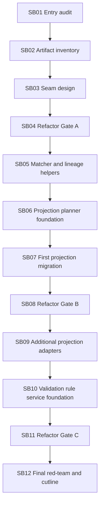

# Phase Plan

## Subbundle Dependency Map

## Critical Subbundles

- SB02 is critical because missing a projection/validation branch will cause semantic regression later.
- SB04 is critical because it freezes guardrails before production movement.
- SB07 is critical because it is the first real projection migration.
- SB10 is critical because validation rules are high-risk and must not weaken artifact satisfaction.
- SB12 is critical because it decides whether a next artifact-validation continuation or narrow core-prep bundle is safe.

## Phase Gates

### Gate A After SB04

Required before SB05 starts:

- Source inventory complete.
- No production movement except tests/docs/guardrails.
- Full build or module build plus relevant unit tests.
- No MAF product dependency.
- No Process Core/driver project.
- No prohibited viewport artifacts.

### Gate B After SB08

Required before SB09 starts:

- First execution-artifact projection path migrated through the planner.
- Existing artifact-lineage tests pass.
- External reference key and duplicate suppression tests pass.
- Dispatcher line-count review recorded.

### Gate C After SB11

Required before final closure:

- Validation helper/service covers selected rules.
- Required artifact negative tests pass.
- Process-filtered integration smoke passes or exact blocker recorded with source-level proof.
- No UI/prohibited viewport artifacts.

## Browser Validation Analytics

For all subbundles, default to `N/A - service/runtime refactor only`. If unexpectedly needed, record large-screen PC-only proof.
