# Phase Plan

## Execution Order

Execute SB01 through SB56 in numeric order. Do not start a subbundle until the previous closure gate passes.

## Subbundle Dependency Map

```mermaid
graph TD
  SB01["SB01: Entry baseline, branch hygiene, and proof inventory"]
  SB02["SB02: ArtifactProjection source-path and source-family inventory"]
  SB01 --> SB02
  SB03["SB03: Projection coordinator cutline and source ownership design"]
  SB02 --> SB03
  SB04["SB04: Gate A - architecture guardrails before source movement"]
  SB03 --> SB04
  SB05["SB05: Projection context snapshot model"]
  SB04 --> SB05
  SB06["SB06: Projection IO and source-read boundary design"]
  SB05 --> SB06
  SB07["SB07: Projection write outcome application helper"]
  SB06 --> SB07
  SB08["SB08: Gate B - context and outcome parity"]
  SB07 --> SB08
  SB09["SB09: Execution artifact source facts"]
  SB08 --> SB09
  SB10["SB10: Execution artifact file resolver and content reader"]
  SB09 --> SB10
  SB11["SB11: Execution artifact projection coordinator"]
  SB10 --> SB11
  SB12["SB12: Migrate execution artifact path into coordinator"]
  SB11 --> SB12
  SB13["SB13: Execution artifact focused parity tests"]
  SB12 --> SB13
  SB14["SB14: Gate C - execution artifact projection proof"]
  SB13 --> SB14
  SB15["SB15: Process mock projection facts"]
  SB14 --> SB15
  SB16["SB16: Process mock content reader boundary"]
  SB15 --> SB16
  SB17["SB17: Process mock projection coordinator"]
  SB16 --> SB17
  SB18["SB18: Migrate process mock projection path"]
  SB17 --> SB18
  SB19["SB19: Process mock negative/parity tests"]
  SB18 --> SB19
  SB20["SB20: Gate D - process mock proof"]
  SB19 --> SB20
  SB21["SB21: Workspace-written artifact source facts"]
  SB20 --> SB21
  SB22["SB22: Workspace-written path resolver and file reader"]
  SB21 --> SB22
  SB23["SB23: Workspace-written projection coordinator"]
  SB22 --> SB23
  SB24["SB24: Migrate workspace-written projection path"]
  SB23 --> SB24
  SB25["SB25: Workspace-written focused parity tests"]
  SB24 --> SB25
  SB26["SB26: Gate E - workspace-written proof"]
  SB25 --> SB26
  SB27["SB27: Existing-managed artifact source facts"]
  SB26 --> SB27
  SB28["SB28: Existing-managed path candidate resolver"]
  SB27 --> SB28
  SB29["SB29: Existing-managed projection coordinator"]
  SB28 --> SB29
  SB30["SB30: Migrate existing-managed projection path"]
  SB29 --> SB30
  SB31["SB31: Existing-managed focused parity tests"]
  SB30 --> SB31
  SB32["SB32: Gate F - existing-managed proof"]
  SB31 --> SB32
  SB33["SB33: Response-text projection facts"]
  SB32 --> SB33
  SB34["SB34: Response-text projection content builder"]
  SB33 --> SB34
  SB35["SB35: Response-text projection coordinator"]
  SB34 --> SB35
  SB36["SB36: Migrate response-text projection path"]
  SB35 --> SB36
  SB37["SB37: Response-text focused parity tests"]
  SB36 --> SB37
  SB38["SB38: Gate G - response-text proof"]
  SB37 --> SB38
  SB39["SB39: Provider-native browser projection facts"]
  SB38 --> SB39
  SB40["SB40: Provider-native browser safe path resolver"]
  SB39 --> SB40
  SB41["SB41: Provider-native browser projection coordinator"]
  SB40 --> SB41
  SB42["SB42: Migrate provider-native browser projection path"]
  SB41 --> SB42
  SB43["SB43: Provider-native browser focused parity tests"]
  SB42 --> SB43
  SB44["SB44: Gate H - provider-native browser proof"]
  SB43 --> SB44
  SB45["SB45: Completed-decision record-only facts"]
  SB44 --> SB45
  SB46["SB46: Completed-decision record-only coordinator cleanup"]
  SB45 --> SB46
  SB47["SB47: Migrate completed-decision path"]
  SB46 --> SB47
  SB48["SB48: Gate I - decision artifact proof"]
  SB47 --> SB48
  SB49["SB49: Projection orchestrator facade"]
  SB48 --> SB49
  SB50["SB50: ArtifactProjection wrapper slimming pass"]
  SB49 --> SB50
  SB51["SB51: Side-effect ownership scan and helper naming cleanup"]
  SB50 --> SB51
  SB52["SB52: Gate J - orchestrator and side-effect proof"]
  SB51 --> SB52
  SB53["SB53: Documentation-only driver-readiness projection map"]
  SB52 --> SB53
  SB54["SB54: Broad focused regression matrix"]
  SB53 --> SB54
  SB55["SB55: Final hardening scans and known-failure ledger"]
  SB54 --> SB55
  SB56["SB56: Final red-team, completed validator, and next cutline"]
  SB55 --> SB56
```

## Critical Subbundles

- SB04: Gate A - architecture guardrails before source movement
- SB08: Gate B - context and outcome parity
- SB14: Gate C - execution artifact projection proof
- SB20: Gate D - process mock proof
- SB26: Gate E - workspace-written proof
- SB32: Gate F - existing-managed proof
- SB38: Gate G - response-text proof
- SB44: Gate H - provider-native browser proof
- SB48: Gate I - decision artifact proof
- SB52: Gate J - orchestrator and side-effect proof
- SB56: Final red-team, completed validator, and next cutline

## Phase Gates

- Every critical gate must include build/test/source scan proof.
- A failed gate reopens the last production movement subbundle.
- All gates must prove no Process Core, no production driver API, no UI/mobile proof drift.
- SB56 must include completed-stage bundle validation or a transcript explaining why it could not run.
