# Phase Plan

## Subbundle Dependency Map

```mermaid
graph TD
    SB01[SB01 Entry audit] --> SB02 --> SB03 --> SB04
    SB04 --> SB05 --> SB06 --> SB07 --> SB08
    SB08 --> SB09 --> SB10 --> SB11 --> SB12
    SB12 --> SB13 --> SB14 --> SB15 --> SB16 --> SB17 --> SB18
    SB18 --> SB19 --> SB20 --> SB21 --> SB22 --> SB23 --> SB24
    SB24 --> SB25 --> SB26 --> SB27 --> SB28 --> SB29 --> SB30
    SB30 --> SB31 --> SB32 --> SB33 --> SB34 --> SB35 --> SB36 --> SB37 --> SB38
    SB38 --> SB39 --> SB40 --> SB41 --> SB42 --> SB43 --> SB44
    SB44 --> SB45 --> SB46 --> SB47 --> SB48 --> SB49 --> SB50
    SB50 --> SB51 --> SB52 --> SB53 --> SB54 --> SB55 --> SB56
    SB56 --> SB57 --> SB58 --> SB59 --> SB60
    SB60 --> SB61 --> SB62 --> SB63 --> SB64
```

## Phases

### Phase A: Baseline, inventory and guardrails

- **SB01**: Entry branch audit.
- **SB02**: Projection source family inventory.
- **SB03**: Current dependency surface map.
- **SB04**: Gate A - architecture guardrails. **CRITICAL GATE**

### Phase B: Context, host and candidate state boundary

- **SB05**: Top-level projection context model.
- **SB06**: Candidate state helper boundary.
- **SB07**: Projection host/services cutline.
- **SB08**: Gate B - context/host parity. **CRITICAL GATE**

### Phase C: Orchestrator skeleton and source-family order lock

- **SB09**: Projection source coordinator interface.
- **SB10**: Projection orchestrator skeleton.
- **SB11**: Wire orchestrator from dispatcher facade.
- **SB12**: Gate C - source family order proof. **CRITICAL GATE**

### Phase D: Execution and process mock coordinator split

- **SB13**: Execution artifact coordinator top-level split.
- **SB14**: Execution artifact dependency narrowing.
- **SB15**: Execution artifact focused tests.
- **SB16**: Process mock coordinator top-level split.
- **SB17**: Process mock dependency narrowing.
- **SB18**: Gate D - execution/process mock parity. **CRITICAL GATE**

### Phase E: Workspace-written and existing-managed coordinator split

- **SB19**: Workspace-written coordinator top-level split.
- **SB20**: Workspace-written matching dependency narrowing.
- **SB21**: Workspace-written file read side-effect proof.
- **SB22**: Existing-managed coordinator top-level split.
- **SB23**: Existing-managed response-reuse boundary.
- **SB24**: Gate E - workspace/existing parity. **CRITICAL GATE**

### Phase F: Response text and managed path projection split

- **SB25**: Response-text coordinator top-level split.
- **SB26**: Response-text path/overwrite rules proof.
- **SB27**: Managed path projection utility split.
- **SB28**: File read/write helper boundary.
- **SB29**: Storage write request builder helper.
- **SB30**: Gate F - response/path parity. **CRITICAL GATE**

### Phase G: Provider-native browser projection split

- **SB31**: Provider-native browser coordinator top-level split.
- **SB32**: Provider-native expected-output helper.
- **SB33**: Provider-native discovered-output helper.
- **SB34**: Provider-native directory preflight boundary.
- **SB35**: Provider-native file copy side-effect proof.
- **SB36**: Provider-native browser projection tests.
- **SB37**: Browser projection driver-readiness notes.
- **SB38**: Gate G - provider-native parity. **CRITICAL GATE**

### Phase H: Completed-decision and candidate mutation consolidation

- **SB39**: Completed-decision coordinator top-level split.
- **SB40**: Completed-decision record-only parity.
- **SB41**: Candidate state mutation audit.
- **SB42**: Projection duplicate handling audit.
- **SB43**: Record-only/write-outcome error handling audit.
- **SB44**: Gate H - candidate mutation and decision parity. **CRITICAL GATE**

### Phase I: Dependency narrowing and nested-class removal

- **SB45**: Remove broad dispatch-service constructor dependencies.
- **SB46**: Move remaining nested coordinator helpers top-level.
- **SB47**: Host dependency completeness scan.
- **SB48**: Nested class removal source scan.
- **SB49**: Compatibility wrappers stabilization.
- **SB50**: Gate I - dependency narrowing proof. **CRITICAL GATE**

### Phase J: Line-count, wrapper and compatibility cleanup

- **SB51**: ArtifactProjection.cs slimming pass.
- **SB52**: ArtifactProjectionCoordinators.cs deletion or shim.
- **SB53**: Projection helper file size review.
- **SB54**: Projection source assertion hardening.
- **SB55**: Integration projection matrix rerun.
- **SB56**: Gate J - line count and regression proof. **CRITICAL GATE**

### Phase K: Driver-readiness documentation and no-core review

- **SB57**: Documentation-only driver-readiness map update.
- **SB58**: No-core readiness review.
- **SB59**: Known unrelated failure cleanup note.
- **SB60**: Gate K - no-core/no-driver review. **CRITICAL GATE**

### Phase L: Broad validation and final red-team closure

- **SB61**: Broad focused smoke matrix.
- **SB62**: Final anti-stub and viewport proof scan.
- **SB63**: Execution report and raw note closure.
- **SB64**: Final red-team and completed validator. **CRITICAL GATE**

## Critical Subbundles

Critical gates: SB04, SB08, SB12, SB18, SB24, SB30, SB38, SB44, SB50, SB56, SB60, SB64.

A failed critical gate reopens the last production-movement subbundle and blocks all downstream work.

## Phase Gates

Every gate must include:

- build or focused test transcript,
- source assertion transcript,
- anti-stub scan,
- no Process Core / no driver API scan,
- no UI and no prohibited viewport proof scan,
- updated execution report row,
- explicit downstream dependency decision.

## Validation Strategy

Runtime/service refactor only. Browser validation is `N/A` unless Codex unexpectedly touches UI. If UI is touched, the change is out of scope and must be reverted rather than proven on small/medium/mobile screens.
