# Phase Plan

## Execution Order

Execute SB01 through SB32 in numeric order. Do not start a subbundle until the previous closure gate passes. Critical gates reopen the last movement subbundle on failure.

## Subbundle Dependency Map

```mermaid
graph TD
SB01[SB01: Entry audit, branch hygiene, and proof baseline]
SB02[SB02: Artifact satisfaction source inventory]
SB01 --> SB02
SB03[SB03: Evidence/satisfaction boundary design]
SB02 --> SB03
SB04[SB04: Gate A: architecture guardrails before movement]
SB03 --> SB04
SB05[SB05: Artifact satisfaction snapshot foundation]
SB04 --> SB05
SB06[SB06: Recorded/execution artifact satisfaction helper]
SB05 --> SB06
SB07[SB07: Fresh current-attempt implementation artifact helper]
SB06 --> SB07
SB08[SB08: Gate B: recorded/fresh artifact parity]
SB07 --> SB08
SB09[SB09: Auto-satisfaction decision planner]
SB08 --> SB09
SB10[SB10: Process mock and workspace write satisfaction bridge hardening]
SB09 --> SB10
SB11[SB11: Completed-decision auto-record decision helper]
SB10 --> SB11
SB12[SB12: Gate C: auto-satisfaction parity]
SB11 --> SB12
SB13[SB13: Provider-native browser output facts]
SB12 --> SB13
SB14[SB14: Provider-native visual evidence satisfaction]
SB13 --> SB14
SB15[SB15: Browser evidence diagnostics and driver-readiness labels]
SB14 --> SB15
SB16[SB16: Gate D: provider-native/browser parity]
SB15 --> SB16
SB17[SB17: Response-text projection eligibility helper]
SB16 --> SB17
SB18[SB18: Required artifact missing summary builder]
SB17 --> SB18
SB19[SB19: External target reference guard helper]
SB18 --> SB19
SB20[SB20: Gate E: response and external-target parity]
SB19 --> SB20
SB21[SB21: Shallow managed artifact reference helper]
SB20 --> SB21
SB22[SB22: Managed path and product file classification consolidation]
SB21 --> SB22
SB23[SB23: Quality validation evidence aggregator boundary]
SB22 --> SB23
SB24[SB24: Gate F: path/quality validation parity]
SB23 --> SB24
SB25[SB25: Incomplete implementation response signal helper]
SB24 --> SB25
SB26[SB26: Completion blocker integration cleanup]
SB25 --> SB26
SB27[SB27: ArtifactValidation wrapper slimming pass]
SB26 --> SB27
SB28[SB28: Gate G: line-count and consumer parity]
SB27 --> SB28
SB29[SB29: Driver-readiness artifact satisfaction map]
SB28 --> SB29
SB30[SB30: No-core readiness review]
SB29 --> SB30
SB31[SB31: Final broad smoke and regression matrix]
SB30 --> SB31
SB32[SB32: Final red-team closure and next cutline]
SB31 --> SB32
```

## Critical Subbundles

- SB04: Gate A architecture guardrails before movement.
- SB08: Gate B recorded/fresh artifact parity.
- SB12: Gate C auto-satisfaction branch parity.
- SB16: Gate D provider-native/browser parity.
- SB20: Gate E response text and external-target parity.
- SB24: Gate F path/quality validation parity.
- SB28: Gate G line-count and consumer parity.
- SB32: Final red-team closure and next cutline.

## Phase Gates

- SB04 Gate A: architecture/no-core/no-driver/no-UI guard before production movement.
- SB08 Gate B: recorded and fresh implementation artifact parity.
- SB12 Gate C: auto-satisfaction branch parity.
- SB16 Gate D: provider-native browser evidence parity.
- SB20 Gate E: response text and external-target parity.
- SB24 Gate F: path/quality validation parity.
- SB28 Gate G: line-count and consumer parity.
- SB32 Final Gate: red-team closure and next cutline.

## Progression Rule

If a gate fails, Codex must stop, repair the earliest impacted subbundle, update proof manifests, and rerun the gate. Do not proceed with downstream refactors after a failed critical gate.
