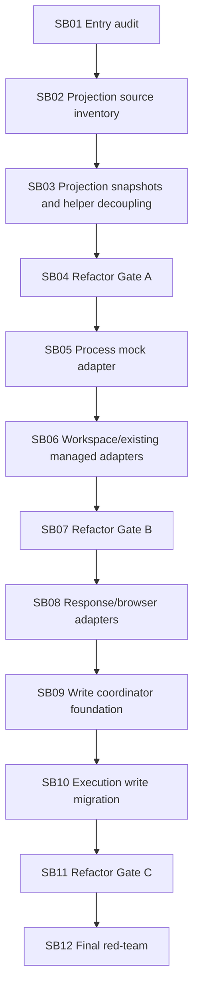

# Phase Plan

## Execution Order

1. SB01 Entry audit.
2. SB02 Projection source inventory.
3. SB03 Projection snapshots and helper decoupling.
4. SB04 Refactor Gate A.
5. SB05 Process mock adapter.
6. SB06 Workspace-written and existing-managed adapters.
7. SB07 Refactor Gate B.
8. SB08 Response-text and provider-native browser adapters.
9. SB09 Write coordinator foundation.
10. SB10 Execution write-path migration.
11. SB11 Refactor Gate C.
12. SB12 Final red-team and next cutline.

## Subbundle Dependency Map

## Critical Subbundles

- SB03 is critical because bad snapshots will pollute all adapters.
- SB04 is a hard refactor gate before source migration.
- SB07 is a hard refactor gate before response/browser adapters.
- SB09 is critical because it introduces side-effect coordination.
- SB11 is a hard runtime regression gate before final closure.

## Phase Gates

### Gate A after SB04

- No Process Core/driver-pack project.
- No MAF/Tooling product-module dependency.
- Helper boundary tests pass.
- No prohibited viewport proof artifacts.

### Gate B after SB07

- Process mock, workspace-written, and existing-managed adapters have exact key parity tests.
- Duplicate skip behavior is proven.
- Artifact regression slice passes.

### Gate C after SB11

- Write coordinator is used only by intended execution-artifact path.
- Artifact lineage and required-artifact satisfaction tests pass.
- Full solution build passes.
- Line-count review shows actual reduction or explains why not.

## Browser Validation Policy

N/A for all subbundles unless a rendered UI route is unexpectedly modified. If needed, only PC/large-screen proof is allowed.
