# Phase Plan
## Execution Order

- Execute SB01-SB36 in numeric order.
- Stop at every critical gate until source scans, focused tests, proof manifests, semantic invariants, and downstream dependency checks pass.
- Reopen the most recent affected production-movement subbundle if a later gate weakens an earlier assumption.

## Subbundle Dependency Map

```mermaid
graph TD
  SB01[SB01] --> SB02[SB02]
  SB02[SB02] --> SB03[SB03]
  SB03[SB03] --> SB04[SB04]
  SB04[SB04] --> SB05[SB05]
  SB05[SB05] --> SB06[SB06]
  SB06[SB06] --> SB07[SB07]
  SB07[SB07] --> SB08[SB08]
  SB08[SB08] --> SB09[SB09]
  SB09[SB09] --> SB10[SB10]
  SB10[SB10] --> SB11[SB11]
  SB11[SB11] --> SB12[SB12]
  SB12[SB12] --> SB13[SB13]
  SB13[SB13] --> SB14[SB14]
  SB14[SB14] --> SB15[SB15]
  SB15[SB15] --> SB16[SB16]
  SB16[SB16] --> SB17[SB17]
  SB17[SB17] --> SB18[SB18]
  SB18[SB18] --> SB19[SB19]
  SB19[SB19] --> SB20[SB20]
  SB20[SB20] --> SB21[SB21]
  SB21[SB21] --> SB22[SB22]
  SB22[SB22] --> SB23[SB23]
  SB23[SB23] --> SB24[SB24]
  SB24[SB24] --> SB25[SB25]
  SB25[SB25] --> SB26[SB26]
  SB26[SB26] --> SB27[SB27]
  SB27[SB27] --> SB28[SB28]
  SB28[SB28] --> SB29[SB29]
  SB29[SB29] --> SB30[SB30]
  SB30[SB30] --> SB31[SB31]
  SB31[SB31] --> SB32[SB32]
  SB32[SB32] --> SB33[SB33]
  SB33[SB33] --> SB34[SB34]
  SB34[SB34] --> SB35[SB35]
  SB35[SB35] --> SB36[SB36]
```

## Critical Subbundles

- SB04: Gate A architecture guardrails
- SB08: Gate B classification parity
- SB12: Gate C provider-native browser parity
- SB16: Gate D critical failure parity
- SB20: Gate E metadata and diagnostic parity
- SB24: Gate F dedupe parity
- SB28: Gate G line-count and consumer parity
- SB32: Gate H build/test/source scan
- SB36: Final manager/architect/QA self-review

## Phase Gates

- SB04 must pass before downstream subbundles continue. It must include source assertions, focused tests, anti-stub scan, no-core/no-driver scan, no prohibited viewport proof scan, and line-count/proof summary where applicable.
- SB08 must pass before downstream subbundles continue. It must include source assertions, focused tests, anti-stub scan, no-core/no-driver scan, no prohibited viewport proof scan, and line-count/proof summary where applicable.
- SB12 must pass before downstream subbundles continue. It must include source assertions, focused tests, anti-stub scan, no-core/no-driver scan, no prohibited viewport proof scan, and line-count/proof summary where applicable.
- SB16 must pass before downstream subbundles continue. It must include source assertions, focused tests, anti-stub scan, no-core/no-driver scan, no prohibited viewport proof scan, and line-count/proof summary where applicable.
- SB20 must pass before downstream subbundles continue. It must include source assertions, focused tests, anti-stub scan, no-core/no-driver scan, no prohibited viewport proof scan, and line-count/proof summary where applicable.
- SB24 must pass before downstream subbundles continue. It must include source assertions, focused tests, anti-stub scan, no-core/no-driver scan, no prohibited viewport proof scan, and line-count/proof summary where applicable.
- SB28 must pass before downstream subbundles continue. It must include source assertions, focused tests, anti-stub scan, no-core/no-driver scan, no prohibited viewport proof scan, and line-count/proof summary where applicable.
- SB32 must pass before downstream subbundles continue. It must include source assertions, focused tests, anti-stub scan, no-core/no-driver scan, no prohibited viewport proof scan, and line-count/proof summary where applicable.
- SB36 must pass before downstream subbundles continue. It must include source assertions, focused tests, anti-stub scan, no-core/no-driver scan, no prohibited viewport proof scan, and line-count/proof summary where applicable.

## Execution Rule

Execute SB01-SB36 in numeric order. If any critical gate fails, reopen the most recent production-movement subbundle and stop downstream work until repaired.

