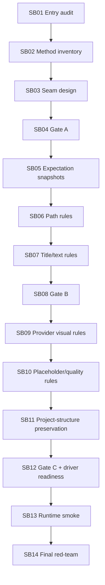

# Phase Plan

## Execution Order

- SB01 Entry audit and branch hygiene.
- SB02 Current artifact validation inventory.
- SB03 Validation seam design.
- SB04 Gate A guardrails.
- SB05 Expectation snapshot decoupling.
- SB06 Path and managed artifact rules.
- SB07 Title, slug, and text rules.
- SB08 Gate B matcher parity review.
- SB09 Provider-native visual validation.
- SB10 Placeholder and quality rules.
- SB11 Project-structure requirement preservation rules.
- SB12 Gate C validation regression and driver-readiness review.
- SB13 Runtime smoke and viewport policy check.
- SB14 Final red-team and next dispatcher cutline.

## Subbundle Dependency Map

## Critical Subbundles

- SB03 is critical because it defines the seam before movement.
- SB04 is critical because it prevents premature Core/driver work.
- SB08 is critical because matcher parity is the highest-risk behavior point.
- SB12 is critical because it closes validation-rule extraction and driver-readiness classification.
- SB14 is critical because it decides the next dispatcher cutline.

## Phase Gates

### Gate A after SB04

- Must prove: branch clean, no Process Core/driver project, validation inventory complete, architecture tests/failing-first guards added.

### Gate B after SB08

- Must prove: expectation/path/title/text matching parity, source scans, focused tests, no line-count growth beyond documented exceptions.

### Gate C after SB12

- Must prove: provider visual, placeholder/quality, and project-structure preservation rules have parity tests; driver-readiness map updated; no driver APIs introduced.

### Final Gate after SB14

- Must prove: full build, targeted tests, source scans, completed validator, no prohibited viewport proof artifacts, next cutline documented.
