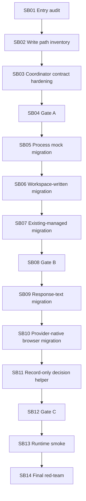

# Phase Plan

## Subbundle Dependency Map

## Execution Order

- Execute subbundles sequentially from SB01 through SB14.
- Stop after SB04, SB08, SB12, and SB14 for the named phase gate before starting the next dependent phase.
- Reopen an earlier subbundle if later source observations weaken its prerequisite proof.

## Critical Subbundles

- SB03 is critical because all later migrations depend on coordinator semantics.
- SB05 is critical because process mock artifacts have hard-failure behavior.
- SB09 is critical because response-text artifacts write files before storage placement.
- SB10 is critical because provider-native browser proof can affect runtime validation.
- SB12 is critical because it checks the boundary before final smoke.

## Phase Gates

### Gate A after SB04

Must prove:

- coordinator outcome contract exists,
- old execution-artifact path still passes,
- no Process Core/driver-pack project,
- no prohibited viewport proof.

### Gate B after SB08

Must prove:

- process mock, workspace-written, and existing-managed write paths use coordinator,
- parity tests pass,
- line counts and source scans are recorded.

### Gate C after SB12

Must prove:

- response-text and provider-native browser writes use coordinator,
- completed decision helper is record-only,
- no source semantics moved into coordinator,
- full focused artifact/projection suite passes.

### Final Gate after SB14

Must prove:

- final solution build,
- targeted unit and integration tests,
- source scans,
- completed bundle validator,
- next cutline.
