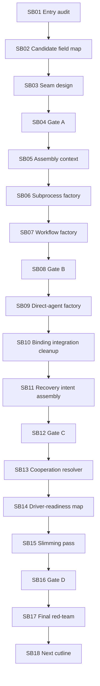

# Phase Plan

## Execution Order

- Execute subbundles strictly in SB01 through SB18 order.
- Stop at each critical gate before allowing dependent production movement.
- Reopen the earliest affected subbundle if later proof weakens a prerequisite.

## Subbundle Dependency Map

## Critical Subbundles

- SB04: first hard architecture gate before production movement.
- SB08: subprocess/workflow candidate parity gate.
- SB12: direct-agent candidate parity and side-effect gate.
- SB16: runtime smoke and line-count gate.
- SB17: final red-team closure.

## Phase Gates

| Gate | Subbundle | Must prove |
| --- | --- | --- |
| Gate A | SB04 | Architecture guardrails; no core/driver/UI/prohibited proof; factory side-effect bans. |
| Gate B | SB08 | Subprocess and workflow candidate parity. |
| Gate C | SB12 | Direct-agent, binding, recovery parity. |
| Gate D | SB16 | Build, focused tests, source scans, line-count review. |
| Final | SB17 | Completed proof pack and raw-note closure. |
