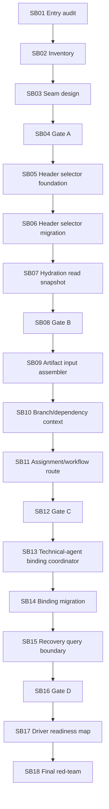

# Phase Plan

## Subbundle Dependency Map

## Critical Subbundles

- SB04: first architecture guard before production movement.
- SB08: proves candidate header selection and hydration read snapshot parity.
- SB12: proves candidate assembly parity for artifact inputs, branch outcomes, assignments, workflow route.
- SB16: proves side-effectful binding/recovery boundaries and runtime smoke.
- SB18: final closure and next cutline.

## Phase Gates

| Gate | After subbundle | Must prove |
| --- | --- | --- |
| Gate A | SB04 | no-core/no-driver guardrails, no UI proof drift, inventory/source baseline. |
| Gate B | SB08 | header selector parity, read snapshot build/tests, no lifecycle behavior drift. |
| Gate C | SB12 | candidate assembly parity across subprocess/workflow/direct-agent route kinds. |
| Gate D | SB16 | technical-agent binding side effects preserved, recovery query parity, full build. |
| Final | SB18 | completed validator, full red-team, next cutline. |

## Browser Validation

Expected `N/A` for every subbundle. This bundle is service/runtime only. If UI changes unexpectedly, stop and record a scope violation; only large desktop/PC proof is allowed after explicit justification.
