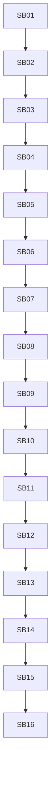

# Phase Plan

## Execution Order

- Execute SB01 through SB16 in numeric order.
- Do not start a downstream subbundle until the prior closure gate passes and the execution report records the result.
- Reopen the earliest affected subbundle if later source observations weaken a critical foundation.

## Subbundle Dependency Map

## Critical Subbundles

- SB04 Gate A: architecture guardrails before production movement.
- SB08 Gate B: concurrency selection parity.
- SB12 Gate C: route/claim parity.
- SB15 Runtime smoke.
- SB16 Final red-team.

## Phase Gates

| Gate | After | Must prove |
| --- | --- | --- |
| Gate A | SB04 | No core/driver drift; source inventory complete; architecture tests pass |
| Gate B | SB08 | Execution-run selection helper is behaviorally equivalent |
| Gate C | SB12 | Claim/session/route planning did not alter dispatch lifecycle |
| Gate D | SB14 | Finalizer context factory and driver-readiness docs did not create production driver API |
| Final | SB16 | Full build, focused integration, source scans, anti-stub, no UI/mobile proof |

## Browser Validation Analytics

Default for all subbundles: `N/A - runtime/service refactor only`.

If UI files unexpectedly change, stop and record a scope violation unless explicitly approved. If proof becomes unavoidable, use large desktop/PC only.
