# Phase plan

## Execution Order
- Execute SB001 through SB024 in numeric order.
- Stop at critical gates SB003, SB006, SB009, SB012, SB015, SB018, SB021, and SB024 until artifact-backed proof is recorded.
- Do not begin a dependent phase until the prior phase gate passes.

## Subbundle Dependency Map

```mermaid
gantt
    title Process dispatch core-readiness multi-phase isolation
    dateFormat  X
    axisFormat  %s
    section Phase 0 Baseline
    SB001 Baseline proof and no-shallow gates       :0, 1
    SB002 Source hotspot and line-count inventory   :1, 1
    SB003 Guardrail tests and scans                 :2, 1
    section Phase 1 Route service adapter burn-down
    SB004 Route service side-effect ownership       :3, 2
    SB005 Route model adapter reduction             :5, 2
    SB006 Route factory/service composition cleanup :7, 1
    section Phase 2 Candidate hydration boundary
    SB007 Candidate hydration service extraction    :8, 2
    SB008 Assignment and direct-agent binding split :10, 2
    SB009 Candidate snapshot and recovery query proof :12, 1
    section Phase 3 Pre-execution and transition boundary
    SB010 Database/materialization service ownership :13, 2
    SB011 Start transition/reload service boundary   :15, 1
    SB012 Pre-execution route handler host cleanup   :16, 1
    section Phase 4 Subprocess runtime boundary
    SB013 Subprocess runtime orchestration service   :17, 2
    SB014 Subprocess artifact projection store       :19, 2
    SB015 Subprocess model/transition proof          :21, 1
    section Phase 5 Finalizer/transition/failure boundary
    SB016 Transition/finalizer application service   :22, 2
    SB017 Failure closure coordinator                :24, 1
    SB018 Run-closed/claim-held guard service         :25, 1
    section Phase 6 Dispatcher facade slimming
    SB019 Static wrapper burn-down                   :26, 2
    SB020 Line-count and source hardening             :28, 1
    SB021 Architecture guard expansion                :29, 1
    section Phase 7 Readiness closure
    SB022 Core-readiness decision matrix              :30, 1
    SB023 Driver-readiness documentation refresh      :31, 1
    SB024 Broad regression and final red-team         :32, 2
```

## Critical Subbundles

- SB003, SB006, SB009, SB012, SB015, SB018, SB021, and SB024 are critical gates.
- Do not continue to the next phase until the gate passes.

## Phase Gates

Each phase gate must include:

- Build proof.
- Focused unit proof.
- Focused integration proof where behavior was moved.
- Source scan proof.
- No Process Core / no driver API proof.
- No UI/mobile proof drift scan.
- Line-count or source-size proof where relevant.

## No-collapse rule

The execution report must contain rows for SB001 through SB024. It must not collapse them into one row per phase. However, each SB is intentionally larger than prior micro-subbundles.
