# Phase Plan

## Subbundle Dependency Map

```mermaid
graph TD
  SB01 --> SB02
  SB02 --> SB03
  SB03 --> SB04
  SB04 --> SB05
  SB05 --> SB06
  SB06 --> SB07
  SB07 --> SB08
  SB08 --> SB09
  SB09 --> SB10
  SB10 --> SB11
  SB11 --> SB12
  SB12 --> SB13
  SB13 --> SB14
  SB14 --> SB15
  SB15 --> SB16
  SB16 --> SB17
  SB17 --> SB18
  SB18 --> SB19
  SB19 --> SB20
  SB20 --> SB21
  SB21 --> SB22
  SB22 --> SB23
  SB23 --> SB24
  SB24 --> SB25
  SB25 --> SB26
  SB26 --> SB27
  SB27 --> SB28
  SB28 --> SB29
  SB29 --> SB30
  SB30 --> SB31
  SB31 --> SB32
  SB32 --> SB33
  SB33 --> SB34
  SB34 --> SB35
  SB35 --> SB36
  SB36 --> SB37
  SB37 --> SB38
  SB38 --> SB39
  SB39 --> SB40
  SB40 --> SB41
  SB41 --> SB42
  SB42 --> SB43
  SB43 --> SB44
```

## Phases

| Phase | Focus | Subbundles |
| --- | --- | --- |
| Phase 0 | Entry audit and guardrails | SB01-SB04 |
| Phase 1 | Execution attempt state and response normalization | SB05-SB08 |
| Phase 2 | Recovered/concurrent execution adoption | SB09-SB12 |
| Phase 3 | Execution launch and failure normalization | SB13-SB16 |
| Phase 4 | Post-attempt facts and retry decisions | SB17-SB22 |
| Phase 5 | No-progress retry compression boundary | SB23-SB28 |
| Phase 6 | Provider fallback and repair boundary | SB29-SB35 |
| Phase 7 | Execution loop facade and line-count refactor | SB36-SB40 |
| Phase 8 | Driver-readiness documentation, final smoke, closure | SB41-SB44 |

## Critical Subbundles

SB04, SB08, SB12, SB16, SB22, SB28, SB35, SB40, and SB44 are critical gates. A failed gate reopens the most recent production movement subbundle and blocks downstream work.

## Phase Gates

Every critical gate must include: build or focused test proof, source assertions, anti-stub scan, no-core/no-driver scan, no UI/prohibited viewport scan, and a line-count or delegation proof where relevant.
