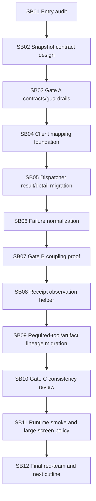

# Phase Plan

## Execution Order

- SB01 entry audit, branch hygiene, and baseline proof.
- SB02 execution snapshot contract design.
- SB03 refactor gate A: contracts and guardrails.
- SB04 client mapping foundation.
- SB05 dispatcher result/detail migration.
- SB06 failure normalization boundary.
- SB07 refactor gate B: coupling reduction proof.
- SB08 receipt observation helper foundation.
- SB09 required-tool and artifact-lineage consumer migration.
- SB10 refactor gate C: boundary consistency review.
- SB11 runtime smoke and large-screen policy check.
- SB12 final red-team and next isolation cutline.
## Subbundle Dependency Map

## Critical Subbundles

- SB02 is critical because missing snapshot fields will invalidate dispatcher migration.
- SB04 is critical because it is the only allowed AgentFramework runtime adapter.
- SB07 is critical because downstream receipt/helper work is untrustworthy if dispatcher still consumes AgentFramework detail types.
- SB10 is critical because it checks source size, coupling counts, and scope drift before final smoke.

## Phase Gates

### Gate A after SB03

- Contracts neutrality proven.
- No production behavior movement yet except tests/guardrails.
- No core/driver projects.
- Large-screen-only policy recorded.

### Gate B after SB07

- Dispatcher no longer consumes AgentFramework execution result/detail/exception types.
- Client mapping/failure behavior covered.
- MAF/Tooling product dependency scans clean.

### Gate C after SB10

- Receipt observation helper in place.
- Required-tool/artifact lineage tests pass.
- Dispatcher source-size/coupling review recorded.

### Final Gate after SB12

- Prepared/completed bundle validator passes.
- Full solution build passes.
- Targeted provider/policy/process tests pass.
- Final cutline says whether next work is artifact-validation isolation or still execution-boundary cleanup.

## Execution Cadence

After each refactor gate, Codex must stop and write a short gate review before continuing. Do not continue into downstream subbundles when gate proof is incomplete.
