# Phase Plan

## Subbundle Dependency Map

```mermaid
graph TD
  SB01[SB01] --> SB02[SB02]
  SB02[SB02] --> SB03[SB03]
  SB03[SB03] --> SB04[SB04]
  SB04[SB04] --> SB05[SB05]
  SB05[SB05] --> SB06[SB06]
  SB06[SB06] --> SB07[SB07]
  SB07[SB07] --> SB08[SB08]
  SB08[SB08] --> SB09[SB09]
  SB09[SB09] --> SB10[SB10]
  SB10[SB10] --> SB11[SB11]
  SB11[SB11] --> SB12[SB12]
  SB12[SB12] --> SB13[SB13]
  SB13[SB13] --> SB14[SB14]
  SB14[SB14] --> SB15[SB15]
  SB15[SB15] --> SB16[SB16]
  SB16[SB16] --> SB17[SB17]
  SB17[SB17] --> SB18[SB18]
  SB18[SB18] --> SB19[SB19]
  SB19[SB19] --> SB20[SB20]
  SB20[SB20] --> SB21[SB21]
  SB21[SB21] --> SB22[SB22]
  SB22[SB22] --> SB23[SB23]
  SB23[SB23] --> SB24[SB24]
  SB24[SB24] --> SB25[SB25]
  SB25[SB25] --> SB26[SB26]
  SB26[SB26] --> SB27[SB27]
  SB27[SB27] --> SB28[SB28]
```

## Critical Subbundles

- SB04 Gate A: architecture guardrails
- SB08 Gate B: contract/stack parity
- SB13 Gate C: receipt/path/mutation parity
- SB18 Gate D: runnable/dotnet parity
- SB23 Gate E: carry/mock/write parity
- SB27 Gate F: build/test/line-count review
- SB28 Final red-team

## Phase Gates

Every gate must decide whether downstream work can continue. A failed gate reopens the most recent production movement subbundle and blocks all later work.

## Subbundle Overview

| SB | Name | Goal | Gate emphasis |
| --- | --- | --- | --- |
| SB01 | Entry audit and previous boundary verification | Record current branch status, prior subprocess proof, line counts, and exact source references. | No source movement. |
| SB02 | Implementation proof source inventory | Map every method/region in ImplementationProof.cs and all consumers in ToolValidation, Execution, RecoveryPackets, ArtifactValidation. | Inventory must include inputs/outputs/side effects. |
| SB03 | Evidence vocabulary and no-core cutline | Define local vocabulary for implementation proof/evidence families and explicit non-goals. | No production code movement except docs/tests. |
| SB04 | Refactor Gate A: architecture guardrails | Add/extend tests/scans preventing Process Core, driver APIs, UI proof drift, and helper stubs. | Critical gate. |
| SB05 | Implementation contract snapshot helper | Extract normalized contract text gathering into a local snapshot/helper. | Existing wrappers must remain. |
| SB06 | Stack token and negation rules | Extract affirmative/negated .NET and JS stack detection, including token/pattern logic. | Preserve negation behavior exactly. |
| SB07 | Explicit test/runnable contract signals | Extract explicit test-request and runnable app contract signal detection. | Do not change summary strings. |
| SB08 | Refactor Gate B: contract/stack parity | Focused tests for .NET/JS/negated .NET/test/runnable signals and no-core/no-driver scan. | Critical gate. |
| SB09 | Receipt facts and timeline helper | Extract successful/failed receipt facts, latest read/mutation/validation/run receipt ordering. | No candidate mutations. |
| SB10 | Concrete product path classification | Extract concrete product/deliverable/source/project path checks and ignored path segments. | No filesystem traversal beyond existing semantics. |
| SB11 | Concrete product mutation/read rules | Extract mutation/read receipt qualification against candidate/detail/context. | Preserve current receipt ordering. |
| SB12 | Bootstrap/scaffold sequence rules | Extract bootstrap/scaffold follow-up source write validation. | Keep exact failure summary. |
| SB13 | Refactor Gate C: receipt/path/mutation parity | Tests for path classification, read/mutation, scaffold, validation-after-mutation. | Critical gate. |
| SB14 | Concrete implementation proof summary helper | Move ResolveMissingConcreteImplementationProofSummary internals into helper with wrapper. | Exact summary strings locked. |
| SB15 | Runnable application proof helper | Move ResolveMissingRunnableApplicationProofSummary internals into helper with wrapper. | Exact summary strings locked. |
| SB16 | DotNet host path discovery helper | Extract ResolveRunnableDotNetHostProjectPaths and candidate project path enumeration. | No driver API. |
| SB17 | DotNet host shape validation helper | Extract invalid runnable dotnet host shape summary integration points. | Do not modify WebHostProof behavior. |
| SB18 | Refactor Gate D: runnable/dotnet parity | Focused tests for host path discovery, JS bypass, dotnet negation, invalid host shape, run-after-mutation ordering. | Critical gate. |
| SB19 | Carried implementation proof facts | Extract carried proof state transitions from current/historical attempts. | No historical loading movement. |
| SB20 | Historical carried proof resolver | Move pure historical proof decision into local helper; loading remains where it is. | Preserve current attempt filtering. |
| SB21 | Process mock implementation proof bridge | Extract process mock proof satisfaction decisions into explicit helper. | Preserve process mock test semantics. |
| SB22 | Implementation artifact write satisfaction bridge | Extract 'recorded artifacts can satisfy workspace_write_file' logic. | Preserve required-artifact behavior. |
| SB23 | Refactor Gate E: carry/mock/write parity | Tests for carry-forward, historical mutation, process mock proof, recorded artifact write satisfaction. | Critical gate. |
| SB24 | Consumer migration in ToolValidation and Execution | Wire helpers into missing tool, completion blocker, historical proof, carried proof consumers through wrappers. | Do not change status decisions. |
| SB25 | Recovery packet/retry reason integration | Wire helper facts into RecoveryPackets/RecoveryDirective only where exact text parity is proven. | No journal persistence changes. |
| SB26 | Documentation-only driver readiness map | Update evidence-family map for future helper drivers; no production driver API. | Docs only. |
| SB27 | Refactor Gate F: build, focused tests, line-count review | Full build, focused integration/unit tests, line count and source scans. | Critical gate. |
| SB28 | Final red-team and completed validator | Final closure, anti-stub audit, no-core/no-driver/no-UI/proof-path scans, next cutline. | Critical gate. |
