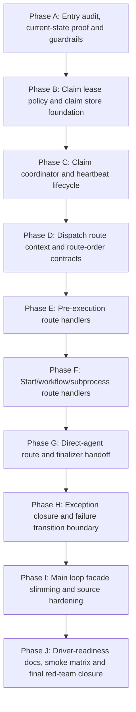

# Phase Plan

## Subbundle Dependency Map

## Critical Subbundles

- **SB04**: Gate A: architecture guardrails before movement
- **SB08**: Gate B: baseline proof and reopen triggers
- **SB16**: Gate C: claim store proof
- **SB28**: Gate D: claim/heartbeat proof
- **SB38**: Gate E: route context/order proof
- **SB48**: Gate F: pre-execution route proof
- **SB58**: Gate G: subprocess/workflow/start proof
- **SB68**: Gate H: direct route proof
- **SB78**: Gate I: exception closure proof
- **SB88**: Gate J: main loop facade proof
- **SB96**: Gate K: final closure and handoff cutline

## Phase Gates

- Critical gates must not be skipped.
- If a gate fails, reopen the most recent production-movement subbundle and all dependent subbundles.
- The execution report must include one row per subbundle. A single collapsed SB01-SB96 row is not acceptable for this bundle.
- Each critical gate must include build/test/source-scan proof and semantic invariants.
