# Phase Plan

## Execution Order

Execute SB01 through SB48 in numeric order. Do not skip gates. If a critical gate fails, reopen the last production-movement subbundle and repair before continuing.

## Subbundle Dependency Map

```mermaid
graph TD
  SB01["SB01: Entry branch audit and previous-bundle proof review"]
  SB02["SB02: Live source inventory for observation/outcome hotspots"]
  SB01 --> SB02
  SB03["SB03: Boundary design and test matrix repair"]
  SB02 --> SB03
  SB04["SB04: Gate A architecture/no-core/no-driver guardrails"]
  SB03 --> SB04
  SB05["SB05: Session observation model skeleton"]
  SB04 --> SB05
  SB06["SB06: Session tool-name and tool-result extraction"]
  SB05 --> SB06
  SB07["SB07: Session file read/write/stat extraction"]
  SB06 --> SB07
  SB08["SB08: Gate B session observation parity"]
  SB07 --> SB08
  SB09["SB09: Execution log observation model"]
  SB08 --> SB09
  SB10["SB10: Execution log browser output extraction"]
  SB09 --> SB10
  SB11["SB11: Combined automation observation snapshot"]
  SB10 --> SB11
  SB12["SB12: Gate C execution-log/observation parity"]
  SB11 --> SB12
  SB13["SB13: Wire observation snapshot into ToolValidation wrappers"]
  SB12 --> SB13
  SB14["SB14: Wire observation snapshot into ArtifactValidation consumers"]
  SB13 --> SB14
  SB15["SB15: Wire observation snapshot into Concurrency/Execution consumers"]
  SB14 --> SB15
  SB16["SB16: Gate D observation consumer parity"]
  SB15 --> SB16
  SB17["SB17: Declared outcome parser helper"]
  SB16 --> SB17
  SB18["SB18: Declared branch selection facts"]
  SB17 --> SB18
  SB19["SB19: Declared missing-tool-without-receipt rule"]
  SB18 --> SB19
  SB20["SB20: Gate E declared outcome parity"]
  SB19 --> SB20
  SB21["SB21: Explicit disposition completion helper"]
  SB20 --> SB21
  SB22["SB22: Repair/terminal escalation branch completion facts"]
  SB21 --> SB22
  SB23["SB23: Context-validation error classification"]
  SB22 --> SB23
  SB24["SB24: Gate F disposition/context parity"]
  SB23 --> SB24
  SB25["SB25: Completion blocker snapshot"]
  SB24 --> SB25
  SB26["SB26: Completion status decision helper phase 1"]
  SB25 --> SB26
  SB27["SB27: Completion status decision helper phase 2"]
  SB26 --> SB27
  SB28["SB28: Gate G completion status parity"]
  SB27 --> SB28
  SB29["SB29: Completion reason input snapshot"]
  SB28 --> SB29
  SB30["SB30: Declared outcome reason builder helper"]
  SB29 --> SB30
  SB31["SB31: Retry/blocker reason fragments"]
  SB30 --> SB31
  SB32["SB32: Gate H completion reason parity"]
  SB31 --> SB32
  SB33["SB33: No-progress observation consumer cleanup"]
  SB32 --> SB33
  SB34["SB34: No-progress signal builder hardening"]
  SB33 --> SB34
  SB35["SB35: Retry reason aggregator observation cleanup"]
  SB34 --> SB35
  SB36["SB36: Gate I retry/no-progress parity"]
  SB35 --> SB36
  SB37["SB37: ToolValidation wrapper slimming pass 1"]
  SB36 --> SB37
  SB38["SB38: ToolValidation wrapper slimming pass 2"]
  SB37 --> SB38
  SB39["SB39: Line-count and source hotspot review"]
  SB38 --> SB39
  SB40["SB40: Gate J line-count/source boundary proof"]
  SB39 --> SB40
  SB41["SB41: Documentation-only driver-readiness map"]
  SB40 --> SB41
  SB42["SB42: No-core readiness review"]
  SB41 --> SB42
  SB43["SB43: Broad focused smoke matrix"]
  SB42 --> SB43
  SB44["SB44: Gate K broad smoke and no-driver scan"]
  SB43 --> SB44
  SB45["SB45: Final red-team source review"]
  SB44 --> SB45
  SB46["SB46: Completed bundle proof manifests"]
  SB45 --> SB46
  SB47["SB47: Completed-stage validator"]
  SB46 --> SB47
  SB48["SB48: Final closure and next cutline"]
  SB47 --> SB48
```

## Critical Subbundles

Critical gates:

- SB04: Architecture/no-core/no-driver guardrails
- SB08: Session observation parity
- SB12: Execution-log/observation parity
- SB16: Observation consumer parity
- SB20: Declared outcome parity
- SB24: Disposition/context parity
- SB28: Completion status parity
- SB32: Completion reason parity
- SB36: Retry/no-progress parity
- SB40: Line-count/source boundary proof
- SB44: Broad smoke and no-driver scan
- SB48: Final closure and next cutline

## Phase Gates

Each critical gate must include:
- focused tests;
- source assertions;
- anti-stub scan;
- no Process Core / no production driver API scan;
- no UI/prohibited viewport proof scan;
- line-count review where relevant;
- explicit downstream continuation decision.

## Reopen Rules

If a critical gate fails, Codex must:
1. stop downstream work;
2. record the failing proof;
3. reopen the last source-movement subbundle;
4. repair behavior;
5. rerun the gate.
