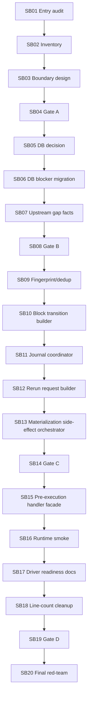

# Phase Plan

## Subbundle Dependency Map

## Ordered phases

    01. Entry audit, current branch proof baseline, and scope lock
    02. Inventory pre-execution guard and upstream materialization methods
    03. Design module-local boundary and no-production-movement cutline
    04. Gate A architecture guardrails before movement
    05. Database requirement decision snapshot and transition request builder
    06. Migrate database requirement blocking through local blocker
    07. Upstream artifact gap facts snapshot
    08. Gate B pre-execution guard parity
    09. Materialization fingerprint and dedup rules
    10. Downstream block transition builder and block reason helper
    11. Materialization journal coordinator with duplicate protection
    12. Upstream rerun request builder
    13. Side-effect orchestrator for upstream materialization
    14. Gate C materialization parity and side-effect boundary proof
    15. Pre-execution route handler facade used by Dispatch.cs
    16. Runtime smoke and focused regression slices
    17. Documentation-only driver readiness evidence/intent map
    18. Line-count review and local refactor cleanup
    19. Gate D final source scans and boundary locks
    20. Final red-team and next cutline

## Critical Subbundles

- SB04: Gate A, no production movement until guardrails pass.
- SB08: Gate B, database and upstream gap facts parity.
- SB14: Gate C, materialization side effects parity.
- SB16: Runtime smoke before documentation/line-count cleanup.
- SB19: Gate D, final scans before red-team.
- SB20: Final closure and next cutline.

## Phase Gates

Each critical gate must record:

- build/test transcript,
- source assertions,
- anti-stub scan,
- no-core/no-driver scan,
- no prohibited viewport proof scan,
- downstream dependency check.

## Reopen Rules

Reopen prior phases if later proof shows:

- changed fingerprint,
- changed journal event shape,
- changed rerun directive,
- helper hides side effects,
- candidate factory route behavior drifts,
- any Process Core or driver production API appears.
