# Phase Plan

## Subbundle Dependency Map

```mermaid
graph TD
  SB01[SB01] --> SB02[SB02]
  SB02[SB02] --> SB03[SB03]
  SB03[SB03] --> SB04[SB04]
  SB04[SB04] --> SB05[SB05]
  SB05[SB05] --> SB06[SB06]
  SB06[SB06] --> SB07[SB07]
  SB07[SB07] --> SB08[SB08]
  SB08[SB08] --> SB09[SB09]
  SB09[SB09] --> SB10[SB10]
  SB10[SB10] --> SB11[SB11]
  SB11[SB11] --> SB12[SB12]
  SB12[SB12] --> SB13[SB13]
  SB13[SB13] --> SB14[SB14]
  SB14[SB14] --> SB15[SB15]
  SB15[SB15] --> SB16[SB16]
  SB16[SB16] --> SB17[SB17]
  SB17[SB17] --> SB18[SB18]
  SB18[SB18] --> SB19[SB19]
  SB19[SB19] --> SB20[SB20]
  SB20[SB20] --> SB21[SB21]
  SB21[SB21] --> SB22[SB22]
  SB22[SB22] --> SB23[SB23]
  SB23[SB23] --> SB24[SB24]
  SB24[SB24] --> SB25[SB25]
  SB25[SB25] --> SB26[SB26]
  SB26[SB26] --> SB27[SB27]
  SB27[SB27] --> SB28[SB28]
  SB28[SB28] --> SB29[SB29]
  SB29[SB29] --> SB30[SB30]
  SB30[SB30] --> SB31[SB31]
  SB31[SB31] --> SB32[SB32]
  SB32[SB32] --> SB33[SB33]
  SB33[SB33] --> SB34[SB34]
  SB34[SB34] --> SB35[SB35]
  SB35[SB35] --> SB36[SB36]
  SB36[SB36] --> SB37[SB37]
  SB37[SB37] --> SB38[SB38]
  SB38[SB38] --> SB39[SB39]
  SB39[SB39] --> SB40[SB40]
  SB40[SB40] --> SB41[SB41]
  SB41[SB41] --> SB42[SB42]
  SB42[SB42] --> SB43[SB43]
  SB43[SB43] --> SB44[SB44]
  SB44[SB44] --> SB45[SB45]
  SB45[SB45] --> SB46[SB46]
  SB46[SB46] --> SB47[SB47]
  SB47[SB47] --> SB48[SB48]
  SB48[SB48] --> SB49[SB49]
  SB49[SB49] --> SB50[SB50]
  SB50[SB50] --> SB51[SB51]
  SB51[SB51] --> SB52[SB52]
  SB52[SB52] --> SB53[SB53]
  SB53[SB53] --> SB54[SB54]
  SB54[SB54] --> SB55[SB55]
  SB55[SB55] --> SB56[SB56]
  SB56[SB56] --> SB57[SB57]
  SB57[SB57] --> SB58[SB58]
  SB58[SB58] --> SB59[SB59]
  SB59[SB59] --> SB60[SB60]
  SB60[SB60] --> SB61[SB61]
  SB61[SB61] --> SB62[SB62]
  SB62[SB62] --> SB63[SB63]
  SB63[SB63] --> SB64[SB64]
  SB64[SB64] --> SB65[SB65]
  SB65[SB65] --> SB66[SB66]
  SB66[SB66] --> SB67[SB67]
  SB67[SB67] --> SB68[SB68]
  SB68[SB68] --> SB69[SB69]
  SB69[SB69] --> SB70[SB70]
  SB70[SB70] --> SB71[SB71]
  SB71[SB71] --> SB72[SB72]
  SB72[SB72] --> SB73[SB73]
  SB73[SB73] --> SB74[SB74]
  SB74[SB74] --> SB75[SB75]
  SB75[SB75] --> SB76[SB76]
  SB76[SB76] --> SB77[SB77]
  SB77[SB77] --> SB78[SB78]
  SB78[SB78] --> SB79[SB79]
  SB79[SB79] --> SB80[SB80]
  SB80[SB80] --> SB81[SB81]
  SB81[SB81] --> SB82[SB82]
  SB82[SB82] --> SB83[SB83]
  SB83[SB83] --> SB84[SB84]
```

## Critical Subbundles

- SB04
- SB08
- SB12
- SB18
- SB24
- SB28
- SB36
- SB40
- SB44
- SB48
- SB52
- SB56
- SB60
- SB64
- SB68
- SB72
- SB76
- SB80
- SB84

## Phase Gates

| Gate | Subbundles | Purpose |
| --- | --- | --- |
| SB04 | P1 Baseline | Gate A: architecture guardrails before movement |
| SB08 | P2 Foundational split | Gate B: file IO and candidate-state proof |
| SB12 | P2 Foundational split | Gate C: claim/path proof |
| SB18 | P3 Classification and matching | Gate D: classifier/matcher/mock proof |
| SB24 | P4 Specialized facets | Gate E: project/session/response/browser proof |
| SB28 | P4 Specialized facets | Gate F: decision/lineage/facet-set proof |
| SB36 | P5 Coordinator hardening | Gate G: all coordinator dependency proof |
| SB40 | P5 Coordinator hardening | Gate H: source-family and duplicate proof |
| SB44 | P6 Remove transitional adapter | Gate I: no all-facet implementation proof |
| SB48 | P6 Remove transitional adapter | Gate J: projection file-size and adapter cleanup proof |
| SB52 | P7 Model alias readiness | Gate K: model alias readiness proof |
| SB56 | P7 Model alias readiness | Gate L: alias/documented deferral proof |
| SB60 | P8 Guardrails and driver readiness | Gate M: projection architecture tests |
| SB64 | P8 Guardrails and driver readiness | Gate N: no-core/no-driver proof |
| SB68 | P9 Validation | Gate O: build and focused tests |
| SB72 | P9 Validation | Gate P: final source hardening |
| SB76 | P10 Closure | Gate Q: documentation closure |
| SB80 | P10 Closure | Gate R: red-team and manager proof |
| SB84 | P10 Closure | Gate S: final closure |

## Execution Order

Execute SB01 through SB84 strictly in numeric order. Do not start a dependent subbundle until the previous critical gate is closed.

## Browser Validation Logging

All subbundles are runtime/service refactors. Browser validation is `N/A` unless Codex unexpectedly touches UI. If that happens, stop and reopen the scope; do not create mobile/small/medium screenshots.
