# Phase plan

## Subbundle Dependency Map

```mermaid
graph TD
    SB01["SB01 Entry branch audit and bundle repair preflight"]
    SB02["SB02 Projection source and host method inventory"]
    SB03["SB03 Facet taxonomy and migration cutline"]
    SB04["SB04 Gate A architecture guardrails"]
    SB05["SB05 Projection services aggregate design"]
    SB06["SB06 Projection context dependency slimming plan"]
    SB07["SB07 Claim guard and cancellation facet"]
    SB08["SB08 Gate B context and claim facet proof"]
    SB09["SB09 Path resolver facet"]
    SB10["SB10 Artifact file IO facet"]
    SB11["SB11 Artifact classification facet"]
    SB12["SB12 Gate C path and classification parity"]
    SB13["SB13 Expectation matcher facet"]
    SB14["SB14 Project-structure artifact path facet"]
    SB15["SB15 Candidate mutation facet"]
    SB16["SB16 Gate D matcher and candidate mutation proof"]
    SB17["SB17 Session observation projection facet"]
    SB18["SB18 Process mock projection rules facet"]
    SB19["SB19 Workspace-written projection rules facet"]
    SB20["SB20 Gate E process-mock/workspace-written proof"]
    %% full order is linear SB01 -> SB72; see table below
    SB01 --> SB02
    SB02 --> SB03
    SB03 --> SB04
    SB04 --> SB05
    SB05 --> SB06
    SB06 --> SB07
    SB07 --> SB08
    SB08 --> SB09
    SB09 --> SB10
    SB10 --> SB11
    SB11 --> SB12
    SB12 --> SB13
    SB13 --> SB14
    SB14 --> SB15
    SB15 --> SB16
    SB16 --> SB17
    SB17 --> SB18
    SB18 --> SB19
    SB19 --> SB20
    SB20 --> SB21
```

The execution order is strictly linear SB01 through SB72. The mermaid graph is abbreviated for readability; the table below is authoritative.

## Critical Subbundles

Critical gates: SB04, SB08, SB12, SB16, SB20, SB24, SB28, SB32, SB36, SB40, SB44, SB48, SB52, SB56, SB60, SB64, SB68, SB72.

## Phase Gates

Every critical gate must prove build/test/source scans and explicitly decide whether downstream work may continue. A failed gate reopens the last production movement subbundle.

| Subbundle | Objective | Prerequisite | Gate kind |
| --- | --- | --- | --- |
| SB01 | Entry branch audit and bundle repair preflight | none | analysis/inventory |
| SB02 | Projection source and host method inventory | SB01 | inventory |
| SB03 | Facet taxonomy and migration cutline | SB02 | architecture |
| SB04 | Gate A architecture guardrails | SB01-SB03 | Critical foundation gate |
| SB05 | Projection services aggregate design | SB04 | foundation |
| SB06 | Projection context dependency slimming plan | SB05 | foundation |
| SB07 | Claim guard and cancellation facet | SB06 | foundation |
| SB08 | Gate B context and claim facet proof | SB05-SB07 | Critical foundation gate |
| SB09 | Path resolver facet | SB08 | facet |
| SB10 | Artifact file IO facet | SB09 | facet |
| SB11 | Artifact classification facet | SB10 | facet |
| SB12 | Gate C path and classification parity | SB09-SB11 | Critical foundation gate |
| SB13 | Expectation matcher facet | SB12 | facet |
| SB14 | Project-structure artifact path facet | SB13 | facet |
| SB15 | Candidate mutation facet | SB14 | facet |
| SB16 | Gate D matcher and candidate mutation proof | SB13-SB15 | Critical foundation gate |
| SB17 | Session observation projection facet | SB16 | facet |
| SB18 | Process mock projection rules facet | SB17 | facet |
| SB19 | Workspace-written projection rules facet | SB18 | facet |
| SB20 | Gate E process-mock/workspace-written proof | SB17-SB19 | Critical foundation gate |
| SB21 | Existing-managed projection rules facet | SB20 | facet |
| SB22 | Response-text projection rules facet | SB21 | facet |
| SB23 | Response-to-existing-managed reuse seam | SB22 | facet |
| SB24 | Gate F existing-managed/response proof | SB21-SB23 | Critical foundation gate |
| SB25 | Provider-native browser evidence facet | SB24 | facet |
| SB26 | Provider-native file copy side-effect facet | SB25 | facet |
| SB27 | Provider-native output directory preflight facet | SB26 | facet |
| SB28 | Gate G provider-native browser proof | SB25-SB27 | Critical foundation gate |
| SB29 | Completed decision projection facet | SB28 | facet |
| SB30 | Lineage and recovery context facet | SB29 | facet |
| SB31 | Write request builder facet | SB30 | facet |
| SB32 | Gate H decision/lineage/write-request proof | SB29-SB31 | Critical foundation gate |
| SB33 | Execution artifact coordinator migration to facets | SB32 | migration |
| SB34 | Process mock coordinator migration to facets | SB33 | migration |
| SB35 | Workspace-written coordinator migration to facets | SB34 | migration |
| SB36 | Gate I first source-family migration proof | SB33-SB35 | Critical foundation gate |
| SB37 | Existing-managed coordinator migration to facets | SB36 | migration |
| SB38 | Response-text coordinator migration to facets | SB37 | migration |
| SB39 | Provider-native browser coordinator migration to facets | SB38 | migration |
| SB40 | Gate J remaining source-family migration proof | SB37-SB39 | Critical foundation gate |
| SB41 | Completed decision coordinator migration to facets | SB40 | migration |
| SB42 | Orchestrator constructor narrowing | SB41 | migration |
| SB43 | Projection facade wiring cleanup | SB42 | migration |
| SB44 | Gate K orchestrator/facade proof | SB41-SB43 | Critical foundation gate |
| SB45 | IProcessArtifactProjectionHost shrink pass | SB44 | cleanup |
| SB46 | DispatcherArtifactProjectionHost shrink or deletion | SB45 | cleanup |
| SB47 | Compatibility wrapper audit | SB46 | cleanup |
| SB48 | Gate L host shrink proof | SB45-SB47 | Critical foundation gate |
| SB49 | Projection file size review | SB48 | cleanup |
| SB50 | Nested type leakage inventory | SB49 | inventory |
| SB51 | Projection context alias reduction | SB50 | cleanup |
| SB52 | Gate M type leakage and file-size proof | SB49-SB51 | Critical foundation gate |
| SB53 | Architecture tests for host/facet boundaries | SB52 | tests |
| SB54 | Projection integration test matrix expansion | SB53 | tests |
| SB55 | Negative tests for forbidden simplification | SB54 | tests |
| SB56 | Gate N test matrix proof | SB53-SB55 | Critical foundation gate |
| SB57 | Documentation-only driver-readiness facet map | SB56 | documentation |
| SB58 | Core-readiness assessment update | SB57 | documentation |
| SB59 | Known unrelated failures review | SB58 | review |
| SB60 | Gate O no-core/no-driver readiness review | SB57-SB59 | Critical foundation gate |
| SB61 | Broad focused smoke matrix | SB60 | validation |
| SB62 | Source hardening scan | SB61 | validation |
| SB63 | Execution report completion | SB62 | reporting |
| SB64 | Gate P final red-team closure | SB61-SB63 | Critical foundation gate |
| SB65 | Post-refactor dependency graph artifact | SB64 | documentation |
| SB66 | Projection host deprecation note | SB65 | documentation |
| SB67 | Regression proof portability pass | SB66 | validation |
| SB68 | Gate Q portability and deprecation proof | SB65-SB67 | Critical foundation gate |
| SB69 | Next-seam recommendation review | SB68 | review |
| SB70 | Bundle QA self-review | SB69 | review |
| SB71 | Final archive hygiene | SB70 | validation |
| SB72 | Final closure gate | SB69-SB71 | Critical foundation gate |
