# Phase Plan

## Execution Order

Execute subbundles in numeric order. Critical gates block downstream work until closure proof passes.

- SB01: Entry branch audit and latest proof review
- SB02: Projection source and alias inventory
- SB03: Static helper forwarding inventory
- SB04: Gate A - no Core/no driver/no UI baseline (critical gate)
- SB05: Current projection test matrix refresh
- SB06: Source-family order invariant hardening
- SB07: Architecture guard for adapter-only nested model usage
- SB08: Gate B - baseline proof closure (critical gate)
- SB09: Introduce ProcessProjectionRunSnapshot
- SB10: Introduce ProcessProjectionStepSnapshot
- SB11: Introduce ProcessProjectionArtifactExpectation
- SB12: Gate C - expectation model proof (critical gate)
- SB13: Introduce ProcessProjectionProcessMockArtifact
- SB14: Introduce ProcessProjectionSessionFileContent
- SB15: Introduce ProcessProjectionLineageInput
- SB16: Gate D - supporting model proof (critical gate)
- SB17: Introduce ProcessProjectionCandidateSnapshot
- SB18: Introduce ProcessProjectionMutableCandidateState
- SB19: Introduce projection snapshot builder adapter
- SB20: Gate E - candidate model proof (critical gate)
- SB21: Candidate state mutation parity tests
- SB22: External reference state migration helper
- SB23: Recorded expectation state migration helper
- SB24: Gate F - candidate state proof (critical gate)
- SB25: Projection context uses projection models where safe
- SB26: Write/record coordinator request compatibility audit
- SB27: Projection adapter owns nested-to-projection conversion
- SB28: Gate G - adapter boundary proof (critical gate)
- SB29: Remove direct model alias from execution coordinator
- SB30: Remove direct model alias from process mock coordinator
- SB31: Remove direct model alias from workspace-written coordinator
- SB32: Gate H - first coordinator model migration proof (critical gate)
- SB33: Extract path rule calls from dispatcher forwarding
- SB34: Extract artifact classification rule calls
- SB35: Extract expectation matching rule calls
- SB36: Gate I - core projection rules proof (critical gate)
- SB37: Extract process mock projection rules
- SB38: Extract project-structure artifact path rules
- SB39: Extract session observation projection rules
- SB40: Gate J - source rule proof (critical gate)
- SB41: Extract response-text projection rules
- SB42: Extract browser-output projection rules
- SB43: Extract completed-decision projection rules
- SB44: Gate K - projection-specific rules proof (critical gate)
- SB45: Extract lineage factory rules
- SB46: Extract storage-relative path rules
- SB47: Extract file-content decode rules
- SB48: Gate L - remaining static forwarding proof (critical gate)
- SB49: Execution coordinator uses projection snapshot/context only
- SB50: Process mock coordinator uses projection snapshot/context only
- SB51: Workspace-written coordinator uses projection snapshot/context only
- SB52: Gate M - first source-family migration proof (critical gate)
- SB53: Existing-managed coordinator uses projection snapshot/context only
- SB54: Response-text coordinator uses projection snapshot/context only
- SB55: Provider-native browser coordinator uses projection snapshot/context only
- SB56: Gate N - second source-family migration proof (critical gate)
- SB57: Completed-decision coordinator uses projection snapshot/context only
- SB58: Orchestrator constructor source-family assertion update
- SB59: Source-family duplicate handling parity
- SB60: Gate O - full coordinator migration proof (critical gate)
- SB61: Projection facet set minimization pass
- SB62: Facet interface parameter type cleanup
- SB63: Facet implementation dependency scan
- SB64: Gate P - facet parameter proof (critical gate)
- SB65: Projection model unit tests for negative cases
- SB66: Projection integration matrix rerun
- SB67: Projection file IO side-effect audit
- SB68: Gate Q - behavior/regression proof (critical gate)
- SB69: Compatibility wrapper inventory
- SB70: Remove obsolete dispatcher forwarding wrappers
- SB71: Remove obsolete alias using statements
- SB72: Gate R - wrapper cleanup proof (critical gate)
- SB73: Slim ProcessArtifactProjectionFacetImplementations.cs
- SB74: Slim ProcessArtifactProjectionFacets.cs
- SB75: Slim ProcessArtifactProjectionContext.cs
- SB76: Gate S - line-count proof (critical gate)
- SB77: Source scan for no nested model aliases in coordinators
- SB78: Source scan for no service static calls in coordinators
- SB79: Known unrelated failure note update
- SB80: Gate T - source hardening proof (critical gate)
- SB81: Documentation-only driver-readiness update
- SB82: Map projection models to future driver evidence families
- SB83: No-core readiness review
- SB84: Gate U - driver readiness/no-core proof (critical gate)
- SB85: Focused unit architecture tests
- SB86: Focused integration projection tests
- SB87: Full solution build
- SB88: Gate V - build/test proof (critical gate)
- SB89: Anti-stub and placeholder scan
- SB90: No UI/prohibited viewport proof scan
- SB91: Critical proof manifest index
- SB92: Gate W - proof completeness (critical gate)
- SB93: Architect self-review
- SB94: QA/red-team review
- SB95: Manager/downstream cutline review
- SB96: Gate X - final closure and completed validator (critical gate)

## Subbundle Dependency Map

```mermaid
graph TD
  SB01[SB01: Entry branch audit and latest proof review] --> SB02[SB02: Projection source and alias inventory]
  SB02[SB02: Projection source and alias inventory] --> SB03[SB03: Static helper forwarding inventory]
  SB03[SB03: Static helper forwarding inventory] --> SB04[SB04: Gate A - no Core/no driver/no UI baseline]
  SB04[SB04: Gate A - no Core/no driver/no UI baseline] --> SB05[SB05: Current projection test matrix refresh]
  SB05[SB05: Current projection test matrix refresh] --> SB06[SB06: Source-family order invariant hardening]
  SB06[SB06: Source-family order invariant hardening] --> SB07[SB07: Architecture guard for adapter-only nested model usage]
  SB07[SB07: Architecture guard for adapter-only nested model usage] --> SB08[SB08: Gate B - baseline proof closure]
  SB08[SB08: Gate B - baseline proof closure] --> SB09[SB09: Introduce ProcessProjectionRunSnapshot]
  SB09[SB09: Introduce ProcessProjectionRunSnapshot] --> SB10[SB10: Introduce ProcessProjectionStepSnapshot]
  SB10[SB10: Introduce ProcessProjectionStepSnapshot] --> SB11[SB11: Introduce ProcessProjectionArtifactExpectation]
  SB11[SB11: Introduce ProcessProjectionArtifactExpectation] --> SB12[SB12: Gate C - expectation model proof]
  SB12[SB12: Gate C - expectation model proof] --> SB13[SB13: Introduce ProcessProjectionProcessMockArtifact]
  SB13[SB13: Introduce ProcessProjectionProcessMockArtifact] --> SB14[SB14: Introduce ProcessProjectionSessionFileContent]
  SB14[SB14: Introduce ProcessProjectionSessionFileContent] --> SB15[SB15: Introduce ProcessProjectionLineageInput]
  SB15[SB15: Introduce ProcessProjectionLineageInput] --> SB16[SB16: Gate D - supporting model proof]
  SB16[SB16: Gate D - supporting model proof] --> SB17[SB17: Introduce ProcessProjectionCandidateSnapshot]
  SB17[SB17: Introduce ProcessProjectionCandidateSnapshot] --> SB18[SB18: Introduce ProcessProjectionMutableCandidateState]
  SB18[SB18: Introduce ProcessProjectionMutableCandidateState] --> SB19[SB19: Introduce projection snapshot builder adapter]
  SB19[SB19: Introduce projection snapshot builder adapter] --> SB20[SB20: Gate E - candidate model proof]
  SB20[SB20: Gate E - candidate model proof] --> SB21[SB21: Candidate state mutation parity tests]
  SB21[SB21: Candidate state mutation parity tests] --> SB22[SB22: External reference state migration helper]
  SB22[SB22: External reference state migration helper] --> SB23[SB23: Recorded expectation state migration helper]
  SB23[SB23: Recorded expectation state migration helper] --> SB24[SB24: Gate F - candidate state proof]
  SB24[SB24: Gate F - candidate state proof] --> SB25[SB25: Projection context uses projection models where safe]
  SB25[SB25: Projection context uses projection models where safe] --> SB26[SB26: Write/record coordinator request compatibility audit]
  SB26[SB26: Write/record coordinator request compatibility audit] --> SB27[SB27: Projection adapter owns nested-to-projection conversion]
  SB27[SB27: Projection adapter owns nested-to-projection conversion] --> SB28[SB28: Gate G - adapter boundary proof]
  SB28[SB28: Gate G - adapter boundary proof] --> SB29[SB29: Remove direct model alias from execution coordinator]
  SB29[SB29: Remove direct model alias from execution coordinator] --> SB30[SB30: Remove direct model alias from process mock coordinator]
  SB30[SB30: Remove direct model alias from process mock coordinator] --> SB31[SB31: Remove direct model alias from workspace-written coordinator]
  SB31[SB31: Remove direct model alias from workspace-written coordinator] --> SB32[SB32: Gate H - first coordinator model migration proof]
  SB32[SB32: Gate H - first coordinator model migration proof] --> SB33[SB33: Extract path rule calls from dispatcher forwarding]
  SB33[SB33: Extract path rule calls from dispatcher forwarding] --> SB34[SB34: Extract artifact classification rule calls]
  SB34[SB34: Extract artifact classification rule calls] --> SB35[SB35: Extract expectation matching rule calls]
  SB35[SB35: Extract expectation matching rule calls] --> SB36[SB36: Gate I - core projection rules proof]
  SB36[SB36: Gate I - core projection rules proof] --> SB37[SB37: Extract process mock projection rules]
  SB37[SB37: Extract process mock projection rules] --> SB38[SB38: Extract project-structure artifact path rules]
  SB38[SB38: Extract project-structure artifact path rules] --> SB39[SB39: Extract session observation projection rules]
  SB39[SB39: Extract session observation projection rules] --> SB40[SB40: Gate J - source rule proof]
  SB40[SB40: Gate J - source rule proof] --> SB41[SB41: Extract response-text projection rules]
  SB41[SB41: Extract response-text projection rules] --> SB42[SB42: Extract browser-output projection rules]
  SB42[SB42: Extract browser-output projection rules] --> SB43[SB43: Extract completed-decision projection rules]
  SB43[SB43: Extract completed-decision projection rules] --> SB44[SB44: Gate K - projection-specific rules proof]
  SB44[SB44: Gate K - projection-specific rules proof] --> SB45[SB45: Extract lineage factory rules]
  SB45[SB45: Extract lineage factory rules] --> SB46[SB46: Extract storage-relative path rules]
  SB46[SB46: Extract storage-relative path rules] --> SB47[SB47: Extract file-content decode rules]
  SB47[SB47: Extract file-content decode rules] --> SB48[SB48: Gate L - remaining static forwarding proof]
  SB48[SB48: Gate L - remaining static forwarding proof] --> SB49[SB49: Execution coordinator uses projection snapshot/context only]
  SB49[SB49: Execution coordinator uses projection snapshot/context only] --> SB50[SB50: Process mock coordinator uses projection snapshot/context only]
  SB50[SB50: Process mock coordinator uses projection snapshot/context only] --> SB51[SB51: Workspace-written coordinator uses projection snapshot/context only]
  SB51[SB51: Workspace-written coordinator uses projection snapshot/context only] --> SB52[SB52: Gate M - first source-family migration proof]
  SB52[SB52: Gate M - first source-family migration proof] --> SB53[SB53: Existing-managed coordinator uses projection snapshot/context only]
  SB53[SB53: Existing-managed coordinator uses projection snapshot/context only] --> SB54[SB54: Response-text coordinator uses projection snapshot/context only]
  SB54[SB54: Response-text coordinator uses projection snapshot/context only] --> SB55[SB55: Provider-native browser coordinator uses projection snapshot/context only]
  SB55[SB55: Provider-native browser coordinator uses projection snapshot/context only] --> SB56[SB56: Gate N - second source-family migration proof]
  SB56[SB56: Gate N - second source-family migration proof] --> SB57[SB57: Completed-decision coordinator uses projection snapshot/context only]
  SB57[SB57: Completed-decision coordinator uses projection snapshot/context only] --> SB58[SB58: Orchestrator constructor source-family assertion update]
  SB58[SB58: Orchestrator constructor source-family assertion update] --> SB59[SB59: Source-family duplicate handling parity]
  SB59[SB59: Source-family duplicate handling parity] --> SB60[SB60: Gate O - full coordinator migration proof]
  SB60[SB60: Gate O - full coordinator migration proof] --> SB61[SB61: Projection facet set minimization pass]
  SB61[SB61: Projection facet set minimization pass] --> SB62[SB62: Facet interface parameter type cleanup]
  SB62[SB62: Facet interface parameter type cleanup] --> SB63[SB63: Facet implementation dependency scan]
  SB63[SB63: Facet implementation dependency scan] --> SB64[SB64: Gate P - facet parameter proof]
  SB64[SB64: Gate P - facet parameter proof] --> SB65[SB65: Projection model unit tests for negative cases]
  SB65[SB65: Projection model unit tests for negative cases] --> SB66[SB66: Projection integration matrix rerun]
  SB66[SB66: Projection integration matrix rerun] --> SB67[SB67: Projection file IO side-effect audit]
  SB67[SB67: Projection file IO side-effect audit] --> SB68[SB68: Gate Q - behavior/regression proof]
  SB68[SB68: Gate Q - behavior/regression proof] --> SB69[SB69: Compatibility wrapper inventory]
  SB69[SB69: Compatibility wrapper inventory] --> SB70[SB70: Remove obsolete dispatcher forwarding wrappers]
  SB70[SB70: Remove obsolete dispatcher forwarding wrappers] --> SB71[SB71: Remove obsolete alias using statements]
  SB71[SB71: Remove obsolete alias using statements] --> SB72[SB72: Gate R - wrapper cleanup proof]
  SB72[SB72: Gate R - wrapper cleanup proof] --> SB73[SB73: Slim ProcessArtifactProjectionFacetImplementations.cs]
  SB73[SB73: Slim ProcessArtifactProjectionFacetImplementations.cs] --> SB74[SB74: Slim ProcessArtifactProjectionFacets.cs]
  SB74[SB74: Slim ProcessArtifactProjectionFacets.cs] --> SB75[SB75: Slim ProcessArtifactProjectionContext.cs]
  SB75[SB75: Slim ProcessArtifactProjectionContext.cs] --> SB76[SB76: Gate S - line-count proof]
  SB76[SB76: Gate S - line-count proof] --> SB77[SB77: Source scan for no nested model aliases in coordinators]
  SB77[SB77: Source scan for no nested model aliases in coordinators] --> SB78[SB78: Source scan for no service static calls in coordinators]
  SB78[SB78: Source scan for no service static calls in coordinators] --> SB79[SB79: Known unrelated failure note update]
  SB79[SB79: Known unrelated failure note update] --> SB80[SB80: Gate T - source hardening proof]
  SB80[SB80: Gate T - source hardening proof] --> SB81[SB81: Documentation-only driver-readiness update]
  SB81[SB81: Documentation-only driver-readiness update] --> SB82[SB82: Map projection models to future driver evidence families]
  SB82[SB82: Map projection models to future driver evidence families] --> SB83[SB83: No-core readiness review]
  SB83[SB83: No-core readiness review] --> SB84[SB84: Gate U - driver readiness/no-core proof]
  SB84[SB84: Gate U - driver readiness/no-core proof] --> SB85[SB85: Focused unit architecture tests]
  SB85[SB85: Focused unit architecture tests] --> SB86[SB86: Focused integration projection tests]
  SB86[SB86: Focused integration projection tests] --> SB87[SB87: Full solution build]
  SB87[SB87: Full solution build] --> SB88[SB88: Gate V - build/test proof]
  SB88[SB88: Gate V - build/test proof] --> SB89[SB89: Anti-stub and placeholder scan]
  SB89[SB89: Anti-stub and placeholder scan] --> SB90[SB90: No UI/prohibited viewport proof scan]
  SB90[SB90: No UI/prohibited viewport proof scan] --> SB91[SB91: Critical proof manifest index]
  SB91[SB91: Critical proof manifest index] --> SB92[SB92: Gate W - proof completeness]
  SB92[SB92: Gate W - proof completeness] --> SB93[SB93: Architect self-review]
  SB93[SB93: Architect self-review] --> SB94[SB94: QA/red-team review]
  SB94[SB94: QA/red-team review] --> SB95[SB95: Manager/downstream cutline review]
  SB95[SB95: Manager/downstream cutline review] --> SB96[SB96: Gate X - final closure and completed validator]
```

## Critical Subbundles

- SB04: Gate A - no Core/no driver/no UI baseline — critical gate; downstream work must stop on failure.
- SB08: Gate B - baseline proof closure — critical gate; downstream work must stop on failure.
- SB12: Gate C - expectation model proof — critical gate; downstream work must stop on failure.
- SB16: Gate D - supporting model proof — critical gate; downstream work must stop on failure.
- SB20: Gate E - candidate model proof — critical gate; downstream work must stop on failure.
- SB24: Gate F - candidate state proof — critical gate; downstream work must stop on failure.
- SB28: Gate G - adapter boundary proof — critical gate; downstream work must stop on failure.
- SB32: Gate H - first coordinator model migration proof — critical gate; downstream work must stop on failure.
- SB36: Gate I - core projection rules proof — critical gate; downstream work must stop on failure.
- SB40: Gate J - source rule proof — critical gate; downstream work must stop on failure.
- SB44: Gate K - projection-specific rules proof — critical gate; downstream work must stop on failure.
- SB48: Gate L - remaining static forwarding proof — critical gate; downstream work must stop on failure.
- SB52: Gate M - first source-family migration proof — critical gate; downstream work must stop on failure.
- SB56: Gate N - second source-family migration proof — critical gate; downstream work must stop on failure.
- SB60: Gate O - full coordinator migration proof — critical gate; downstream work must stop on failure.
- SB64: Gate P - facet parameter proof — critical gate; downstream work must stop on failure.
- SB68: Gate Q - behavior/regression proof — critical gate; downstream work must stop on failure.
- SB72: Gate R - wrapper cleanup proof — critical gate; downstream work must stop on failure.
- SB76: Gate S - line-count proof — critical gate; downstream work must stop on failure.
- SB80: Gate T - source hardening proof — critical gate; downstream work must stop on failure.
- SB84: Gate U - driver readiness/no-core proof — critical gate; downstream work must stop on failure.
- SB88: Gate V - build/test proof — critical gate; downstream work must stop on failure.
- SB92: Gate W - proof completeness — critical gate; downstream work must stop on failure.
- SB96: Gate X - final closure and completed validator — critical gate; downstream work must stop on failure.

## Phase Gates

### Phase 1 - Baseline, guardrails, inventories
- Covers SB01–SB08.
- Must preserve behavior, update proof, and close downstream dependency review before continuing.

### Phase 2 - Projection model foundations
- Covers SB09–SB20.
- Must preserve behavior, update proof, and close downstream dependency review before continuing.

### Phase 3 - Candidate state and adapter boundary
- Covers SB21–SB32.
- Must preserve behavior, update proof, and close downstream dependency review before continuing.

### Phase 4 - Rule extraction from dispatcher static helpers
- Covers SB33–SB48.
- Must preserve behavior, update proof, and close downstream dependency review before continuing.

### Phase 5 - Coordinator migration to projection models
- Covers SB49–SB68.
- Must preserve behavior, update proof, and close downstream dependency review before continuing.

### Phase 6 - Compatibility wrapper cleanup and source hardening
- Covers SB69–SB80.
- Must preserve behavior, update proof, and close downstream dependency review before continuing.

### Phase 7 - Tests, driver-readiness, no-core review, final closure
- Covers SB81–SB96.
- Must preserve behavior, update proof, and close downstream dependency review before continuing.
