# Phase Plan

## Phase Sequence

- P1: Baseline, inventory and hard guardrails.
- P2: Route model extraction and vocabulary.
- P3: Route facet interface foundation.
- P4: Pre-execution route handler split.
- P5: Recovery, subprocess and start route handler split.
- P6: Workflow, direct-agent and finalizer route handler split.
- P7: Route host/factory composition and source-hardening.
- P8: Dispatcher shim slimming and nested handler removal.
- P9: No-core, no-driver, driver-readiness documentation.
- P10: Broad smoke, red-team and completed closure.
## Subbundle Dependency Map

```mermaid
gantt
    title Process Dispatch Route Handler Facet Implementation Boundary v1
    dateFormat  X
    axisFormat %s
    section P1 Baseline, inventory and hard guardrails
    Baseline, inventory and hard guardrails :p1, 1, 8
    section P2 Route model extraction and vocabulary
    Route model extraction and vocabulary :p2, 9, 12
    section P3 Route facet interface foundation
    Route facet interface foundation :p3, 21, 12
    section P4 Pre-execution route handler split
    Pre-execution route handler split :p4, 33, 16
    section P5 Recovery, subprocess and start route handler split
    Recovery, subprocess and start route handler split :p5, 49, 20
    section P6 Workflow, direct-agent and finalizer route handler split
    Workflow, direct-agent and finalizer route handler split :p6, 69, 24
    section P7 Route host/factory composition and source-hardening
    Route host/factory composition and source-hardening :p7, 93, 16
    section P8 Dispatcher shim slimming and nested handler removal
    Dispatcher shim slimming and nested handler removal :p8, 109, 16
    section P9 No-core, no-driver, driver-readiness documentation
    No-core, no-driver, driver-readiness documentation :p9, 125, 12
    section P10 Broad smoke, red-team and completed closure
    Broad smoke, red-team and completed closure :p10, 137, 8
```

## Critical Subbundles

- SB004: Critical gate for Critical Gate A: architecture guardrails before movement
- SB008: Critical gate for Critical Gate B: baseline proof and reopen triggers
- SB012: Critical gate for Critical Gate C: route vocabulary parity
- SB016: Critical gate for Critical Gate D: route-order assertion proof
- SB020: Critical gate for Critical Gate E: route model readiness
- SB024: Critical gate for Define recovery route facet
- SB028: Critical gate for Critical Gate F: route facet contract proof
- SB032: Critical gate for Critical Gate G: route facet adapter proof
- SB040: Critical gate for Critical Gate H: pre-execution handler proof
- SB044: Critical gate for Critical Gate I: pre-execution parity
- SB048: Critical gate for Critical Gate J: pre-execution closure
- SB056: Critical gate for Critical Gate K: recovery/subprocess/start topology proof
- SB064: Critical gate for Add start transition reload continue-candidates tests
- SB068: Critical gate for Critical Gate M: mid-route closure
- SB076: Critical gate for Narrow run-closed guard dependencies
- SB084: Critical gate for Add finalizer null outcome test
- SB092: Critical gate for Critical Gate P: late route closure
- SB096: Critical gate for Remove handler construction list from dispatcher partial
- SB104: Critical gate for Critical Gate R: route host/factory proof
- SB108: Critical gate for Critical Gate S: route handler hardening closure
- SB116: Critical gate for Critical Gate T: nested handler removal proof
- SB120: Critical gate for Route stage order golden test rerun
- SB124: Critical gate for Critical Gate V: no hidden route coupling
- SB132: Critical gate for Critical Gate W: no-core/no-driver checkpoint
- SB136: Critical gate for Critical Gate X: documentation closure
- SB144: Critical gate for Critical Gate Y: final completed closure

## Phase Gates

- P1 `Baseline, inventory and hard guardrails` must not continue past its critical gates without passing proof: SB004, SB008
- P2 `Route model extraction and vocabulary` must not continue past its critical gates without passing proof: SB012, SB016, SB020
- P3 `Route facet interface foundation` must not continue past its critical gates without passing proof: SB024, SB028, SB032
- P4 `Pre-execution route handler split` must not continue past its critical gates without passing proof: SB040, SB044, SB048
- P5 `Recovery, subprocess and start route handler split` must not continue past its critical gates without passing proof: SB056, SB064, SB068
- P6 `Workflow, direct-agent and finalizer route handler split` must not continue past its critical gates without passing proof: SB076, SB084, SB092
- P7 `Route host/factory composition and source-hardening` must not continue past its critical gates without passing proof: SB096, SB104, SB108
- P8 `Dispatcher shim slimming and nested handler removal` must not continue past its critical gates without passing proof: SB116, SB120, SB124
- P9 `No-core, no-driver, driver-readiness documentation` must not continue past its critical gates without passing proof: SB132, SB136
- P10 `Broad smoke, red-team and completed closure` must not continue past its critical gates without passing proof: SB144