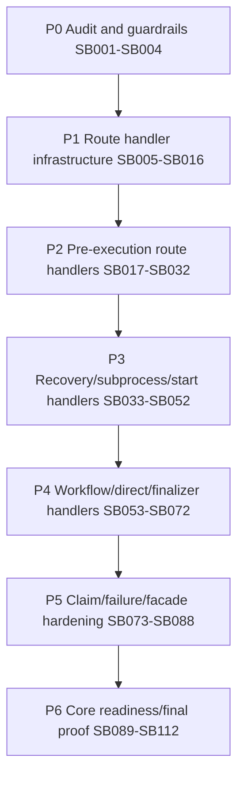

# Phase Plan

## Execution Order

Execute subbundles in numeric order from `SB001` through `SB112`.

Do not continue past a critical gate until its entry gate, closure gate, source scan, test proof and proof manifest pass.

## Phase Summary

| Phase | Subbundles |
| --- | --- |
| P0 - Audit and guardrails | SB001-SB004 |
| P1 - Route handler infrastructure | SB005-SB016 |
| P2 - Pre-execution route handlers | SB017-SB032 |
| P3 - Recovery, subprocess, and start-transition handlers | SB033-SB052 |
| P4 - Workflow/direct-agent/finalizer handlers | SB053-SB072 |
| P5 - Claim, failure closure, and route facade hardening | SB073-SB088 |
| P6 - Core readiness, driver readiness, and final proof | SB089-SB112 |

## Subbundle Dependency Map

## Critical Subbundles

- `SB004`
- `SB008`
- `SB016`
- `SB024`
- `SB028`
- `SB032`
- `SB044`
- `SB048`
- `SB052`
- `SB064`
- `SB068`
- `SB072`
- `SB078`
- `SB084`
- `SB088`
- `SB092`
- `SB096`
- `SB104`
- `SB112`

## Phase Gates

- Each critical gate must create `proof/<SB>/manifest.md`.
- Each critical gate must create `proof/<SB>/semantic-invariants.md`.
- Each critical gate must run source scans for:
  - Process Core
  - production driver API
  - UI/mobile/browser proof drift
  - route order drift
  - stubs/TODO/NotImplemented
- Final report must have explicit rows for all SB001-SB112; do not collapse them.
