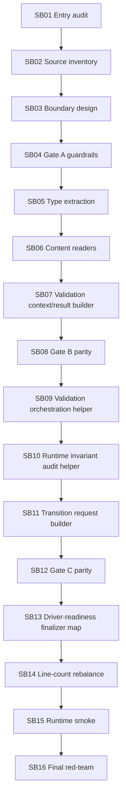

# Phase Plan

## Execution Order

- SB01: `subbundles/01-01-entry-audit-and-current-boundary-smoke`
- SB02: `subbundles/02-02-step-finalizer-source-inventory`
- SB03: `subbundles/03-03-finalizer-boundary-design-and-cutline`
- SB04: `subbundles/04-04-refactor-gate-a-architecture-guardrails`
- SB05: `subbundles/05-05-finalizer-type-snapshot-extraction`
- SB06: `subbundles/06-06-artifact-content-reader-extraction`
- SB07: `subbundles/07-07-validation-context-and-result-builder`
- SB08: `subbundles/08-08-refactor-gate-b-type-reader-parity`
- SB09: `subbundles/09-09-artifact-validation-orchestration-helper`
- SB10: `subbundles/10-10-runtime-invariant-audit-helper`
- SB11: `subbundles/11-11-step-transition-request-builder`
- SB12: `subbundles/12-12-refactor-gate-c-finalizer-parity`
- SB13: `subbundles/13-13-driver-readiness-finalizer-map`
- SB14: `subbundles/14-14-line-count-and-hotspot-rebalance`
- SB15: `subbundles/15-15-runtime-smoke-and-large-screen-policy-check`
- SB16: `subbundles/16-16-final-red-team-and-next-cutline`

## Subbundle Dependency Map

## Critical Subbundles

- SB02: wrong inventory invalidates all later extraction.
- SB04: guardrails must pass before production movement.
- SB06: content reader extraction is high risk because it touches file/storage fallback diagnostics.
- SB08: parity gate before orchestration extraction.
- SB10: invariant audit extraction is high risk because it can block completed runs.
- SB12: finalizer parity gate before driver-readiness mapping.
- SB16: final red-team decides whether next work can approach Core or must continue local seams.

## Phase Gates

- Gate A after SB04 must prove no Process Core/driver/API, no MAF dependency broadening, no prohibited viewport proof, and architecture tests exist.
- Gate B after SB08 must prove finalizer type and content-reader parity with focused tests and build.
- Gate C after SB12 must prove validation orchestration, invariant audit, and transition request builder parity.
- Final Gate after SB16 must prove final build, no hidden dependencies, no stubs, no scope creep, and clear next cutline.

### Gate A after SB04

Must prove no Process Core/driver/API, no MAF dependency broadening, no prohibited viewport proof, and architecture tests exist.

### Gate B after SB08

Must prove finalizer type and content-reader parity with focused tests and build.

### Gate C after SB12

Must prove validation orchestration, invariant audit, and transition request builder parity.

### Final Gate after SB16

Must prove final build, no hidden dependencies, no stubs, no scope creep, and clear next cutline.
