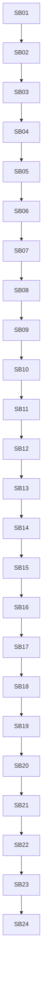

# Phase Plan

## Subbundle Dependency Map

## Critical Subbundles

- SB04: Architecture guardrails before movement.
- SB08: Lifecycle parity gate before projection movement.
- SB16: Artifact projection parity gate.
- SB19: Dispatch facade parity gate.
- SB23: Line-count and boundary review.
- SB24: Final red-team and next cutline.

## Phase Gates

Each gate must prove build/test/source scans and explicitly decide whether downstream work may continue. A failed gate reopens the last production movement subbundle.
