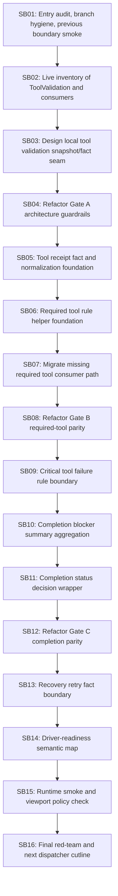

# Phase Plan

## Phase Sequence

1. SB01 - Entry audit, branch hygiene, previous boundary smoke.
2. SB02 - Live inventory of ToolValidation and consumers.
3. SB03 - Design local tool validation snapshot/fact seam.
4. SB04 - Refactor Gate A architecture guardrails.
5. SB05 - Tool receipt fact and normalization foundation.
6. SB06 - Required tool rule helper foundation.
7. SB07 - Migrate missing required tool consumer path.
8. SB08 - Refactor Gate B required-tool parity.
9. SB09 - Critical tool failure rule boundary.
10. SB10 - Completion blocker summary aggregation.
11. SB11 - Completion status decision wrapper.
12. SB12 - Refactor Gate C completion parity.
13. SB13 - Recovery retry fact boundary.
14. SB14 - Driver-readiness semantic map.
15. SB15 - Runtime smoke and viewport policy check.
16. SB16 - Final red-team and next dispatcher cutline.

## Subbundle Dependency Map

## Critical Subbundles

- SB03: establishes the seam design; downstream migration depends on its boundary.
- SB04: Gate A guardrails before production movement.
- SB07: first required-tool migration; high risk for behavior drift.
- SB08: Gate B required-tool parity.
- SB11: completion status decision wrapper; high risk for step closure semantics.
- SB12: Gate C completion parity.
- SB13: recovery retry fact boundary; high risk for retry/rework behavior.
- SB16: final red-team and next cutline.

## Phase Gates

### Gate A after SB04

Must pass before production movement:
- no Process Core or driver-pack production files,
- helper purity architecture tests,
- no MAF/Tooling product dependency regression,
- live inventory complete,
- no prohibited viewport proof artifacts.

### Gate B after SB08

Must pass before critical-failure or completion-status movement:
- required-tool parity tests,
- process mock/carry-forward/dotnet scaffold/browser metadata cases,
- line-count review,
- full build or documented focused build + final full build.

### Gate C after SB12

Must pass before recovery/retry movement:
- completion status/reason parity,
- declared outcome and blocker summary tests,
- critical failure parity,
- no dependency broadening.

### Final Gate after SB16

Must pass:
- focused tests,
- full build,
- source scans,
- completed-stage bundle validator,
- raw note closure,
- driver-readiness map complete,
- next safe cutline recorded.
