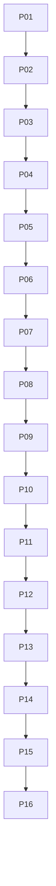

# Phase Plan

## Execution Order
This bundle intentionally uses broader phases rather than micro-subbundles. Each phase owns a coherent architectural slice and each third subbundle is a critical gate.

| Phase | Theme | Subbundles |
| --- | --- | --- |
| P01 | Baseline, current proof review, and active guardrails | SB001, SB002, SB003 |
| P02 | Alpha verifier parser and fixture hardening | SB004, SB005, SB006 |
| P03 | Contract/API compatibility and diagnostic stability | SB007, SB008, SB009 |
| P04 | Process module read-only adapter boundary | SB010, SB011, SB012 |
| P05 | Evidence payload resolution and hash policy | SB013, SB014, SB015 |
| P06 | Verification observation envelope and process-owned diagnostics | SB016, SB017, SB018 |
| P07 | Audit, redaction, no-mutation, and denial behavior | SB019, SB020, SB021 |
| P08 | Process workflow/evidence consumer rehearsal without runtime hooks | SB022, SB023, SB024 |
| P09 | Core descriptor compatibility and consumer allow-list hardening | SB025, SB026, SB027 |
| P10 | .NET/Rust transcript coverage expansion | SB028, SB029, SB030 |
| P11 | Runtime evidence consistency verifier proposal | SB031, SB032, SB033 |
| P12 | Office and business-analysis denial hardening | SB034, SB035, SB036 |
| P13 | Runtime host and registry roadmap with explicit deferral | SB037, SB038, SB039 |
| P14 | Documentation, migration guide, and release gate consolidation | SB040, SB041, SB042 |
| P15 | Broad smoke, red-team, and completed closure | SB043, SB044, SB045 |
| P16 | Next-bundle decision toward production controlled adapter release | SB046, SB047, SB048 |

## Subbundle Dependency Map

## Critical Subbundles
- `SB003` — Gate A baseline closure
- `SB006` — Gate B parser parity
- `SB009` — Gate C contract/API stability
- `SB012` — Gate D adapter boundary
- `SB015` — Gate E evidence/hash policy
- `SB018` — Gate F observation parity
- `SB021` — Gate G audit/redaction/no-mutation
- `SB024` — Gate H consumer rehearsal
- `SB027` — Gate I Core compatibility
- `SB030` — Gate J domain fixture coverage
- `SB033` — Gate K runtime evidence proposal closure
- `SB036` — Gate L Office/business denial closure
- `SB039` — Gate M runtime deferral
- `SB042` — Gate N docs/release closure
- `SB045` — Completed validator and handoff
- `SB048` — Gate O next-bundle decision

## Phase Gates
- Every critical gate must include failing-first evidence where production behavior or safety policy can regress.
- Every critical gate must include build/test/source-scan proof suitable for downstream phases.
- Downstream phases must stop if forbidden runtime hooks, mutation APIs, or Core reverse dependencies appear.
- Runtime/service-only changes must keep browser validation `N/A` and prove no UI/media drift.

## Browser Validation Logging
Browser validation is `N/A` for all subbundles unless UI/media files are unexpectedly changed. If UI/media files change, fail the bundle and re-scope rather than adding mobile/small/medium proof.
