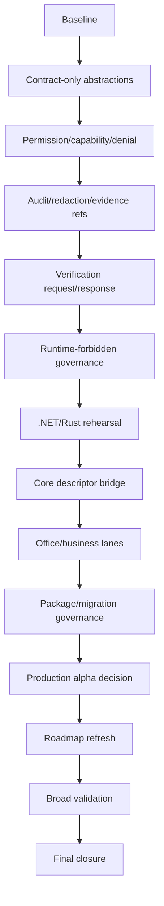

# Phase Plan

## Subbundle Dependency Map

## Phase Breakdown
### P01 — Baseline and active guardrails
- **SB001**: Current branch proof intake and preflight
- **SB002**: Existing Core/driver prerequisite proof revalidation
- **SB003**: Gate A: no broad Core/runtime drift baseline
### P02 — Contract-only driver abstractions project
- **SB004**: Create CanDoItAll.Processes.Drivers.Abstractions project
- **SB005**: Define approved public contract surface inventory
- **SB006**: Gate B: contract-only project dependency and solution proof
### P03 — Permission, capability, and denial model
- **SB007**: Define permission modes and capability scope value models
- **SB008**: Define denial reasons and unsupported-operation results
- **SB009**: Gate C: permission and denial semantics proof
### P04 — Audit facts, redaction, and evidence references
- **SB010**: Define audit fact read models and redaction descriptors
- **SB011**: Define evidence reference and transcript reference descriptors
- **SB012**: Gate D: audit/redaction/evidence immutability proof
### P05 — Verification-only request/response contracts
- **SB013**: Define verification-only request and response contracts
- **SB014**: Define diagnostic severity/category/readonly result shape
- **SB015**: Gate E: verification contracts cannot mutate state
### P06 — Driver contract governance and forbidden runtime surfaces
- **SB016**: Update architecture tests for approved Abstractions-only driver API
- **SB017**: Reject registry, DI registration, runtime selector, manager command
- **SB018**: Gate F: production runtime remains absent
### P07 — .NET/Rust transcript verifier alpha rehearsal
- **SB019**: Add test-only .NET/Rust transcript fixture inventory
- **SB020**: Add test-only transcript diagnostic classification harness
- **SB021**: Gate G: alpha rehearsal stays readonly and non-runtime
### P08 — Core descriptor bridge and driver evidence vocabulary
- **SB022**: Map Core execution/finalizer/retry/projection descriptors to driver evidence refs
- **SB023**: Define descriptor compatibility and version metadata
- **SB024**: Gate H: driver evidence reads Core descriptors without runtime ownership
### P09 — Office and business-analysis lane hardening
- **SB025**: Strengthen Office read-only lane denial tests
- **SB026**: Strengthen business-analysis read-only lane denial tests
- **SB027**: Gate I: non-.NET lanes remain readonly and deferred
### P10 — Package, namespace, and migration governance
- **SB028**: Create package/namespace naming and versioning policy
- **SB029**: Create migration guide for future verification-only drivers
- **SB030**: Gate J: compatibility docs and API snapshot proof
### P11 — Production alpha decision gate
- **SB031**: Evaluate whether first verification-only production alpha is approved
- **SB032**: Define next alpha implementation boundary if approved
- **SB033**: Gate K: no alpha runtime unless explicit decision is positive
### P12 — Stable Core and driver roadmap refresh
- **SB034**: Refresh stable Core roadmap after contract project
- **SB035**: Refresh domain driver roadmap and release gates
- **SB036**: Gate L: roadmap consistency proof
### P13 — Broad validation and red-team
- **SB037**: Run solution build, full unit, focused integration, source scans
- **SB038**: Architect/QA/security red-team review
- **SB039**: Gate M: broad smoke and no-runtime closure
### P14 — Final closure and handoff
- **SB040**: Complete proof index and execution report
- **SB041**: Run prepared and completed validators
- **SB042**: Gate N: final handoff and next bundle decision

## Critical Subbundles
- SB003, SB006, SB009, SB012, SB015, SB018, SB021, SB024, SB027, SB030, SB033, SB036, SB039, SB042.

## Phase Gates
Every critical gate must prove:
- prior phase proof is not stale
- build/test/source scans are green
- no broad Core runtime extraction
- no forbidden production driver runtime
- no UI/media drift
- no stub or placeholder implementation
- execution report rows remain separate
