# Phase Plan

## Execution Order

- Execute SB001 through SB039 in numeric order.
- Stop after every critical gate until its proof manifest, semantic invariants, tests, scans, and execution-report rows pass closure.
- Reopen the earliest failed prerequisite if a downstream phase weakens permission, audit, sandbox, Core boundary, or no-production-driver assumptions.

## Subbundle Dependency Map

```mermaid
graph TD
    SB001 --> SB002
    SB002 --> SB003
    SB003 --> SB004
    SB004 --> SB005
    SB005 --> SB006
    SB006 --> SB007
    SB007 --> SB008
    SB008 --> SB009
    SB009 --> SB010
    SB010 --> SB011
    SB011 --> SB012
    SB012 --> SB013
    SB013 --> SB014
    SB014 --> SB015
    SB015 --> SB016
    SB016 --> SB017
    SB017 --> SB018
    SB018 --> SB019
    SB019 --> SB020
    SB020 --> SB021
    SB021 --> SB022
    SB022 --> SB023
    SB023 --> SB024
    SB024 --> SB025
    SB025 --> SB026
    SB026 --> SB027
    SB027 --> SB028
    SB028 --> SB029
    SB029 --> SB030
    SB030 --> SB031
    SB031 --> SB032
    SB032 --> SB033
    SB033 --> SB034
    SB034 --> SB035
    SB035 --> SB036
    SB036 --> SB037
    SB037 --> SB038
    SB038 --> SB039
```

## Phases

### P01: Baseline, active proof intake, and no-regression guardrails
- **SB001 — Current branch and proof intake:** Verify the latest maf-processes-refactor branch, last bundle proof, changed Core/API surface, warning status, and driver decision docs before any implementation.
- **SB002 — Active architecture guard baseline:** Add or refresh architecture tests that lock no broad Core runtime extraction, no production driver API, no UI/media drift, and no collapsed execution-report rows for this bundle.
- **SB003 — Gate A: baseline closure:** Run build/full unit/focused process tests and source scans before downstream phases can start.

### P02: Core API stability and descriptor governance
- **SB004 — Core public API snapshot refresh:** Inventory every public Core type/member and classify as stable, provisional, or candidate-to-split.
- **SB005 — Descriptor versioning and compatibility policy:** Define explicit v1 compatibility rules for Core descriptors, enum additions, deprecations, and API owner review.
- **SB006 — Gate B: Core API governance:** Prove public Core API guard, no forbidden dependency drift, and compatibility docs/tests are current.

### P03: Driver permission model as executable prerequisites
- **SB007 — Permission mode facts and denial matrix:** Convert VerificationOnly, ManagerReadonly, and ExecutionCapableFuture mode semantics into executable tests and docs-only read models.
- **SB008 — Capability scope and lane ownership matrix:** Define capability scopes for route, artifact, runtime verification, .NET/Rust, Office, and business-analysis lanes with denied side effects.
- **SB009 — Gate C: permission/capability closure:** Prove missing mode is denied, verification-only is read-only, manager-readonly cannot mutate, and execution-capable remains disabled.

### P04: Audit facts, redaction, and evidence traceability
- **SB010 — Audit fact schema proposal:** Define audit fact shape: caller, mode, lane, process/run/step/artifact ids, input evidence ids, denial reason, output hash, and redaction status.
- **SB011 — Secret masking and sensitive field policy:** Define and test redaction rules for tokens, connection strings, env vars, emails where needed, and unrelated user content.
- **SB012 — Gate D: audit/redaction closure:** Prove audit/read-only diagnostics cannot expose secrets and cannot record mutable side effects.

### P05: Sandbox and command policy denial
- **SB013 — Command policy allow/deny model:** Define docs/test-only command policy: no shell execution, no Graph/Office calls, no workspace/storage writes, no process mutation for current bundle.
- **SB014 — Sandbox boundary requirements:** Define future sandbox prerequisites: working directory, timeout, captured output hash, network policy, file-system policy, and failure semantics.
- **SB015 — Gate E: sandbox/command denial:** Prove no production command executor, shell helper, Office connector runtime, or sandbox runtime is introduced.

### P06: Verification-only contract rehearsal without production runtime
- **SB016 — Verification evidence request/response rehearsal:** Create test-only/readme contract shape for verification-only requests and results, using existing Core descriptors as inputs.
- **SB017 — Driver denial and unsupported operation results:** Define consistent denial result shape for unsupported mutation, missing permission, unsupported lane, unsafe command, and missing evidence.
- **SB018 — Gate F: verification rehearsal closure:** Prove the rehearsal stays test/docs-only and does not create runtime driver interfaces, registry, DI registration, manager command, or selectors.

### P07: .NET/Rust transcript verifier alpha preparation
- **SB019 — .NET/Rust evidence fixture inventory:** Inventory current build/test/proof transcript shapes that a future verification-only .NET/Rust driver may inspect.
- **SB020 — Transcript normalization and diagnostic taxonomy:** Define read-only taxonomy for build warnings/errors, test failures, missing artifacts, unsupported target framework, and runtime proof gaps.
- **SB021 — Gate G: .NET/Rust verifier readiness:** Prove the alpha lane only inspects existing transcripts and cannot execute dotnet, shell, package restore, file writes, or process transitions.

### P08: Core evidence descriptor consumer hardening
- **SB022 — Execution/finalizer descriptor consumer map:** Update adapter ownership map for execution/finalizer descriptors and ensure only explicit module adapters consume Core descriptors.
- **SB023 — Projection/validation descriptor consumer map:** Update projection/validation descriptor adapter map and keep storage/workspace/browser probing module-local.
- **SB024 — Gate H: descriptor consumer boundary:** Prove Core consumers are allow-listed and no side-effect dispatch files import Core by broad/global using.

### P09: Office and business-analysis read-only lane hardening
- **SB025 — Office evidence lane denial tests:** Define Office lane as read-only over already-produced evidence; reject Graph calls, email mutation, category changes, task creation, and document writes.
- **SB026 — Business-analysis evidence lane denial tests:** Define business-analysis lane as read-only over process artifacts and proofs; reject CRM/business-record mutation and hidden task creation.
- **SB027 — Gate I: Office/business lane closure:** Prove domain lane docs/tests deny all side effects and remain non-production.

### P10: Production driver contract decision gate
- **SB028 — Production API readiness checklist:** Evaluate if permission, audit, sandbox, lane ownership, negative tests, and Core descriptor stability are sufficient for a production contract project.
- **SB029 — Decision: first production contract or defer:** Record explicit decision. If not ready, list blockers. If ready, propose a separate next bundle for contract-only production API.
- **SB030 — Gate J: driver decision closure:** Prove no production driver API was introduced in this bundle and the decision cannot be ambiguous.

### P11: Core documentation, package hygiene, and compatibility roadmap
- **SB031 — Core package and API documentation:** Document current Core namespaces, public descriptors, extension rules, and forbidden dependencies for future contributors.
- **SB032 — Compatibility and migration guide:** Write migration notes for route/subprocess/artifact/execution/finalizer descriptor consumers and adapter ownership.
- **SB033 — Gate K: Core docs and compatibility closure:** Prove docs match current public API snapshot and no docs claim broader runtime ownership than code permits.

### P12: Long-range roadmap to stable Core + domain drivers
- **SB034 — Roadmap: stable Core phases:** Define next phases after this bundle: production driver contracts, first verification-only alpha, Office/business lanes, audited execution-capable future.
- **SB035 — Roadmap: domain driver release gates:** Define release gates for .NET/Rust, Office, business-analysis, runtime verification, and future execution-capable drivers.
- **SB036 — Gate L: roadmap closure:** Prove roadmap is consistent with Core/API/driver decisions and contains no production runtime implementation instructions.

### P13: Broad smoke, red-team, and completed-stage closure
- **SB037 — Broad validation matrix:** Run solution build, full unit tests, focused integration matrix, architecture tests, no-Core-broad/no-driver-runtime/no-UI/no-stub scans.
- **SB038 — Architect/QA/red-team review:** Perform senior architecture review focused on fake proof, hidden side effects, Core public surface drift, and driver permission loopholes.
- **SB039 — Final closure and next bundle handoff:** Run prepared/completed validators, update execution report, raw note closure, proof index, and next-bundle decision.

## Critical Subbundles

Critical gates:
- SB003 baseline closure
- SB006 Core API governance
- SB009 permission/capability closure
- SB012 audit/redaction closure
- SB015 sandbox/command denial
- SB018 verification rehearsal closure
- SB021 .NET/Rust verifier readiness
- SB024 descriptor consumer boundary
- SB027 Office/business lane closure
- SB030 driver decision closure
- SB033 Core docs closure
- SB036 roadmap closure
- SB039 final closure

## Phase Gates

- Each critical gate must pass before downstream implementation starts.
- If a critical gate fails, downstream proof is invalid and execution must return to the failed phase.
- Every critical gate requires artifact-backed proof under `proof/SBxx/`, semantic invariants, source assertions, anti-stub audit, and execution-report gate rows.
