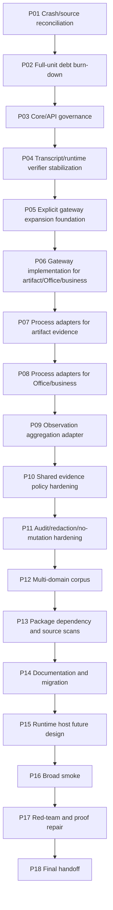

# Phase Plan

## Execution Order

1. P01 Crash/source reconciliation: SB001-SB003
2. P02 Full-unit debt burn-down: SB004-SB006
3. P03 Core/API governance: SB007-SB009
4. P04 Transcript/runtime verifier stabilization: SB010-SB012
5. P05 Explicit gateway expansion foundation: SB013-SB015
6. P06 Gateway implementation for artifact/Office/business: SB016-SB018
7. P07 Process adapters for artifact evidence: SB019-SB021
8. P08 Process adapters for Office/business: SB022-SB024
9. P09 Observation aggregation adapter: SB025-SB027
10. P10 Shared evidence policy hardening: SB028-SB030
11. P11 Audit/redaction/no-mutation hardening: SB031-SB033
12. P12 Multi-domain corpus: SB034-SB036
13. P13 Package dependency and source scans: SB037-SB039
14. P14 Documentation and migration: SB040-SB042
15. P15 Runtime host future design: SB043-SB045
16. P16 Broad smoke: SB046-SB048
17. P17 Red-team and proof repair: SB049-SB051
18. P18 Final handoff: SB052-SB054

## Subbundle Dependency Map

## Critical Subbundles

- SB003: SB003 Gate A source-backed baseline
- SB006: SB006 Gate B full-unit debt closure
- SB009: SB009 Gate C Core/contract dependency guard
- SB012: SB012 Gate D existing verifier stabilization
- SB015: SB015 Gate E no generic runtime host proof
- SB018: SB018 Gate F gateway multi-domain behavior
- SB021: SB021 Gate G artifact adapter no-mutation proof
- SB024: SB024 Gate H Office/business adapter denial proof
- SB027: SB027 Gate I aggregation no-persistence proof
- SB030: SB030 Gate J URI/hash/size policy proof
- SB033: SB033 Gate K audit/redaction proof
- SB036: SB036 Gate L corpus semantic adequacy
- SB039: SB039 Gate M package/source boundary proof
- SB042: SB042 Gate N docs/no-approval proof
- SB045: SB045 Gate O runtime host still deferred
- SB048: SB048 Gate P broad smoke closure
- SB051: SB051 Gate Q proof integrity closure
- SB054: SB054 Gate R zip/handoff closure

## Phase Gates

Every third subbundle is a critical gate and must include artifact-backed proof manifest, semantic-invariants file, changed-file hashes, command transcripts, source assertions, anti-stub audit, and red-team/adversarial negative proof.
