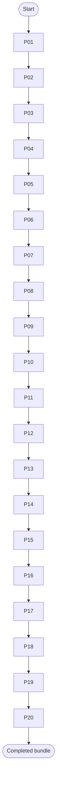

# Phase Plan

## Execution Order

- P01: Crash recovery, source/proof reconciliation, and baseline (SB001, SB002, SB003)
- P02: Full-unit debt and architecture fixture modernization (SB004, SB005, SB006)
- P03: Core and driver public API governance (SB007, SB008, SB009)
- P04: Transcript verifier internal decomposition and security hardening (SB010, SB011, SB012)
- P05: Runtime evidence verifier hardening (SB013, SB014, SB015)
- P06: Shared verification test harness (SB016, SB017, SB018)
- P07: Controlled process verification gateway boundary (SB019, SB020, SB021)
- P08: Evidence content boundary and supplied-payload policy (SB022, SB023, SB024)
- P09: Audit fact lifecycle and redaction policy (SB025, SB026, SB027)
- P10: Office evidence read-only alpha (SB028, SB029, SB030)
- P11: Business-analysis evidence read-only alpha (SB031, SB032, SB033)
- P12: Process artifact evidence verifier alpha (SB034, SB035, SB036)
- P13: Process module observation aggregation (SB037, SB038, SB039)
- P14: Core descriptor and driver compatibility tests (SB040, SB041, SB042)
- P15: Domain verifier corpus and adversarial testing (SB043, SB044, SB045)
- P16: Runtime host roadmap without implementation (SB046, SB047, SB048)
- P17: Release packaging and source-scoped validation (SB049, SB050, SB051)
- P18: Bundle skill compliance and proof hardening (SB052, SB053, SB054)
- P19: Stable Core and driver release roadmap (SB055, SB056, SB057)
- P20: Final decision and next work handoff (SB058, SB059, SB060)

## Subbundle Dependency Map

## Critical Subbundles

- SB003, SB006, SB009, SB012, SB015, SB018, SB021, SB024, SB027, SB030, SB033, SB036, SB039, SB042, SB045, SB048, SB051, SB054, SB057, SB060

## Phase Gates

- Every third subbundle is a phase gate. Downstream phases must not start until the gate passes build/test/source-scan proof and semantic adequacy proof.
- If any earlier gate fails later, reopen dependent downstream phases.
