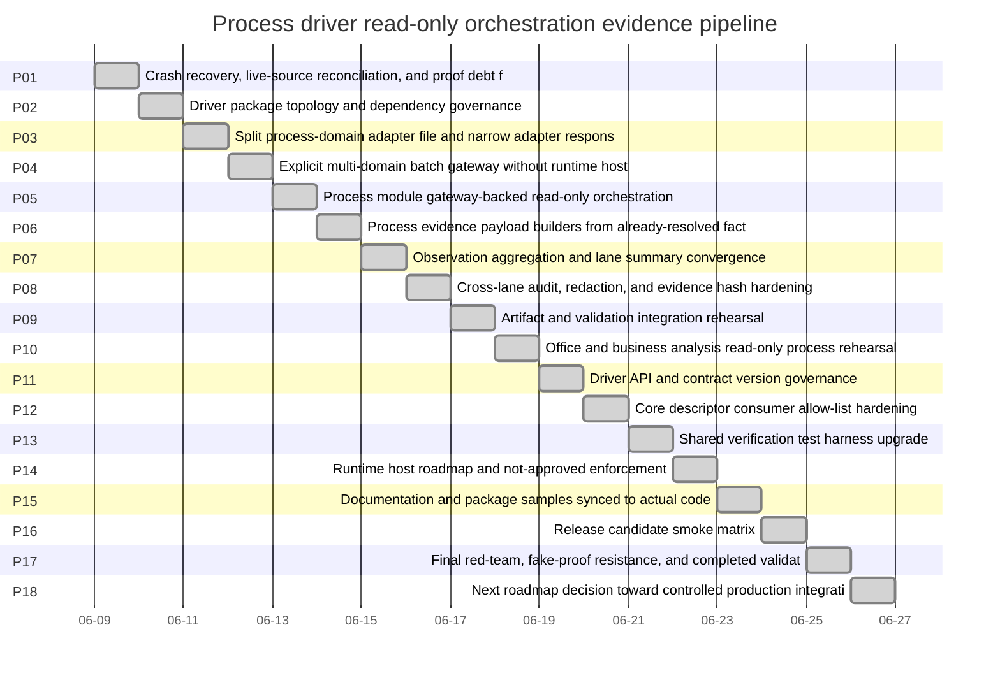

# Phase Plan

## Subbundle Dependency Map

## Phase Gates

- **P01 / Crash recovery, live-source reconciliation, and proof debt freeze** closes at **SB003**. Downstream phases must not proceed if this gate fails.
- **P02 / Driver package topology and dependency governance** closes at **SB006**. Downstream phases must not proceed if this gate fails.
- **P03 / Split process-domain adapter file and narrow adapter responsibilities** closes at **SB009**. Downstream phases must not proceed if this gate fails.
- **P04 / Explicit multi-domain batch gateway without runtime host** closes at **SB012**. Downstream phases must not proceed if this gate fails.
- **P05 / Process module gateway-backed read-only orchestration** closes at **SB015**. Downstream phases must not proceed if this gate fails.
- **P06 / Process evidence payload builders from already-resolved facts only** closes at **SB018**. Downstream phases must not proceed if this gate fails.
- **P07 / Observation aggregation and lane summary convergence** closes at **SB021**. Downstream phases must not proceed if this gate fails.
- **P08 / Cross-lane audit, redaction, and evidence hash hardening** closes at **SB024**. Downstream phases must not proceed if this gate fails.
- **P09 / Artifact and validation integration rehearsal** closes at **SB027**. Downstream phases must not proceed if this gate fails.
- **P10 / Office and business analysis read-only process rehearsal** closes at **SB030**. Downstream phases must not proceed if this gate fails.
- **P11 / Driver API and contract version governance** closes at **SB033**. Downstream phases must not proceed if this gate fails.
- **P12 / Core descriptor consumer allow-list hardening** closes at **SB036**. Downstream phases must not proceed if this gate fails.
- **P13 / Shared verification test harness upgrade** closes at **SB039**. Downstream phases must not proceed if this gate fails.
- **P14 / Runtime host roadmap and not-approved enforcement** closes at **SB042**. Downstream phases must not proceed if this gate fails.
- **P15 / Documentation and package samples synced to actual code** closes at **SB045**. Downstream phases must not proceed if this gate fails.
- **P16 / Release candidate smoke matrix** closes at **SB048**. Downstream phases must not proceed if this gate fails.
- **P17 / Final red-team, fake-proof resistance, and completed validator** closes at **SB051**. Downstream phases must not proceed if this gate fails.
- **P18 / Next roadmap decision toward controlled production integration** closes at **SB054**. Downstream phases must not proceed if this gate fails.

## Critical Subbundles

- **SB003**: Gate A baseline closure (P01)
- **SB006**: Gate B package topology closure (P02)
- **SB009**: Gate C adapter decomposition closure (P03)
- **SB012**: Gate D batch gateway no-generic-dispatch closure (P04)
- **SB015**: Gate E process orchestration no-runtime closure (P05)
- **SB018**: Gate F payload builder no-file-storage closure (P06)
- **SB021**: Gate G aggregation parity and immutability closure (P07)
- **SB024**: Gate H no-secret/no-mutation/no-mismatch closure (P08)
- **SB027**: Gate I artifact evidence integration closure (P09)
- **SB030**: Gate J Office/business no-external-call closure (P10)
- **SB033**: Gate K API compatibility closure (P11)
- **SB036**: Gate L Core/driver boundary closure (P12)
- **SB039**: Gate M harness semantic adequacy closure (P13)
- **SB042**: Gate N runtime-host denial closure (P14)
- **SB045**: Gate O docs/code parity closure (P15)
- **SB048**: Gate P release-candidate closure (P16)
- **SB051**: Gate Q final validation closure (P17)
- **SB054**: Gate R handoff and zip generation closure (P18)
