# Phase Plan

## Execution Order

- **P01 — Crash Recovery, Source/Proof Reconciliation**
- **P02 — Transcript Verifier Decomposition**
- **P03 — Driver Abstraction Compatibility And Versioning**
- **P04 — Process Transcript Adapter Decomposition**
- **P05 — Evidence URI/Hash Policy Hardening**
- **P06 — Audit, Redaction, And No-Mutation Hardening**
- **P07 — Runtime Evidence Verifier Package Boundary**
- **P08 — Runtime Evidence Consistency Rules**
- **P09 — Runtime Evidence Response/Audit Integration**
- **P10 — Process Runtime Evidence Read-Only Adapter**
- **P11 — Core Descriptor Consumer Boundary**
- **P12 — Malicious Transcript And Descriptor Corpus**
- **P13 — Office/Business Read-Only Denial Hardening**
- **P14 — Shared Verification Test Harness**
- **P15 — Runtime Host Roadmap Without Implementation**
- **P16 — Docs, Package READMEs, Migration Notes**
- **P17 — Broad Smoke Matrix And Red-Team Proof**
- **P18 — Final Decision And Next-Bundle Handoff**

## Subbundle Dependency Map

```mermaid
graph TD
  SB001[SB001 Crash Recovery, Source/Proof Reconciliation] --> SB002[SB002]
  SB002 --> SB003[SB003 Gate]
  SB003 --> SB004
  SB004[SB004 Transcript Verifier Decomposition] --> SB005[SB005]
  SB005 --> SB006[SB006 Gate]
  SB006 --> SB007
  SB007[SB007 Driver Abstraction Compatibility And Versioning] --> SB008[SB008]
  SB008 --> SB009[SB009 Gate]
  SB009 --> SB010
  SB010[SB010 Process Transcript Adapter Decomposition] --> SB011[SB011]
  SB011 --> SB012[SB012 Gate]
  SB012 --> SB013
  SB013[SB013 Evidence URI/Hash Policy Hardening] --> SB014[SB014]
  SB014 --> SB015[SB015 Gate]
  SB015 --> SB016
  SB016[SB016 Audit, Redaction, And No-Mutation Hardening] --> SB017[SB017]
  SB017 --> SB018[SB018 Gate]
  SB018 --> SB019
  SB019[SB019 Runtime Evidence Verifier Package Boundary] --> SB020[SB020]
  SB020 --> SB021[SB021 Gate]
  SB021 --> SB022
  SB022[SB022 Runtime Evidence Consistency Rules] --> SB023[SB023]
  SB023 --> SB024[SB024 Gate]
  SB024 --> SB025
  SB025[SB025 Runtime Evidence Response/Audit Integration] --> SB026[SB026]
  SB026 --> SB027[SB027 Gate]
  SB027 --> SB028
  SB028[SB028 Process Runtime Evidence Read-Only Adapter] --> SB029[SB029]
  SB029 --> SB030[SB030 Gate]
  SB030 --> SB031
  SB031[SB031 Core Descriptor Consumer Boundary] --> SB032[SB032]
  SB032 --> SB033[SB033 Gate]
  SB033 --> SB034
  SB034[SB034 Malicious Transcript And Descriptor Corpus] --> SB035[SB035]
  SB035 --> SB036[SB036 Gate]
  SB036 --> SB037
  SB037[SB037 Office/Business Read-Only Denial Hardening] --> SB038[SB038]
  SB038 --> SB039[SB039 Gate]
  SB039 --> SB040
  SB040[SB040 Shared Verification Test Harness] --> SB041[SB041]
  SB041 --> SB042[SB042 Gate]
  SB042 --> SB043
  SB043[SB043 Runtime Host Roadmap Without Implementation] --> SB044[SB044]
  SB044 --> SB045[SB045 Gate]
  SB045 --> SB046
  SB046[SB046 Docs, Package READMEs, Migration Notes] --> SB047[SB047]
  SB047 --> SB048[SB048 Gate]
  SB048 --> SB049
  SB049[SB049 Broad Smoke Matrix And Red-Team Proof] --> SB050[SB050]
  SB050 --> SB051[SB051 Gate]
  SB051 --> SB052
  SB052[SB052 Final Decision And Next-Bundle Handoff] --> SB053[SB053]
  SB053 --> SB054[SB054 Gate]
```

## Critical Subbundles

- `SB003`: critical phase gate; must include semantic adequacy proof, manifest, source assertions, changed-file hashes, anti-stub audit, and failing-first or adversarial negative proof.
- `SB006`: critical phase gate; must include semantic adequacy proof, manifest, source assertions, changed-file hashes, anti-stub audit, and failing-first or adversarial negative proof.
- `SB009`: critical phase gate; must include semantic adequacy proof, manifest, source assertions, changed-file hashes, anti-stub audit, and failing-first or adversarial negative proof.
- `SB012`: critical phase gate; must include semantic adequacy proof, manifest, source assertions, changed-file hashes, anti-stub audit, and failing-first or adversarial negative proof.
- `SB015`: critical phase gate; must include semantic adequacy proof, manifest, source assertions, changed-file hashes, anti-stub audit, and failing-first or adversarial negative proof.
- `SB018`: critical phase gate; must include semantic adequacy proof, manifest, source assertions, changed-file hashes, anti-stub audit, and failing-first or adversarial negative proof.
- `SB021`: critical phase gate; must include semantic adequacy proof, manifest, source assertions, changed-file hashes, anti-stub audit, and failing-first or adversarial negative proof.
- `SB024`: critical phase gate; must include semantic adequacy proof, manifest, source assertions, changed-file hashes, anti-stub audit, and failing-first or adversarial negative proof.
- `SB027`: critical phase gate; must include semantic adequacy proof, manifest, source assertions, changed-file hashes, anti-stub audit, and failing-first or adversarial negative proof.
- `SB030`: critical phase gate; must include semantic adequacy proof, manifest, source assertions, changed-file hashes, anti-stub audit, and failing-first or adversarial negative proof.
- `SB033`: critical phase gate; must include semantic adequacy proof, manifest, source assertions, changed-file hashes, anti-stub audit, and failing-first or adversarial negative proof.
- `SB036`: critical phase gate; must include semantic adequacy proof, manifest, source assertions, changed-file hashes, anti-stub audit, and failing-first or adversarial negative proof.
- `SB039`: critical phase gate; must include semantic adequacy proof, manifest, source assertions, changed-file hashes, anti-stub audit, and failing-first or adversarial negative proof.
- `SB042`: critical phase gate; must include semantic adequacy proof, manifest, source assertions, changed-file hashes, anti-stub audit, and failing-first or adversarial negative proof.
- `SB045`: critical phase gate; must include semantic adequacy proof, manifest, source assertions, changed-file hashes, anti-stub audit, and failing-first or adversarial negative proof.
- `SB048`: critical phase gate; must include semantic adequacy proof, manifest, source assertions, changed-file hashes, anti-stub audit, and failing-first or adversarial negative proof.
- `SB051`: critical phase gate; must include semantic adequacy proof, manifest, source assertions, changed-file hashes, anti-stub audit, and failing-first or adversarial negative proof.
- `SB054`: critical phase gate; must include semantic adequacy proof, manifest, source assertions, changed-file hashes, anti-stub audit, and failing-first or adversarial negative proof.

## Phase Gates

Every third subbundle is a phase gate. Downstream phases must not start until the gate is green. Reopen downstream phases if an earlier gate later fails source scans, architecture tests, or behavior parity.
