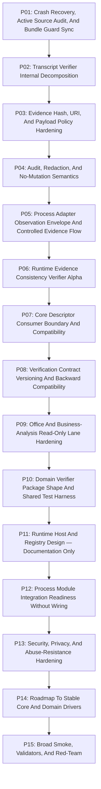

# Phase Plan

## Execution Order

1. **P01 — Crash Recovery, Active Source Audit, And Bundle Guard Sync**: Prove the previous Codex crash did not leave partial work, stale proof, or hidden runtime hooks.
2. **P02 — Transcript Verifier Internal Decomposition**: Prevent the alpha verifier from becoming the next monolith while preserving exact diagnostics.
3. **P03 — Evidence Hash, URI, And Payload Policy Hardening**: Make supplied-evidence boundaries explicit and reusable before more drivers appear.
4. **P04 — Audit, Redaction, And No-Mutation Semantics**: Make audit/redaction outputs reliable production signals, not optional response fields.
5. **P05 — Process Adapter Observation Envelope And Controlled Evidence Flow**: Turn the adapter into a reusable read-only observation producer without runtime registration.
6. **P06 — Runtime Evidence Consistency Verifier Alpha**: Implement a second verification-only alpha that checks consistency across existing Core execution/finalizer/retry/projection descriptors.
7. **P07 — Core Descriptor Consumer Boundary And Compatibility**: Keep Core stable while adding descriptor consumers safely.
8. **P08 — Verification Contract Versioning And Backward Compatibility**: Prepare the driver contract package for multiple verification lanes without runtime host.
9. **P09 — Office And Business-Analysis Read-Only Lane Hardening**: Prepare later domain drivers with stronger denial guarantees before implementation.
10. **P10 — Domain Verifier Package Shape And Shared Test Harness**: Avoid duplicating unsafe logic across future domain driver packages.
11. **P11 — Runtime Host And Registry Design — Documentation Only**: Define future host requirements without creating it.
12. **P12 — Process Module Integration Readiness Without Wiring**: Prepare safe handoff points for eventual controlled process integration.
13. **P13 — Security, Privacy, And Abuse-Resistance Hardening**: Make verification drivers robust against secret leakage and malicious transcripts.
14. **P14 — Roadmap To Stable Core And Domain Drivers**: Make the next two bundles clear before any runtime host appears.
15. **P15 — Broad Smoke, Validators, And Red-Team**: Close implementation with strong proof after complex multi-area work.

## Subbundle Dependency Map

## Critical Subbundles

- `SB003` closes P01 and is a critical foundation for downstream phases.
- `SB006` closes P02 and is a critical foundation for downstream phases.
- `SB009` closes P03 and is a critical foundation for downstream phases.
- `SB012` closes P04 and is a critical foundation for downstream phases.
- `SB015` closes P05 and is a critical foundation for downstream phases.
- `SB018` closes P06 and is a critical foundation for downstream phases.
- `SB021` closes P07 and is a critical foundation for downstream phases.
- `SB024` closes P08 and is a critical foundation for downstream phases.
- `SB027` closes P09 and is a critical foundation for downstream phases.
- `SB030` closes P10 and is a critical foundation for downstream phases.
- `SB033` closes P11 and is a critical foundation for downstream phases.
- `SB036` closes P12 and is a critical foundation for downstream phases.
- `SB039` closes P13 and is a critical foundation for downstream phases.
- `SB042` closes P14 and is a critical foundation for downstream phases.
- `SB045` closes P15 and is a critical foundation for downstream phases.

## Phase Gates

- `SB003` must pass build/test/source-scan/semantic-proof gates before P01 is considered closed.
- `SB006` must pass build/test/source-scan/semantic-proof gates before P02 is considered closed.
- `SB009` must pass build/test/source-scan/semantic-proof gates before P03 is considered closed.
- `SB012` must pass build/test/source-scan/semantic-proof gates before P04 is considered closed.
- `SB015` must pass build/test/source-scan/semantic-proof gates before P05 is considered closed.
- `SB018` must pass build/test/source-scan/semantic-proof gates before P06 is considered closed.
- `SB021` must pass build/test/source-scan/semantic-proof gates before P07 is considered closed.
- `SB024` must pass build/test/source-scan/semantic-proof gates before P08 is considered closed.
- `SB027` must pass build/test/source-scan/semantic-proof gates before P09 is considered closed.
- `SB030` must pass build/test/source-scan/semantic-proof gates before P10 is considered closed.
- `SB033` must pass build/test/source-scan/semantic-proof gates before P11 is considered closed.
- `SB036` must pass build/test/source-scan/semantic-proof gates before P12 is considered closed.
- `SB039` must pass build/test/source-scan/semantic-proof gates before P13 is considered closed.
- `SB042` must pass build/test/source-scan/semantic-proof gates before P14 is considered closed.
- `SB045` must pass build/test/source-scan/semantic-proof gates before P15 is considered closed.
