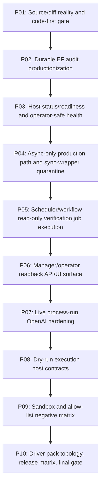

# Phase Plan

## Execution Order
- Execute subbundles sequentially from SB001 through SB030.
- Stop at each critical gate before allowing dependent phases to proceed.
- Reopen earlier phases if validation weakens a prerequisite.
## Subbundle Dependency Map

## Phase Gates

| Phase | Theme | Subbundles | Critical Gate |
| --- | --- | --- | --- |
| P01 | Source/diff reality and code-first gate | SB001, SB002, SB003 | SB003 |
| P02 | Durable EF audit productionization | SB004, SB005, SB006 | SB006 |
| P03 | Host status/readiness and operator-safe health | SB007, SB008, SB009 | SB009 |
| P04 | Async-only production path and sync-wrapper quarantine | SB010, SB011, SB012 | SB012 |
| P05 | Scheduler/workflow read-only verification job execution | SB013, SB014, SB015 | SB015 |
| P06 | Manager/operator readback API/UI surface | SB016, SB017, SB018 | SB018 |
| P07 | Live process-run OpenAI hardening | SB019, SB020, SB021 | SB021 |
| P08 | Dry-run execution host contracts | SB022, SB023, SB024 | SB024 |
| P09 | Sandbox and allow-list negative matrix | SB025, SB026, SB027 | SB027 |
| P10 | Driver pack topology, release matrix, final gate | SB028, SB029, SB030 | SB030 |

## Critical Subbundles

Critical gates: SB003, SB006, SB009, SB012, SB015, SB018, SB021, SB024, SB027, SB030.

Every critical gate must include:
- source-level changed-file hashes,
- command transcripts,
- code-vs-bundle diff-stat ratio,
- semantic positive proof,
- adversarial negative proof,
- anti-stub audit,
- no bundle-path coupling scan,
- raw-note closure.
