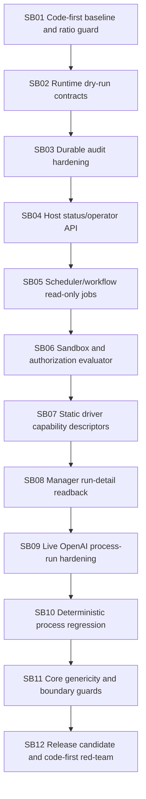

# Phase plan

## Phase Sequence
- Execute SB01 through SB12 in dependency order.
- Do not start a subbundle until its predecessor closure gate passes or is honestly blocked with a follow-up path.

## Subbundle Dependency Map

## Critical Subbundles
- SB01 through SB12 are critical. This bundle has fewer subbundles; each owns a larger coherent implementation area.

## Phase Gates
- Prepared-stage bundle validator passes before implementation.
- Each subbundle has an entry gate, focused implementation, proof manifest, semantic invariant contract, closure gate, and downstream progression decision.
- Completed-stage bundle validator and code-first ratio gate pass before final closure.

## Final validation matrix
- `dotnet build CanDoItAll.slnx --configuration Debug`
- full unit tests
- focused integration tests for verification host, dry-run host, audit, manager facade, scheduler/workflow read-only jobs
- live OpenAI process-run smoke when opt-in variables are present
- large-screen operator readback smoke when UI/API route changes are made
- source scans for Core dependency drift, reflection discovery, fallback selector, mutation APIs, bundle-path coupling, secret leakage
- code-first ratio gate with `git diff --numstat`
