# Phase Plan

## Subbundle Dependency Map

```mermaid
graph TD
  P01[Source and proof reconciliation] --> P02[Durable EF audit production default]
  P02[Durable EF audit production default] --> P03[Async host and structured denial hardening]
  P03[Async host and structured denial hardening] --> P04[Host health, readiness, emergency disable]
  P04[Host health, readiness, emergency disable] --> P05[Exact registry/selector and lane options]
  P05[Exact registry/selector and lane options] --> P06[Manager API/readback facade]
  P06[Manager API/readback facade] --> P07[Manager UI/operator readback]
  P07[Manager UI/operator readback] --> P08[Scheduler/workflow read-only verification jobs]
  P08[Scheduler/workflow read-only verification jobs] --> P09[Live OpenAI process-run proof hardening]
  P09[Live OpenAI process-run proof hardening] --> P10[Deterministic process runtime safety net]
  P10[Deterministic process runtime safety net] --> P11[Observability, correlation, failure taxonomy]
  P11[Observability, correlation, failure taxonomy] --> P12[Audit retention and query governance]
  P12[Audit retention and query governance] --> P13[Dry-run sandbox and allow-list contracts]
  P13[Dry-run sandbox and allow-list contracts] --> P14[Execution-capable future gate tests]
  P14[Execution-capable future gate tests] --> P15[Domain driver pack topology and no self-registration]
  P15[Domain driver pack topology and no self-registration] --> P16[Process Core genericity and contract governance]
  P16[Process Core genericity and contract governance] --> P17[Release-candidate build/unit/focused matrix]
  P17[Release-candidate build/unit/focused matrix] --> P18[Large-screen UI/operator smoke]
  P18[Large-screen UI/operator smoke] --> P19[Docs, runbook, migration notes]
  P19[Docs, runbook, migration notes] --> P20[Final red-team and validators]
```

## Critical Subbundles

Critical gates: SB003, SB006, SB009, SB012, SB015, SB018, SB021, SB024, SB027, SB030, SB033, SB036, SB039, SB042, SB045, SB048, SB051, SB054, SB057, SB060.

## Phase Gates

| Phase | Focus | Subbundles | Critical gate |
| --- | --- | --- | --- |
| P01 | Source and proof reconciliation | SB001-SB003 | SB003 |
| P02 | Durable EF audit production default | SB004-SB006 | SB006 |
| P03 | Async host and structured denial hardening | SB007-SB009 | SB009 |
| P04 | Host health, readiness, emergency disable | SB010-SB012 | SB012 |
| P05 | Exact registry/selector and lane options | SB013-SB015 | SB015 |
| P06 | Manager API/readback facade | SB016-SB018 | SB018 |
| P07 | Manager UI/operator readback | SB019-SB021 | SB021 |
| P08 | Scheduler/workflow read-only verification jobs | SB022-SB024 | SB024 |
| P09 | Live OpenAI process-run proof hardening | SB025-SB027 | SB027 |
| P10 | Deterministic process runtime safety net | SB028-SB030 | SB030 |
| P11 | Observability, correlation, failure taxonomy | SB031-SB033 | SB033 |
| P12 | Audit retention and query governance | SB034-SB036 | SB036 |
| P13 | Dry-run sandbox and allow-list contracts | SB037-SB039 | SB039 |
| P14 | Execution-capable future gate tests | SB040-SB042 | SB042 |
| P15 | Domain driver pack topology and no self-registration | SB043-SB045 | SB045 |
| P16 | Process Core genericity and contract governance | SB046-SB048 | SB048 |
| P17 | Release-candidate build/unit/focused matrix | SB049-SB051 | SB051 |
| P18 | Large-screen UI/operator smoke | SB052-SB054 | SB054 |
| P19 | Docs, runbook, migration notes | SB055-SB057 | SB057 |
| P20 | Final red-team and validators | SB058-SB060 | SB060 |