# Phase Plan

## Subbundle Dependency Map

```mermaid
graph TD
  P01["P01: Real-code reconciliation and failed-report traps"]
  P02["P02: Durable verification audit as default runtime boundary"]
  P01 --> P02
  P03["P03: Verification host beta contract hardening"]
  P02 --> P03
  P04["P04: Host lifecycle, options, health, and emergency stop"]
  P03 --> P04
  P05["P05: Manager API and operator readback surface"]
  P04 --> P05
  P06["P06: Large-screen manager diagnostics UI"]
  P05 --> P06
  P07["P07: Process runtime integration without execution-capable drivers"]
  P06 --> P07
  P08["P08: Scheduler/workflow read-only verification jobs"]
  P07 --> P08
  P09["P09: Live OpenAI process-run proof hardening"]
  P08 --> P09
  P10["P10: .NET and business scenarios as runtime regression suite"]
  P09 --> P10
  P11["P11: Driver package topology and gateway compatibility"]
  P10 --> P11
  P12["P12: Verification host observability and failure taxonomy"]
  P11 --> P12
  P13["P13: Security, redaction, and evidence-policy hardening"]
  P12 --> P13
  P14["P14: Runtime host production-readiness decision"]
  P13 --> P14
  P15["P15: Execution-capable driver future gate rehearsal"]
  P14 --> P15
  P16["P16: UI/project-structure release smoke"]
  P15 --> P16
  P17["P17: Build/test/release candidate matrix"]
  P16 --> P17
  P18["P18: Docs, runbook, and migration path"]
  P17 --> P18
  P19["P19: Final red-team and fake-proof rejection"]
  P18 --> P19
  P20["P20: Completed-stage validators and handoff"]
  P19 --> P20
```

## Critical Subbundles
Critical gates: SB003, SB006, SB009, SB012, SB015, SB018, SB021, SB024, SB027, SB030, SB033, SB036, SB039, SB042, SB045, SB048, SB051, SB054, SB057, SB060.

Every critical gate must include semantic adequacy proof, changed-file hashes, command transcripts, source assertions, anti-stub audit, red-team negative proof, and raw-note closure.

## Phase Gates

| Phase | Theme | Subbundles | Critical gate |
| --- | --- | --- | --- |
| P01 | Real-code reconciliation and failed-report traps | SB001–SB003 | SB003 |
| P02 | Durable verification audit as default runtime boundary | SB004–SB006 | SB006 |
| P03 | Verification host beta contract hardening | SB007–SB009 | SB009 |
| P04 | Host lifecycle, options, health, and emergency stop | SB010–SB012 | SB012 |
| P05 | Manager API and operator readback surface | SB013–SB015 | SB015 |
| P06 | Large-screen manager diagnostics UI | SB016–SB018 | SB018 |
| P07 | Process runtime integration without execution-capable drivers | SB019–SB021 | SB021 |
| P08 | Scheduler/workflow read-only verification jobs | SB022–SB024 | SB024 |
| P09 | Live OpenAI process-run proof hardening | SB025–SB027 | SB027 |
| P10 | .NET and business scenarios as runtime regression suite | SB028–SB030 | SB030 |
| P11 | Driver package topology and gateway compatibility | SB031–SB033 | SB033 |
| P12 | Verification host observability and failure taxonomy | SB034–SB036 | SB036 |
| P13 | Security, redaction, and evidence-policy hardening | SB037–SB039 | SB039 |
| P14 | Runtime host production-readiness decision | SB040–SB042 | SB042 |
| P15 | Execution-capable driver future gate rehearsal | SB043–SB045 | SB045 |
| P16 | UI/project-structure release smoke | SB046–SB048 | SB048 |
| P17 | Build/test/release candidate matrix | SB049–SB051 | SB051 |
| P18 | Docs, runbook, and migration path | SB052–SB054 | SB054 |
| P19 | Final red-team and fake-proof rejection | SB055–SB057 | SB057 |
| P20 | Completed-stage validators and handoff | SB058–SB060 | SB060 |
