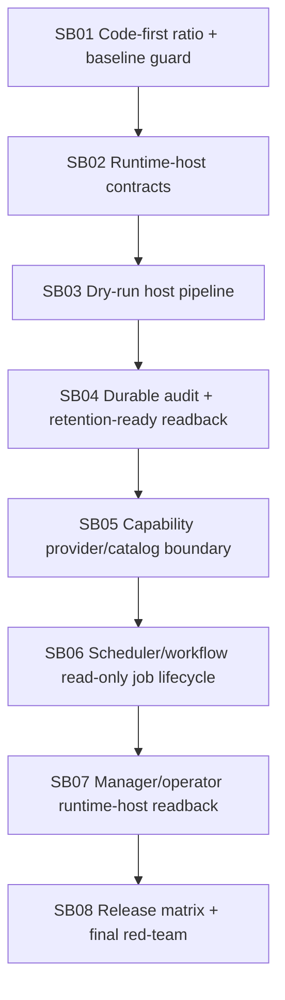

# Phase Plan

## Execution Order

- SB01 establishes the code-first baseline and guardrails.
- SB02-SB07 implement the runtime-host foundation in dependency order.
- SB08 runs the final validation matrix, code-first ratio, and red-team scans.

## Subbundle Dependency Map

## Critical Subbundles

- SB01: Code-first ratio and current-state guard.
- SB02: Runtime-host contract boundary.
- SB03: Dry-run execution host pipeline.
- SB04: Durable audit and retention-ready readback.
- SB05: Static capability provider/catalog boundary.
- SB06: Scheduler/workflow read-only verification job lifecycle.
- SB07: Manager/operator runtime-host readback.
- SB08: Release matrix, live proof classification, and future gate closure.

## Phase Gates
Each subbundle must record:

- changed source/test files,
- focused test command and result,
- anti-stub scan,
- boundary scan,
- code-first ratio impact,
- explicit downstream impact.

## Final Gate
Completion requires:

- build pass,
- full unit pass,
- focused integration pass,
- live process-run smoke classification,
- code-first ratio pass,
- no Core dependency drift,
- no reflection discovery/self-registration/fallback selector,
- no execution-capable effects.
