# Phase Plan

## Phase Sequence

1. P01: Baseline, Proof Intake, And Active Guardrails
2. P02: Contract API Stability And Versioning
3. P03: Alpha Driver Package Boundary
4. P04: .NET Transcript Verification Rules
5. P05: Rust Transcript Verification Rules
6. P06: Verification Request/Response Integration
7. P07: Audit, Redaction, And No-Mutation Proof
8. P08: Evidence Reference And Hash Policy
9. P09: Process Module Test-Only Consumer Rehearsal
10. P10: Core Descriptor Compatibility And Consumer Allowlist
11. P11: Office/Business Lane Denial Hardening
12. P12: Driver Runtime Deferral And Future Host Roadmap
13. P13: Package Docs, Samples, And Migration Notes
14. P14: Broad Smoke Matrix And Red-Team
15. P15: Final Decision And Next-Bundle Handoff

## Subbundle Dependency Map

```mermaid
graph TD
    SB001[SB001 Baseline, Proof Intake, And Active Guardrails]
    SB002[SB002 Baseline, Proof Intake, And Active Guardrails]
    SB001 --> SB002
    SB003[SB003 Baseline, Proof Intake, And Active Guardrails]
    SB002 --> SB003
    SB004[SB004 Contract API Stability And Versioning]
    SB003 --> SB004
    SB005[SB005 Contract API Stability And Versioning]
    SB004 --> SB005
    SB006[SB006 Contract API Stability And Versioning]
    SB005 --> SB006
    SB007[SB007 Alpha Driver Package Boundary]
    SB006 --> SB007
    SB008[SB008 Alpha Driver Package Boundary]
    SB007 --> SB008
    SB009[SB009 Alpha Driver Package Boundary]
    SB008 --> SB009
    SB010[SB010 .NET Transcript Verification Rules]
    SB009 --> SB010
    SB011[SB011 .NET Transcript Verification Rules]
    SB010 --> SB011
    SB012[SB012 .NET Transcript Verification Rules]
    SB011 --> SB012
    SB013[SB013 Rust Transcript Verification Rules]
    SB012 --> SB013
    SB014[SB014 Rust Transcript Verification Rules]
    SB013 --> SB014
    SB015[SB015 Rust Transcript Verification Rules]
    SB014 --> SB015
    SB016[SB016 Verification Request/Response Integration]
    SB015 --> SB016
    SB017[SB017 Verification Request/Response Integration]
    SB016 --> SB017
    SB018[SB018 Verification Request/Response Integration]
    SB017 --> SB018
    SB019[SB019 Audit, Redaction, And No-Mutation Proof]
    SB018 --> SB019
    SB020[SB020 Audit, Redaction, And No-Mutation Proof]
    SB019 --> SB020
    SB021[SB021 Audit, Redaction, And No-Mutation Proof]
    SB020 --> SB021
    SB022[SB022 Evidence Reference And Hash Policy]
    SB021 --> SB022
    SB023[SB023 Evidence Reference And Hash Policy]
    SB022 --> SB023
    SB024[SB024 Evidence Reference And Hash Policy]
    SB023 --> SB024
    SB025[SB025 Process Module Test-Only Consumer Rehearsal]
    SB024 --> SB025
    SB026[SB026 Process Module Test-Only Consumer Rehearsal]
    SB025 --> SB026
    SB027[SB027 Process Module Test-Only Consumer Rehearsal]
    SB026 --> SB027
    SB028[SB028 Core Descriptor Compatibility And Consumer Allowlist]
    SB027 --> SB028
    SB029[SB029 Core Descriptor Compatibility And Consumer Allowlist]
    SB028 --> SB029
    SB030[SB030 Core Descriptor Compatibility And Consumer Allowlist]
    SB029 --> SB030
    SB031[SB031 Office/Business Lane Denial Hardening]
    SB030 --> SB031
    SB032[SB032 Office/Business Lane Denial Hardening]
    SB031 --> SB032
    SB033[SB033 Office/Business Lane Denial Hardening]
    SB032 --> SB033
    SB034[SB034 Driver Runtime Deferral And Future Host Roadmap]
    SB033 --> SB034
    SB035[SB035 Driver Runtime Deferral And Future Host Roadmap]
    SB034 --> SB035
    SB036[SB036 Driver Runtime Deferral And Future Host Roadmap]
    SB035 --> SB036
    SB037[SB037 Package Docs, Samples, And Migration Notes]
    SB036 --> SB037
    SB038[SB038 Package Docs, Samples, And Migration Notes]
    SB037 --> SB038
    SB039[SB039 Package Docs, Samples, And Migration Notes]
    SB038 --> SB039
    SB040[SB040 Broad Smoke Matrix And Red-Team]
    SB039 --> SB040
    SB041[SB041 Broad Smoke Matrix And Red-Team]
    SB040 --> SB041
    SB042[SB042 Broad Smoke Matrix And Red-Team]
    SB041 --> SB042
    SB043[SB043 Final Decision And Next-Bundle Handoff]
    SB042 --> SB043
    SB044[SB044 Final Decision And Next-Bundle Handoff]
    SB043 --> SB044
    SB045[SB045 Final Decision And Next-Bundle Handoff]
    SB044 --> SB045
```

## Critical Subbundles

- `SB003`: Critical gate for Baseline, Proof Intake, And Active Guardrails.
- `SB006`: Critical gate for Contract API Stability And Versioning.
- `SB009`: Critical gate for Alpha Driver Package Boundary.
- `SB012`: Critical gate for .NET Transcript Verification Rules.
- `SB015`: Critical gate for Rust Transcript Verification Rules.
- `SB018`: Critical gate for Verification Request/Response Integration.
- `SB021`: Critical gate for Audit, Redaction, And No-Mutation Proof.
- `SB024`: Critical gate for Evidence Reference And Hash Policy.
- `SB027`: Critical gate for Process Module Test-Only Consumer Rehearsal.
- `SB030`: Critical gate for Core Descriptor Compatibility And Consumer Allowlist.
- `SB033`: Critical gate for Office/Business Lane Denial Hardening.
- `SB036`: Critical gate for Driver Runtime Deferral And Future Host Roadmap.
- `SB039`: Critical gate for Package Docs, Samples, And Migration Notes.
- `SB042`: Critical gate for Broad Smoke Matrix And Red-Team.
- `SB045`: Critical gate for Final Decision And Next-Bundle Handoff.

## Phase Gates

### P01 — Baseline, Proof Intake, And Active Guardrails
- Subbundles: SB001, SB002, SB003
- Closure gate: `SB003` must pass build/test/source-scan proof relevant to this phase before downstream work starts.

### P02 — Contract API Stability And Versioning
- Subbundles: SB004, SB005, SB006
- Closure gate: `SB006` must pass build/test/source-scan proof relevant to this phase before downstream work starts.

### P03 — Alpha Driver Package Boundary
- Subbundles: SB007, SB008, SB009
- Closure gate: `SB009` must pass build/test/source-scan proof relevant to this phase before downstream work starts.

### P04 — .NET Transcript Verification Rules
- Subbundles: SB010, SB011, SB012
- Closure gate: `SB012` must pass build/test/source-scan proof relevant to this phase before downstream work starts.

### P05 — Rust Transcript Verification Rules
- Subbundles: SB013, SB014, SB015
- Closure gate: `SB015` must pass build/test/source-scan proof relevant to this phase before downstream work starts.

### P06 — Verification Request/Response Integration
- Subbundles: SB016, SB017, SB018
- Closure gate: `SB018` must pass build/test/source-scan proof relevant to this phase before downstream work starts.

### P07 — Audit, Redaction, And No-Mutation Proof
- Subbundles: SB019, SB020, SB021
- Closure gate: `SB021` must pass build/test/source-scan proof relevant to this phase before downstream work starts.

### P08 — Evidence Reference And Hash Policy
- Subbundles: SB022, SB023, SB024
- Closure gate: `SB024` must pass build/test/source-scan proof relevant to this phase before downstream work starts.

### P09 — Process Module Test-Only Consumer Rehearsal
- Subbundles: SB025, SB026, SB027
- Closure gate: `SB027` must pass build/test/source-scan proof relevant to this phase before downstream work starts.

### P10 — Core Descriptor Compatibility And Consumer Allowlist
- Subbundles: SB028, SB029, SB030
- Closure gate: `SB030` must pass build/test/source-scan proof relevant to this phase before downstream work starts.

### P11 — Office/Business Lane Denial Hardening
- Subbundles: SB031, SB032, SB033
- Closure gate: `SB033` must pass build/test/source-scan proof relevant to this phase before downstream work starts.

### P12 — Driver Runtime Deferral And Future Host Roadmap
- Subbundles: SB034, SB035, SB036
- Closure gate: `SB036` must pass build/test/source-scan proof relevant to this phase before downstream work starts.

### P13 — Package Docs, Samples, And Migration Notes
- Subbundles: SB037, SB038, SB039
- Closure gate: `SB039` must pass build/test/source-scan proof relevant to this phase before downstream work starts.

### P14 — Broad Smoke Matrix And Red-Team
- Subbundles: SB040, SB041, SB042
- Closure gate: `SB042` must pass build/test/source-scan proof relevant to this phase before downstream work starts.

### P15 — Final Decision And Next-Bundle Handoff
- Subbundles: SB043, SB044, SB045
- Closure gate: `SB045` must pass build/test/source-scan proof relevant to this phase before downstream work starts.
