# Phase Plan

## Subbundle Dependency Map

```mermaid
graph TD
  P01[P01: Source and proof reconciliation]
  P02[P02: Live OpenAI proof classification]
  P01 --> P02
  P03[P03: Live process-run OpenAI smoke]
  P02 --> P03
  P04[P04: Deterministic runtime safety net]
  P03 --> P04
  P05[P05: Host API beta shape]
  P04 --> P05
  P06[P06: Host options and emergency disable]
  P05 --> P06
  P07[P07: Registry and selector hardening]
  P06 --> P07
  P08[P08: Durable audit persistence boundary]
  P07 --> P08
  P09[P09: Manager-readonly command/API facade]
  P08 --> P09
  P10[P10: Manager diagnostics UI/readback]
  P09 --> P10
  P11[P11: Scheduler/workflow verification readiness]
  P10 --> P11
  P12[P12: Process runtime regression matrix]
  P11 --> P12
  P13[P13: Core genericity and contract governance]
  P12 --> P13
  P14[P14: Domain driver pack boundary]
  P13 --> P14
  P15[P15: Execution-capable future gate]
  P14 --> P15
  P16[P16: Observability and failure taxonomy]
  P15 --> P16
  P17[P17: Security and redaction hardening]
  P16 --> P17
  P18[P18: Release-candidate validation]
  P17 --> P18
  P19[P19: Large-screen operator smoke]
  P18 --> P19
  P20[P20: Docs and migration]
  P19 --> P20
  P21[P21: Final red-team]
  P20 --> P21
  P22[P22: Completed-stage closure]
  P21 --> P22
```

## Critical Subbundles

Every third subbundle is a critical gate and must include semantic adequacy proof, changed-file hashes, command transcripts, source assertions, anti-stub audit, and red-team evidence.

## Phase Gates

### P01 — Source and proof reconciliation
- SB001: Re-read branch, current report, changed source, and live proof
- SB002: No transient bundle-path source/test guard
- SB003: Critical Gate A baseline closure

### P02 — Live OpenAI proof classification
- SB004: Classify specialist-agent live proof
- SB005: Harden live env gate source assertions
- SB006: Critical Gate B live-proof classification

### P03 — Live process-run OpenAI smoke
- SB007: Add live process-run test setup
- SB008: Run/skip live process-run smoke by strict policy
- SB009: Critical Gate C live process-run proof

### P04 — Deterministic runtime safety net
- SB010: Re-run .NET deterministic scenario
- SB011: Re-run business-analysis deterministic scenario
- SB012: Critical Gate D deterministic safety net

### P05 — Host API beta shape
- SB013: Introduce async/cancellable host API
- SB014: Add structured non-throwing denial result
- SB015: Critical Gate E host API beta

### P06 — Host options and emergency disable
- SB016: Add options model and validation
- SB017: Add lane enable/disable and payload limits
- SB018: Critical Gate F options policy

### P07 — Registry and selector hardening
- SB019: Exact lane selection result
- SB020: No fallback/discovery/reflective selection tests
- SB021: Critical Gate G selector hardening

### P08 — Durable audit persistence boundary
- SB022: Add audit entity/migration or stable persistence model
- SB023: Add append/query/redaction/hash tests
- SB024: Critical Gate H durable audit

### P09 — Manager-readonly command/API facade
- SB025: Add stable manager-readonly service/API contract
- SB026: Add auth/requester/projection guard tests
- SB027: Critical Gate I manager facade

### P10 — Manager diagnostics UI/readback
- SB028: Expose manager verification readback DTO
- SB029: Large-screen or API smoke for diagnostics projection
- SB030: Critical Gate J manager diagnostics

### P11 — Scheduler/workflow verification readiness
- SB031: Add read-only verification job model
- SB032: Prove scheduler/workflow do not call drivers directly
- SB033: Critical Gate K scheduler/workflow readiness

### P12 — Process runtime regression matrix
- SB034: Run lifecycle/outbox/finalizer regression
- SB035: Run project-structure/UI regression
- SB036: Critical Gate L process runtime matrix

### P13 — Core genericity and contract governance
- SB037: Core dependency/API snapshot
- SB038: Driver contracts/version snapshots
- SB039: Critical Gate M Core/contract governance

### P14 — Domain driver pack boundary
- SB040: Define verification-pack manifest docs/tests
- SB041: Prove no self-registration/discovery
- SB042: Critical Gate N pack boundary

### P15 — Execution-capable future gate
- SB043: Convert future prerequisites to executable guard docs
- SB044: Add negative tests for premature execution surfaces
- SB045: Critical Gate O execution-capable still blocked

### P16 — Observability and failure taxonomy
- SB046: Host failure categories and reason codes
- SB047: Operator troubleshooting/readback tests
- SB048: Critical Gate P observability

### P17 — Security and redaction hardening
- SB049: Malicious payload and secret corpus
- SB050: Audit/redaction/non-leak matrix
- SB051: Critical Gate Q security hardening

### P18 — Release-candidate validation
- SB052: Build/unit/focused integration matrix
- SB053: Live smoke summary and deterministic fallback matrix
- SB054: Critical Gate R release-candidate

### P19 — Large-screen operator smoke
- SB055: Manager diagnostics large-screen route or API proof
- SB056: Process run detail with verification audit readback
- SB057: Critical Gate S operator smoke

### P20 — Docs and migration
- SB058: Update Processes README and runbook
- SB059: Update driver host beta migration guide
- SB060: Critical Gate T docs parity

### P21 — Final red-team
- SB061: Reject report-only/live-skip-as-pass/generic-host traps
- SB062: Final source scans and proof index
- SB063: Critical Gate U red-team

### P22 — Completed-stage closure
- SB064: Prepared validator after execution edits
- SB065: Completed validator and zip generation
- SB066: Critical Gate V final handoff
