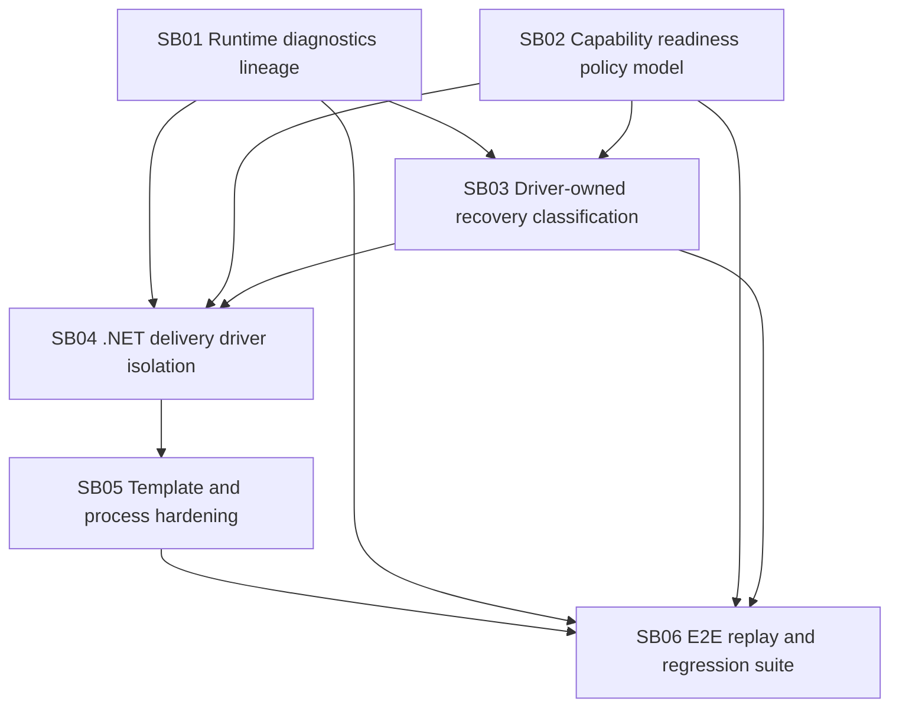

# Phase Plan

## Phase Sequence

1. SB01 Runtime diagnostics lineage: make blocked results and missing evidence explain themselves.
2. SB02 Capability readiness policy model: define and enforce the typed step contract for tools, MCPs, skills, suppressions, instructions, operations, and receipt gates.
3. SB03 Driver-owned recovery classification: classify failures and route recovery without generic domain leaks.
4. SB04 .NET delivery driver isolation: move .NET delivery proof behavior into domain-owned driver/template policy.
5. SB05 Template and process hardening: reduce brittle prose and fixture-specific assumptions after the foundations are observable.
6. SB06 E2E replay and regression suite: validate the simple development flow, UI/browser proof flow, and management-only suppression flow.

## Subbundle Dependency Map

## Critical Subbundles

- SB01 is a critical foundation. Weak proof here invalidates every downstream root-cause conclusion.
- SB02 is a critical foundation. Without it, the system cannot know whether an agent is missing a tool, MCP, skill, operation, or allowed context.
- SB03 is a critical foundation for recovery. It may not invent fallback behavior until SB01 and SB02 can identify root causes.
- SB04 is the domain isolation phase. It may not modify generic runtime with .NET-specific logic.

## Phase Gates

- Gate after preparation: run the bundle validator at prepared stage.
- Gate before SB01: confirm rollback is still present and no runtime source changes are part of this bundle-preparation commit.
- Gate after SB01: blocked diagnostics can be read through projection/API and tested without direct DB inspection.
- Gate after SB02: launch/readiness can identify missing/denied/suppressed tools, MCPs, and skills before dispatch.
- Gate after SB03: manager fallback records a typed failure category and recovery decision for every automatic recovery attempt.
- Gate after SB04: generic runtime/application layers contain no .NET, Blazor, Calculator, Tetris, screenshot, or Playwright-specific behavior.
- Gate after SB05: templates declare capabilities/readiness without overfitting to Calculator/Tetris or forcing browser proof onto non-UI steps.
- Gate before closure: run unit/integration/E2E replay proof, architecture checks, and domain leak scan.

## Execution Notes

- Implement one subbundle at a time.
- Do not skip characterization tests in foundation subbundles.
- Do not use prompt edits as a substitute for typed contracts.
- Do not treat the contaminated latest run as clean proof after rollback; use it to seed failure fixtures and diagnostic categories.
