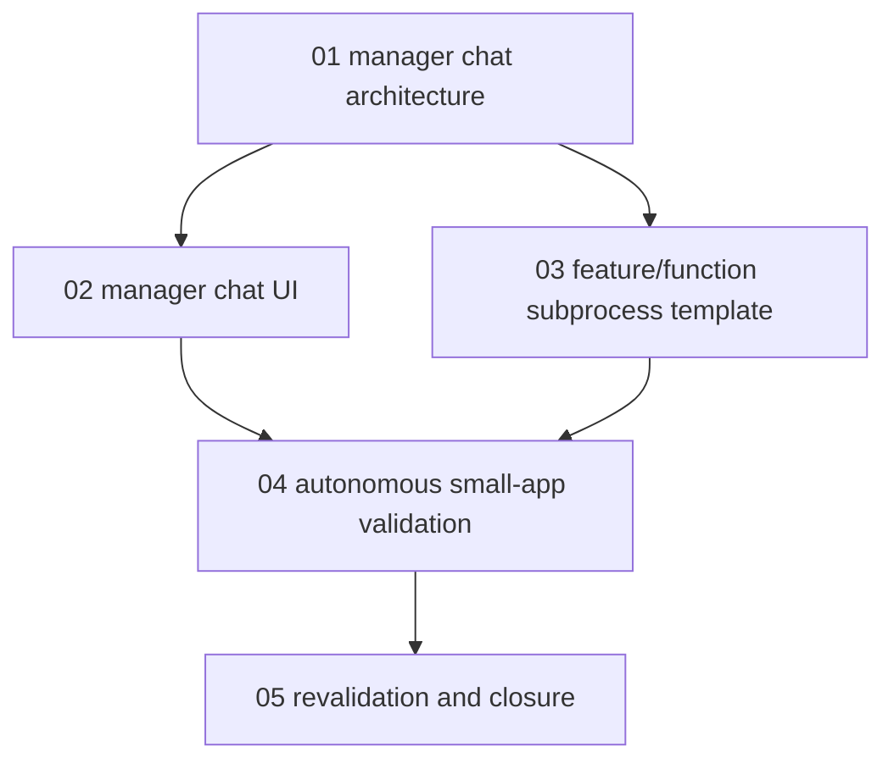

# Phase Plan

## Phase Sequence

1. Finalize manager-chat architecture and source-of-truth boundaries.
2. Add the process detail manager chat tab and run selector modal.
3. Add the feature/function implementation subprocess template and wire the implementation slice to it.
4. Run targeted build/tests and browser validation.
5. Attempt a small-app autonomous process validation and document agent behavior.
6. Revalidate architecture and close the bundle.

## Subbundle Dependency Map

## Critical Subbundles

- `01-manager-chat-architecture`: critical source-of-truth gate for avoiding duplicate chat or manager state.
- `02-manager-chat-ui`: critical UI gate requiring browser proof of the tab and run picker modal.
- `03-feature-function-subprocess-template`: critical template gate because downstream process import depends on stable nested subprocess references.
- `04-autonomous-small-app-validation`: critical behavioral gate for proving or honestly blocking real agent delivery.

## Phase Gates

- Gate after subbundle 01: confirm manager chat uses AgentFramework chat storage only.
- Gate after subbundle 02: run browser proof for the tab and modal before claiming UI completion.
- Gate after subbundle 03: run template import tests proving nested subprocess references resolve.
- Gate after subbundle 04: separate dispatcher defects from process-step or agent-skill instruction gaps.
- Gate before closure: run bundle validator and synchronize execution evidence.
