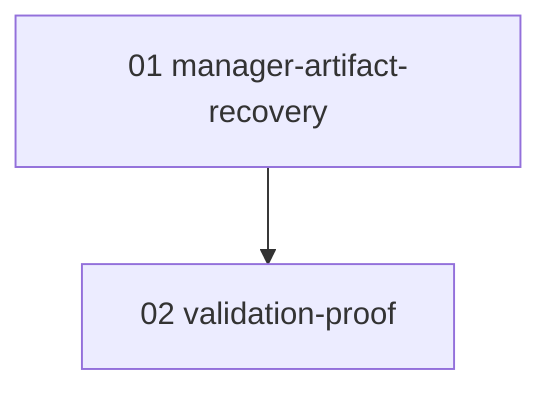

# Phase Plan

## Phase Sequence

1. `SB01 01-manager-artifact-recovery`: implement manager-mediated recovery for missing completion artifacts.
2. `SB02 02-validation-proof`: add focused proof and run targeted tests.

## Subbundle Dependency Map

## Critical Subbundles

- `SB01 01-manager-artifact-recovery` is the critical foundation. If it still targets the same executor, the validation subbundle cannot close the user request.
- Deeper validation required: prove manager resolution/routing and directive content, not only string wording.

## Phase Gates

- Gate after preparation: run the bundle validator and repair failures.
- Gate before `SB01 01-manager-artifact-recovery`: confirm the current runtime path still uses completion artifact recovery.
- Gate after `SB01 01-manager-artifact-recovery`: prove missing completion artifacts no longer invoke same-executor recovery when a manager is available.
- Gate after `SB02 02-validation-proof`: targeted tests pass and proof is recorded in the execution report.
- Closure gate: completed-stage bundle validator passes.

## Critical Notes

- Phase 2 depends on Phase 1; no validation closure is meaningful until the runtime no longer self-reruns for missing completion artifacts.
