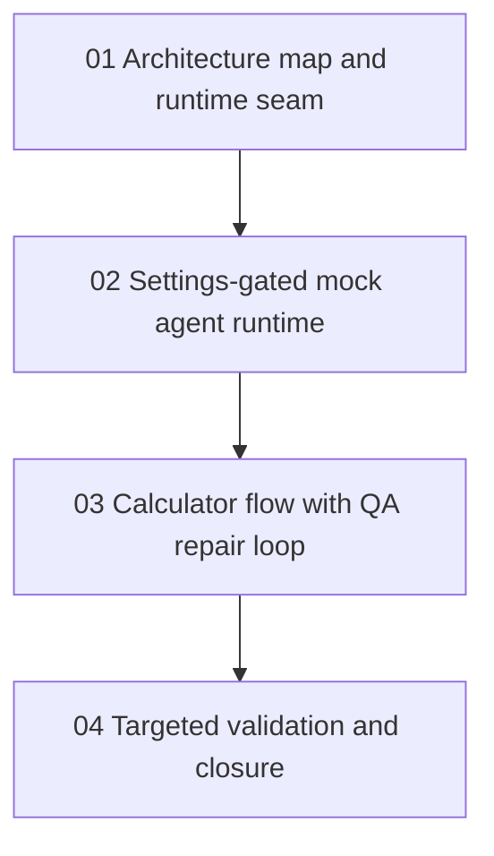

# Phase Plan

## Execution Order

1. Complete the architecture map and confirm the runtime seam.
2. Add settings-gated mock provider, mock agents, and deterministic runtime decorator.
3. Add the deterministic calculator process script with QA rejection and repair behavior.
4. Run targeted tests, update proof, and close the bundle.

## Subbundle Dependency Map

## Critical Subbundles

- Subbundle 01 is the foundation because it prevents special-casing the process dispatcher.
- Subbundle 02 is the execution foundation because every later proof depends on the settings gate and runtime decorator.
- Subbundle 03 is process-critical because it proves branch outcomes and repair iteration.
- Subbundle 04 must rerun validators and tests before closure.

## Phase Gates

- Gate after preparation: run `validate_bundle.py --profile initiative --stage prepared`.
- Gate before subbundle 02: confirm subbundle 01 captured the runtime seam and no process dispatcher rewrite is needed.
- Gate before subbundle 03: confirm mock provider and role agents are available only when enabled.
- Gate before subbundle 04: confirm the QA repair loop has an automated test or explicit blocker.
- Gate before closure: rerun targeted tests and `validate_bundle.py --profile initiative --stage completed`.
