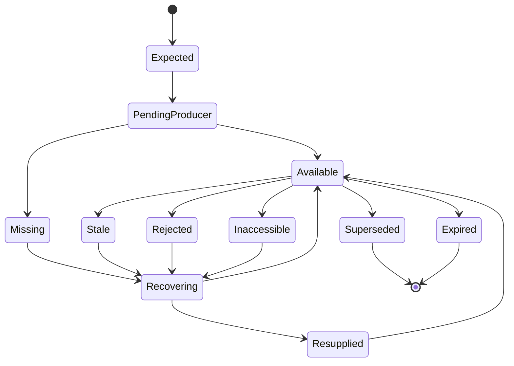
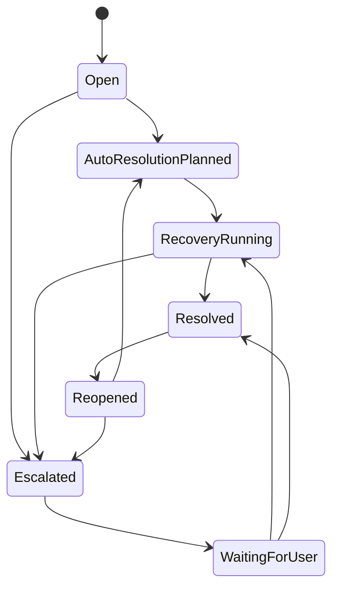
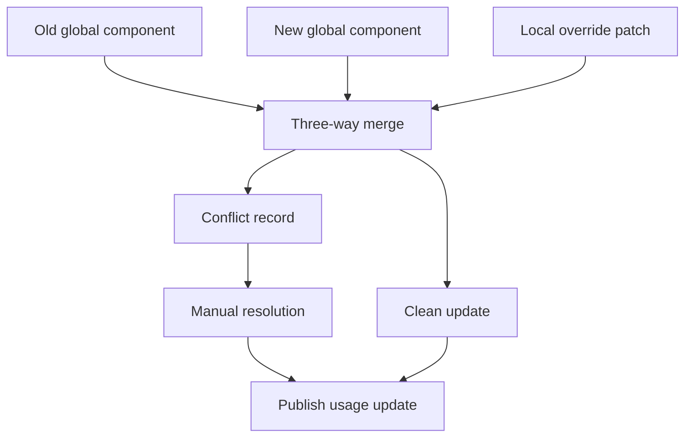

# Detailed Design Appendix

## Dependency Rules

Allowed dependency direction:

```text
UI -> Application -> Runtime/Builder/Templates -> Abstractions/Core
Application -> Persistence
Runtime -> Persistence abstractions
Drivers -> Driver abstractions + Core contracts
Git UI -> Git wrapper contracts
Process UI -> Git UI + Process application read models
```

Forbidden:

- Core to UI.
- Core to EF.
- Core to concrete drivers.
- Core to domain-specific capability names.
- Dispatcher to Razor components.
- Strategy implementations mutating runtime state directly.
- UI querying EF entities for runtime truth.

## Builder Pipeline

The builder is a compiler. It transforms source definitions and run context into an immutable instance plan.

1. Normalize request.
2. Resolve template/process definition source.
3. Run schema migrations.
4. Resolve global components and local overrides.
5. Detect unresolved component conflicts.
6. Validate definition graph.
7. Select driver stack from run context.
8. Resolve strategy factories from drivers.
9. Assign manager strategy and policies.
10. Assign step execution strategy for every step.
11. Build artifact slots.
12. Build artifact reference graph.
13. Build branch route table and loop budgets.
14. Recursively build subprocess plans.
15. Build monitoring configuration.
16. Create instance plan hash.
17. Persist instance plan and initial runtime state in one transaction.

Failure at any stage is explicit. There is no runtime fallback that silently chooses a default strategy when the builder could not resolve one.

## Factories

| Factory | Input | Output |
| --- | --- | --- |
| `ProcessDefinitionFactory` | Template JSON or editor model | Validated definition snapshot |
| `ProcessInstancePlanFactory` | Definition snapshot, launch context, driver catalog | Instance plan |
| `DriverStackFactory` | Capability request, project/run context | Ordered driver stack |
| `StrategyBindingFactory` | Step definition, driver stack, policies | Strategy binding |
| `ArtifactLedgerFactory` | Definition outputs and inputs | Artifact slots and reference graph |
| `SubprocessPlanFactory` | Subprocess step and parent context | Child instance plan |
| `ManagerRuntimeFactory` | Manager profile, driver stack, run policy | Manager runtime plan |
| `MonitoringPlanFactory` | Monitoring profile and run context | Snapshot/event projection config |

## Artifact Lifecycle



Artifact state transitions are runtime events. They include producer, consumer, slot, policy, provenance, and manager decision correlation.

## Artifact Reference Rules

- A step consumes artifact slots, not arbitrary previous step records.
- A slot can have multiple candidate producers.
- A produced artifact can satisfy multiple slots only when its sharing policy allows it.
- Parent/child projection creates a new reference with lineage, not a blind copy.
- A recovery strategy can create a new artifact instance or resupply an existing slot.
- Stale artifacts can remain visible but cannot satisfy strict fresh-input requirements.

## Manager Incident Lifecycle



Every incident contains:

- incident ID,
- run/step/subprocess references,
- generic category,
- preprocessed user message,
- restricted raw diagnostic reference,
- selected strategy,
- budget state,
- next action,
- escalation owner,
- related artifact slots,
- related branch/loop fingerprint.

## Error Preprocessing

Raw execution output is never the primary UI message. Error preprocessing produces:

- short title,
- user-actionable summary,
- cause category,
- safe details,
- hidden raw diagnostic reference,
- recommended recovery action,
- escalation reason when automatic recovery is disallowed.

Domain drivers can enrich the preprocessing context, but the envelope remains generic.

## Subprocess Manager Communication

Parent and child managers communicate through durable messages:

```csharp
public sealed record ProcessManagerControlMessage(
    ProcessRunId SourceRunId,
    ProcessRunId TargetRunId,
    ProcessManagerMessageKind Kind,
    string Summary,
    IReadOnlyList<ArtifactReference> ArtifactReferences,
    IncidentReference? Incident,
    DateTimeOffset CreatedAtUtc);
```

Messages are observed by managers through the runtime event stream. Direct cross-manager method calls are allowed only inside the application service boundary and must still persist the message.

## Branch Decision Flow

1. Runtime reaches a switch/branch step.
2. Runtime creates branch decision request.
3. Manager loads branch input artifacts and context facets.
4. Branch decision strategy evaluates generic and driver-provided outcomes.
5. Manager records selected outcome and explanation.
6. Runtime validates route target and loop budget.
7. Runtime applies route and emits branch decision event.

If the route targets an earlier step, loop protection is checked before the target step is reactivated.

## Loop Guard

Loop guard inputs:

- source step ID,
- target step ID,
- branch definition ID,
- selected outcome ID,
- incident fingerprint,
- artifact slot fingerprints,
- strategy ID,
- subprocess path.

Loop budgets:

- edge budget,
- step budget,
- branch definition budget,
- process budget,
- subprocess subtree budget.

Budget exhaustion creates an escalation and blocks further automatic backward routing for the fingerprint.

## Runtime Event Contract

Every runtime event has:

- event ID,
- run ID,
- root run ID,
- optional step ID,
- optional subprocess run ID,
- event type,
- occurred at UTC,
- actor,
- correlation ID,
- causation ID,
- payload schema version,
- payload JSON,
- sensitivity classification.

Event payloads must be typed in code and serialized through explicit converters. UI projections never parse driver-owned raw diagnostics directly.

## Snapshot Projection Rules

- Runtime writes events and returns.
- Projection workers consume events asynchronously.
- Current snapshots overwrite by run ID.
- Historical projections append by event time.
- Live mode reads latest current snapshots and a bounded recent event projection.
- History mode reads historical projections by explicit time range.
- Force refresh bypasses memory cache but not the event/projection boundary.

## Template Merge Flow



Conflict records must identify the component key, field path, old global value, new global value, local override value, and available resolution actions.

## Git Wrapper Boundary

The wrapper runs Git and parses stable output. Process code receives typed results:

- `GitStatusSnapshot`
- `GitDiffSummary`
- `GitTextDiff`
- `GitCommitResult`
- `GitMergeResult`
- `GitConflictSet`
- `GitPathAuthorizationResult`

Process manager file-change audits use the wrapper to compare allowed paths with actual changes made during a process run.

