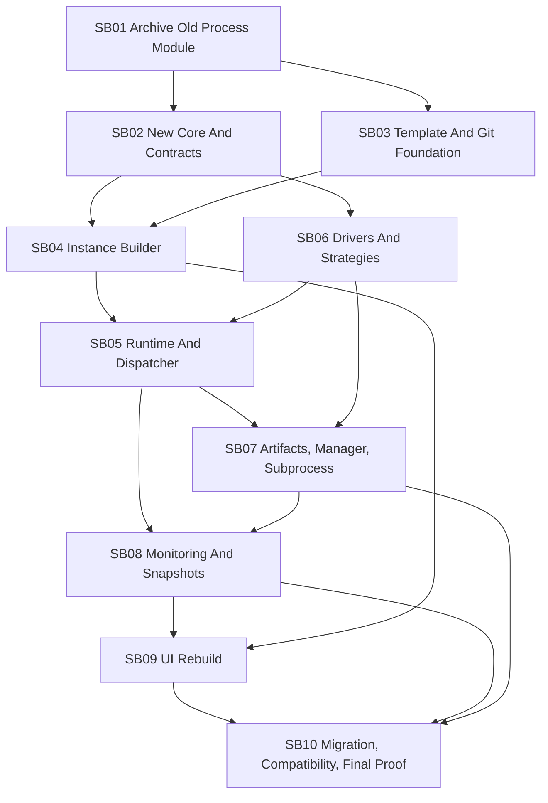

# Phase Plan

## Subbundle Dependency Map

## Critical Subbundles

- SB01 is critical because the old implementation must be preserved before removal.
- SB02 is critical because every later project depends on the generic core boundary.
- SB03 is critical because templates and Git-backed source control define source-of-truth behavior.
- SB04 is critical because process instance composition determines selected drivers, strategies, subprocesses, artifacts, branches, manager behavior, and monitoring configuration.
- SB05 is critical because runtime/dispatcher boundaries determine reliability and concurrency behavior.
- SB06 is critical because domain extensibility depends on driver/strategy layering.
- SB07 is critical because artifact recovery, manager behavior, subprocess communication, and loop protection are core reliability requirements.
- SB08 is critical because live/history UX depends on non-blocking event and snapshot projection.

## Phase Gates

| Gate | Required Before | Required Proof |
| --- | --- | --- |
| G01 Reference archive complete | Any deletion | Archive manifest with source paths and hashes. |
| G02 Old Process removed | New implementation projects | Build fails only for intentionally removed references, then new skeleton build restores solution health. |
| G03 Core semantic boundary | Builder/runtime work | Architecture tests prove no EF/Razor/driver/domain references in core. |
| G04 Template/Git source-of-truth | Builder uses templates | JSON schema/migration tests and Git wrapper contract tests pass. |
| G05 Instance composition | Runtime execution | Builder tests prove strategies, drivers, subprocess plans, artifacts, branches, managers, and monitoring config are persisted in plan. |
| G06 Runtime reliability | Manager/artifact workflows | Concurrency, claim lease, event emission, cancellation, retry, and transition invariant tests pass. |
| G07 Driver layering | Domain execution flows | Driver stack selection tests pass without domain terms in core. |
| G08 Artifact/manager/subprocess | Monitoring and UI | Recovery, resupply, parent/child manager communication, and loop protection tests pass. |
| G09 Snapshot projections | UI rebuild | Live/history projection tests prove time filtering and cache semantics. |
| G10 End-to-end quality | Completion | Unit, integration, component, Playwright, migration, and red-team tests pass. |

## Rewrite Order

1. Create rewrite branch.
2. Copy old Process implementation and process tests to bundle/reference material.
3. Remove old Process projects, modules, and process-specific tests.
4. Add new core/contracts projects.
5. Add template and Git foundation.
6. Add builder.
7. Add runtime and dispatcher.
8. Add driver/strategy layer.
9. Add artifact, manager, subprocess, recovery, and loop protection.
10. Add monitoring event stream and snapshot projections.
11. Rebuild UI against projections.
12. Migrate templates and validate compatibility.

## Execution Order

1. SB01 Reference Archive And Removal.
2. SB02 Core And Contracts.
3. SB03 Template And Git Foundation.
4. SB04 Instance Builder.
5. SB05 Runtime And Dispatcher.
6. SB06 Drivers And Strategies.
7. SB07 Artifacts, Manager, Subprocess.
8. SB08 Monitoring And Snapshots.
9. SB09 UI Rebuild.
10. SB10 Migration And Final Proof.
