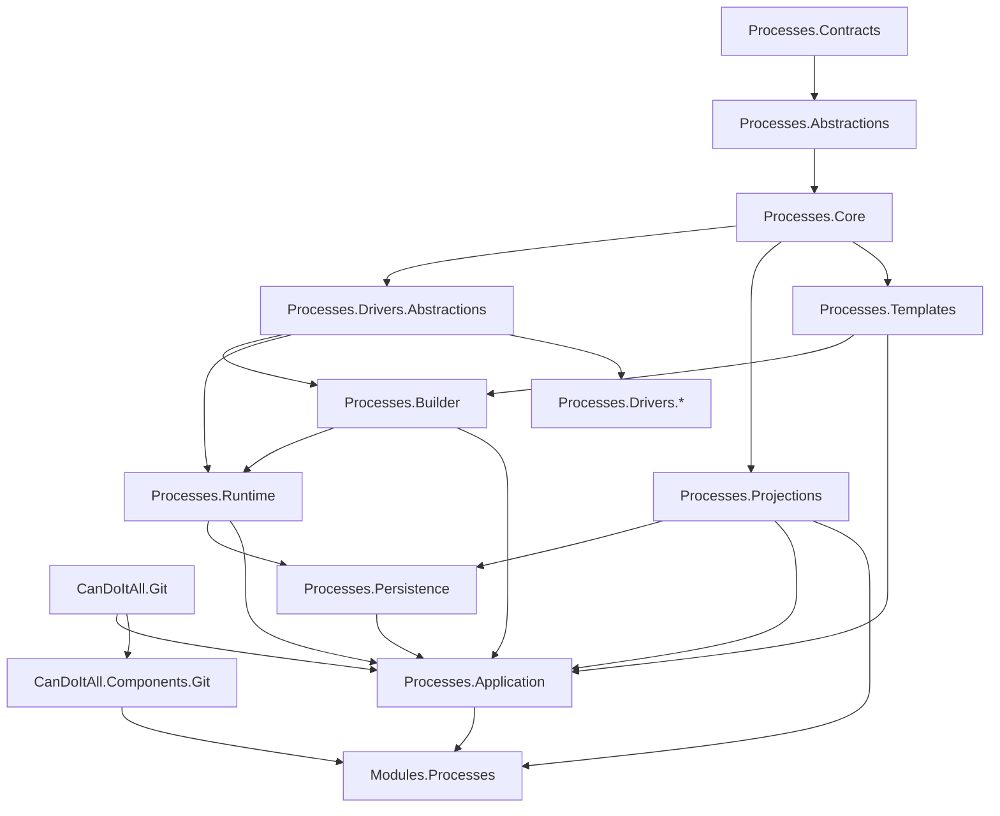

# Project Boundary And Dependency Map

## Design Intent

v3 fixes the v2 project-order ambiguity. The builder needs driver catalog and strategy-binding contracts, so driver abstractions must exist before the builder. UI needs stable read models, so projection contracts must exist before UI rebuild. Runtime needs persistence ports, but must not reference EF/PostgreSQL implementation.

The target architecture uses explicit project boundaries to prevent the old module shape from returning as a new large service.

## Corrected Project Order

| Order | Project | Owns | Allowed references | Forbidden references |
| --- | --- | --- | --- | --- |
| 1 | `CanDoItAll.Processes.Contracts` | External DTOs, public API schemas, version markers. | Shared primitives only. | EF, Razor, runtime internals, drivers, Git, UI. |
| 2 | `CanDoItAll.Processes.Abstractions` | Strong IDs, capability tags, generic ports, strategy/manager/driver-facing neutral interfaces. | Contracts. | EF, Razor, concrete drivers, application services. |
| 3 | `CanDoItAll.Processes.Core` | Kernel rules, graph validation, artifact core model, branch core model, loop fingerprints, state machine definitions. | Contracts, Abstractions. | EF, Razor, infrastructure, concrete drivers, Git implementation. |
| 4 | `CanDoItAll.Processes.Drivers.Abstractions` | Driver descriptors, packages, catalog contracts, strategy factory contracts, driver facets. | Contracts, Abstractions, Core. | UI, Persistence, concrete driver implementations. |
| 5 | `CanDoItAll.Processes.Projections` | Projection DTOs, read-model contracts, projector input/output contracts. | Contracts, Abstractions, Core. | EF, Runtime implementation, UI components. |
| 6 | `CanDoItAll.Git` | Typed Git wrapper, path authorization, sanitized command execution, Git result models. | Shared primitives. | Process-specific behavior, Process runtime, UI. |
| 7 | `CanDoItAll.Processes.Templates` | Canonical JSON schemas, component refs, override patches, migration chain, template validation. | Contracts, Abstractions, Core. | Runtime execution, UI, direct shell/Git calls. |
| 8 | `CanDoItAll.Processes.Builder` | Builder/compiler pipeline, immutable plan model, driver stack selection, strategy binding, plan hash. | Contracts, Abstractions, Core, Templates, Drivers.Abstractions. | UI, EF implementation, concrete drivers. |
| 9 | `CanDoItAll.Processes.Runtime` | Runtime state transitions, scheduler, dispatcher boundary, manager runtime ports, event emission ports. | Contracts, Abstractions, Core, Builder contracts, Drivers.Abstractions. | UI, EF implementation, concrete drivers, direct Git. |
| 10 | `CanDoItAll.Processes.Persistence` | EF/PostgreSQL implementation of runtime state store, event store, outbox, artifact ledger, projection stores, indexes. | Contracts, Abstractions, Core, Runtime ports, Projections. | UI components, concrete domain drivers. |
| 11 | `CanDoItAll.Processes.Application` | Use cases, authorization, transactions, template Git orchestration, run start, projection queries. | Builder, Runtime, Persistence, Templates, Projections, Git, Drivers.Abstractions. | Razor components, direct old module services. |
| 12 | `CanDoItAll.Processes.Drivers.*` | Concrete domain drivers, strategy implementations, facets, diagnostics. | Drivers.Abstractions, Core, relevant domain libraries. | UI module, Persistence internals, Runtime state mutation. |
| 13 | `CanDoItAll.Components.Git` | Generic Git UI components for status, diff, commit, merge, conflicts. | `CanDoItAll.Git`, UI component base libraries. | Process runtime, Process persistence. |
| 14 | `CanDoItAll.Modules.Processes` | Blazor pages/components, presenters, Process UI orchestration over application services. | Application, Projections, Components.Git. | EF runtime entities, Runtime internals, old dispatcher. |

## Dependency Graph

## Contract Ownership

- External API shape belongs to `Processes.Contracts`.
- Generic runtime concepts and ports belong to `Processes.Abstractions` and `Processes.Runtime` when they are runtime-specific.
- Pure invariant rules belong to `Processes.Core`.
- Driver package and strategy factory contracts belong to `Processes.Drivers.Abstractions`.
- UI read model contracts belong to `Processes.Projections`.
- EF entities and persistence implementation types belong only to `Processes.Persistence`.

## Runtime Persistence Boundary

Runtime depends on ports such as:

- `IProcessRuntimeUnitOfWork`
- `IProcessRuntimeStateStore`
- `IProcessRuntimeEventStore`
- `IProcessArtifactLedgerStore`
- `IProcessOutboxWriter`

Persistence implements these ports. Runtime does not reference EF types, migrations, DbContext, database provider APIs, or SQL.

## Projection Contract Decision

Projection contracts live in `CanDoItAll.Processes.Projections`, not in `Processes.Application`.

Reason:

- UI, projectors, and application services need a stable shared read-model language.
- Application services should orchestrate queries and authorization, not own every projection type.
- Projection DTOs must remain independent from EF and runtime mutable state.

Application exposes authorized projection query services that return projection DTOs.

## Template And Git Dependency Decision

`Processes.Templates` owns deterministic schema, migration, merge, and validation logic. It does not run Git commands directly.

`Processes.Application` composes template operations with `CanDoItAll.Git` when files must be read, staged, committed, branched, or merged. This prevents template schema logic from becoming a Git orchestration layer while still allowing Git-backed template workflows.

## Invariants

- Builder cannot exist before driver abstractions.
- UI cannot exist before projection contracts.
- Runtime cannot reference persistence implementation.
- Concrete drivers cannot force generic runtime changes.
- Git wrapper remains Process-neutral.
- Template JSON logic remains canonical even when Application uses Git to version files.

## Failure Behavior

| Failure | Required response |
| --- | --- |
| A lower layer needs a higher-layer type | Stop and move the contract down or redesign boundary. |
| Runtime needs EF-specific behavior | Add or refine a persistence port; do not reference EF. |
| UI needs a field not in projections | Add projection contract/projector support; do not query runtime internals. |
| Concrete driver needs runtime mutation | Return strategy envelope/manager signal; do not mutate state. |

## Test Implications

- Architecture tests enforce project references.
- Domain vocabulary leak tests run on Contracts, Abstractions, Core, Builder, and Runtime.
- UI dependency tests reject direct references to Persistence and Runtime internals.
- Git wrapper tests reject Process-specific references.
