# Phase Plan

v3 prepares future implementation subbundles. It does not execute them. This revision expands the roadmap to SB01-SB28 so the UI/UX rebuild and user-story coverage are not hidden inside one oversized package.

## Subbundle Dependency Map

```mermaid
flowchart TD
    SB01["SB01 Reference Archive And Legacy Evidence Inventory"]
    SB02["SB02 Active Removal, Quarantine, Skeleton Projects, And Boundary Tests"]
    SB03["SB03 Contracts, Abstractions, Core Kernel, And Invariants"]
    SB04["SB04 Git Wrapper And Canonical Template Foundation"]
    SB05["SB05 Driver Abstractions, Capability Catalog, And Strategy Binding Contracts"]
    SB06["SB06 Instance Builder And Immutable Plan Compiler"]
    SB07["SB07 Runtime, Scheduler, Dispatcher Claims, And Event Ports"]
    SB08["SB08 Persistence, Event Store, Outbox, Artifact Ledger Stores, And Projection Storage"]
    SB09["SB09 Manager, Incidents, Recovery, Branch/Switch, Loop Protection, And Subprocess Control"]
    SB10["SB10 Monitoring Projectors, Live/History Snapshots, And Projection Contracts"]
    SB11["SB11 Execution Adapters And First Layered Driver Slice"]
    SB12["SB12 Template Migration, Existing Process Pack Compatibility, And Runtime History Plan"]
    SB13["SB13 UI Shell, Routing, Navigation, And Projection Client Foundation"]
    SB14["SB14 Definition List, Scope Tree, Search, And Feed Defaults"]
    SB15["SB15 Definition Editor, Governance, Contracts, Simulation, Lint, And Publication"]
    SB16["SB16 Role Editor, Role Templates, Executor Model, And Step Role Bindings"]
    SB17["SB17 Definition Canvas, Toolbox, Selection, And Recomposition"]
    SB18["SB18 Step Editor, Operation Contracts, Routing, Artifacts, And Subprocess Mapping"]
    SB19["SB19 Template Library Browser, Preview, And Selective Import"]
    SB20["SB20 Exchange, Import/Export, Git Status, Diff, Merge, And Conflict UI"]
    SB21["SB21 Launch Planning, Candidate Matching, Approval, Provisioning, And Execution"]
    SB22["SB22 Run History, Activity, Selected Run Details, And Basic Run Controls"]
    SB23["SB23 Runtime Execution View, Runtime Canvas, Step Operations, And Telemetry"]
    SB24["SB24 Operator Control Center, Escalations, Approvals, Rework, And Manager Directives"]
    SB25["SB25 Evidence, Artifact Obligations, Assignments, Direct Messaging, And Manager Chat"]
    SB26["SB26 Analytics, Graphs, Live Processes Dashboard, Snapshot Cache, And Time Windows"]
    SB27["SB27 Project-Scoped Processes, Project Structure Integration, Agent Tools, And API Compatibility"]
    SB28["SB28 E2E User Story Regression, Refactoring Hardening, Security, And Final Closure"]

    SB01 --> SB02 --> SB03
    SB03 --> SB04
    SB03 --> SB05
    SB04 --> SB06
    SB05 --> SB06
    SB06 --> SB07 --> SB08
    SB08 --> SB09
    SB08 --> SB10
    SB09 --> SB10
    SB10 --> SB11
    SB11 --> SB12
    SB12 --> SB13
    SB10 --> SB13
    SB13 --> SB14 --> SB15 --> SB16 --> SB17 --> SB18
    SB12 --> SB19
    SB14 --> SB19
    SB19 --> SB20
    SB18 --> SB21
    SB21 --> SB22
    SB22 --> SB23
    SB23 --> SB24
    SB24 --> SB25
    SB25 --> SB26
    SB26 --> SB27
    SB27 --> SB28
    SB20 --> SB28
```

## Critical Subbundles

- SB01 is critical because no active deletion may happen before complete archive/hash proof, current UI evidence, current test inventory, and user-story evidence exist.
- SB02 is critical because it removes active old coupling and establishes skeleton boundaries plus architecture tests.
- SB03 is critical because every later layer depends on generic contracts, strongly typed IDs, core invariants, branch contracts, and event envelopes.
- SB04 is critical because template source-of-truth and Git wrapper behavior must be stable before builder, migration, and Git UI work.
- SB05 is critical because builder and runtime require driver/strategy contracts before implementation.
- SB06 is critical because runtime must execute immutable plans and must not rediscover semantics.
- SB07 is critical because transition integrity, claims, leases, cancellation, and event ports define reliability.
- SB08 is critical because runtime persistence, event store, artifact ledger, outbox, projection stores, offsets, and dead letters provide durable truth.
- SB09 is critical because manager/recovery/branch/subprocess behavior is where uncontrolled loops and hidden dispatchers are most likely.
- SB10 is critical because every UI subbundle depends on projection contracts and live/history correctness.
- SB12 is critical because template compatibility and runtime history compatibility are required before UI/final closure.
- SB13 through SB27 are critical because each owns a concrete current user-story group and must produce localized proof before final regression.
- SB28 is critical because it proves the rewrite works end to end, covers every US-001 through US-055 story, and did not reintroduce the old architecture.

## Phase Gates

| Gate | Required before | Required proof |
| --- | --- | --- |
| G01 Archive completeness and story baseline | SB02 | Reference archive manifest, hashes, line counts, integration inventory, old test inventory, template inventory, UI evidence, and current user-story baseline. |
| G02 Active old implementation removed | SB03 | Old-symbol search proof and build restored through skeleton projects, not old dispatcher contracts. |
| G03 Generic core boundary | SB04-SB07 | Dependency tests and domain vocabulary leak tests pass. |
| G04 Template/Git foundation | SB06, SB12, SB19, SB20 | Git wrapper tests, template schema tests, migration chain tests, sidecar projection hash tests. |
| G05 Driver/strategy contracts | SB06-SB11 | Driver catalog, strategy binding, capability conflict, and opaque tag tests pass. |
| G06 Plan compiler | SB07-SB09, SB21 | Immutable plan, strategy binding snapshot, branch route table, subprocess recursive plan, artifact plan, plan hash tests. |
| G07 Runtime/event integrity | SB08-SB10, SB22-SB24 | Runtime transition, dispatcher claim, idempotency, cancellation, event/outbox port tests. |
| G08 Persistence durability | SB09-SB10, SB22-SB26 | EF/PostgreSQL event store, outbox, artifact ledger, projection store, offset, dead-letter, replay tests. |
| G09 Manager/branch/recovery safety | SB10-SB12, SB24-SB25 | Manager decision, incident, recovery, branch loop, subprocess message, raw diagnostic restriction tests. |
| G10 Projection readiness | SB13 | Live/history projection, canvas projection, incident projection, definition projection, template projection, freshness/lag tests. |
| G11 Adapter proof | SB12, SB27 | Strategy adapter envelopes, restricted diagnostics, no generic runtime references to concrete integrations. |
| G12 Compatibility proof | SB13-SB20 | Template migration report, sidecar drift report, runtime history inventory, chosen compatibility strategy. |
| G13 UI shell proof | SB14 | Routes, navigation, projection client services, dependency scan, browser proof for workspace shell. |
| G14 Definition catalog proof | SB15 | Catalog search/filter/scope/feed-defaults component and Playwright proof. |
| G15 Definition editor proof | SB16 | Definition authoring commands, linting, publication, delete/archive, component and Playwright proof. |
| G16 Role editor proof | SB17 | Role template/customization, executor, fallback, approval, role binding component and Playwright proof. |
| G17 Canvas proof | SB18 | Canvas selection, toolbox, route visualization, recomposition, projection-only dependency scan, Playwright proof. |
| G18 Step editor proof | SB19 | Step contracts, operation policy, branch routing, artifact expectations, subprocess mapping tests and Playwright proof. |
| G19 Template library proof | SB20 | Template search/preview/selective import/migration report and Playwright proof. |
| G20 Exchange/Git UI proof | SB21 | Import/export envelope, Git status/diff/conflict components, conflict resolution proof. |
| G21 Launch proof | SB22 | Launch plan, candidate matching, approval, provisioning, execute-ready integration and Playwright proof. |
| G22 Run history proof | SB23 | Run filters, selected run details, status controls, state transition command proof. |
| G23 Runtime view proof | SB24 | Runtime canvas, step operations, subprocess open, telemetry, invariant diagnostics proof. |
| G24 Operator proof | SB25 | Escalation, approval, manager directive, rework, recovery advice proof. |
| G25 Evidence/coordination proof | SB26 | Artifact obligations, evidence, assignments, direct messages, manager chat proof. |
| G26 Analytics/live proof | SB27 | Graphs, analytics, live dashboard, snapshot cache, time-window filtering proof. |
| G27 Project/API compatibility proof | SB28 | Project-scoped routes, project structure integration, agent tools, API compatibility proof. |
| G28 Final closure | Merge | E2E story regression, dependency/vocabulary/old-symbol scans, refactoring review, security/redaction proof, complete US-001 through US-055 coverage table. |

## Rewrite Order

1. Create future implementation branch.
2. Execute SB01 archive-only, including current UI screenshots/snapshots and user-story baseline.
3. Execute SB02 active removal, quarantine, skeleton projects, and boundary tests.
4. Execute SB03 through SB10 to build the backend foundation and projections.
5. Execute SB11 to prove execution adapters and layered driver slice.
6. Execute SB12 for template migration and runtime history compatibility.
7. Execute SB13 through SB20 for UI shell, definition authoring, canvas, templates, exchange, and Git UI.
8. Execute SB21 through SB27 for launch, runtime, operator, evidence, live/history, project, and tool/API behaviors.
9. Execute SB28 for end-to-end user-story regression, hardening, and final closure.

## Execution Order

1. SB01 Reference Archive And Legacy Evidence Inventory.
2. SB02 Active Removal, Quarantine, Skeleton Projects, And Boundary Tests.
3. SB03 Contracts, Abstractions, Core Kernel, And Invariants.
4. SB04 Git Wrapper And Canonical Template Foundation.
5. SB05 Driver Abstractions, Capability Catalog, And Strategy Binding Contracts.
6. SB06 Instance Builder And Immutable Plan Compiler.
7. SB07 Runtime, Scheduler, Dispatcher Claims, And Event Ports.
8. SB08 Persistence, Event Store, Outbox, Artifact Ledger Stores, And Projection Storage.
9. SB09 Manager, Incidents, Recovery, Branch/Switch, Loop Protection, And Subprocess Control.
10. SB10 Monitoring Projectors, Live/History Snapshots, And Projection Contracts.
11. SB11 Execution Adapters And First Layered Driver Slice.
12. SB12 Template Migration, Existing Process Pack Compatibility, And Runtime History Plan.
13. SB13 UI Shell, Routing, Navigation, And Projection Client Foundation.
14. SB14 Definition List, Scope Tree, Search, And Feed Defaults.
15. SB15 Definition Editor, Governance, Contracts, Simulation, Lint, And Publication.
16. SB16 Role Editor, Role Templates, Executor Model, And Step Role Bindings.
17. SB17 Definition Canvas, Toolbox, Selection, And Recomposition.
18. SB18 Step Editor, Operation Contracts, Routing, Artifacts, And Subprocess Mapping.
19. SB19 Template Library Browser, Preview, And Selective Import.
20. SB20 Exchange, Import/Export, Git Status, Diff, Merge, And Conflict UI.
21. SB21 Launch Planning, Candidate Matching, Approval, Provisioning, And Execution.
22. SB22 Run History, Activity, Selected Run Details, And Basic Run Controls.
23. SB23 Runtime Execution View, Runtime Canvas, Step Operations, And Telemetry.
24. SB24 Operator Control Center, Escalations, Approvals, Rework, And Manager Directives.
25. SB25 Evidence, Artifact Obligations, Assignments, Direct Messaging, And Manager Chat.
26. SB26 Analytics, Graphs, Live Processes Dashboard, Snapshot Cache, And Time Windows.
27. SB27 Project-Scoped Processes, Project Structure Integration, Agent Tools, And API Compatibility.
28. SB28 E2E User Story Regression, Refactoring Hardening, Security, And Final Closure.
