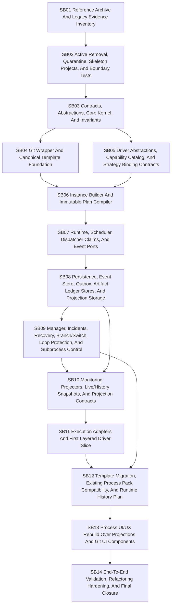

# Phase Plan

v3 prepares future implementation subbundles. It does not execute them.

## Subbundle Dependency Map

## Critical Subbundles

- SB01 is critical because no active deletion may happen before complete archive/hash proof exists.
- SB02 is critical because it removes active old coupling and establishes skeleton boundaries plus architecture tests.
- SB03 is critical because every later layer depends on generic contracts, abstractions, core invariants, branch core contracts, and event envelopes.
- SB04 is critical because template source-of-truth and Git wrapper behavior must be stable before builder and migration work.
- SB05 is critical because Builder and Runtime require driver/strategy contracts before implementation.
- SB06 is critical because runtime must execute immutable plans and must not rediscover semantics.
- SB07 is critical because transition integrity, claims, leases, cancellation, and event ports define reliability.
- SB08 is critical because runtime persistence, event store, artifact ledger, outbox, projection stores, offsets, and dead letters provide durable truth.
- SB09 is critical because manager/recovery/branch/subprocess behavior is where uncontrolled loops and hidden dispatchers are most likely.
- SB10 is critical because UI rebuild depends on projection contracts and live/history correctness.
- SB12 is critical because template compatibility and runtime history compatibility are required before UI/final closure.
- SB14 is critical because it proves the rewrite works end to end and did not reintroduce the old architecture.

## Phase Gates

| Gate | Required before | Required proof |
| --- | --- | --- |
| G01 Archive completeness | SB02 | Reference archive manifest, hashes, line counts, integration inventory, old test inventory, template inventory. |
| G02 Active old implementation removed | SB03 | Old-symbol search proof and build restored through skeleton projects, not old dispatcher contracts. |
| G03 Generic core boundary | SB04-SB07 | Dependency tests and domain vocabulary leak tests pass. |
| G04 Template/Git foundation | SB06, SB12, SB13 | Git wrapper tests, template schema tests, migration chain tests, sidecar projection hash tests. |
| G05 Driver/strategy contracts | SB06-SB11 | Driver catalog, strategy binding, capability conflict, and opaque tag tests pass. |
| G06 Plan compiler | SB07-SB09 | Immutable plan, strategy binding snapshot, branch route table, subprocess recursive plan, artifact plan, plan hash tests. |
| G07 Runtime/event integrity | SB08-SB10 | Runtime transition, dispatcher claim, idempotency, cancellation, event/outbox port tests. |
| G08 Persistence durability | SB09-SB10 | EF/PostgreSQL event store, outbox, artifact ledger, projection store, offset, dead-letter, replay tests. |
| G09 Manager/branch/recovery safety | SB10-SB12 | Manager decision, incident, recovery, branch loop, subprocess message, raw diagnostic restriction tests. |
| G10 Projection readiness | SB13 | Live/history projection, canvas projection, incident projection, freshness/lag tests. |
| G11 Adapter proof | SB12-SB14 | Strategy adapter envelopes, restricted diagnostics, no generic runtime references to concrete integrations. |
| G12 Compatibility proof | SB13-SB14 | Template migration report, sidecar drift report, runtime history inventory, chosen compatibility strategy. |
| G13 UI projection proof | SB14 | UI dependency tests, component tests, Playwright smoke flows, restricted diagnostic behavior. |
| G14 Final closure | Merge | E2E scenarios, dependency/vocabulary/old-symbol scans, refactoring review, security/redaction proof. |

## Rewrite Order

1. Create future implementation branch.
2. Execute SB01 archive-only.
3. Execute SB02 active removal, quarantine, skeleton projects, and boundary tests.
4. Execute SB03 through SB10 to build the backend foundation and projections.
5. Execute SB11 to prove execution adapters and layered driver slice.
6. Execute SB12 for template migration and runtime history compatibility.
7. Execute SB13 for UI rebuild over projections and Git UI components.
8. Execute SB14 for E2E validation and hardening.

## Execution Order

1. SB01 Reference Archive And Legacy Evidence Inventory.
2. SB02 Active Removal, Quarantine, Skeleton Projects, And Boundary Tests.
3. SB03 Contracts, Abstractions, Core Kernel, And Invariants.
4. SB04 Git Wrapper And Canonical Template Foundation.
5. SB05 Driver Abstractions, Capability Catalog, And Strategy Binding Contracts.
6. SB06 Instance Builder And Immutable Plan Compiler.
7. SB07 Runtime, Scheduler, Dispatcher Claims, And Event Ports.
8. SB08 Persistence, Event Store, Outbox, Artifact Ledger Stores, And Projection Storage.
9. SB09 Manager, Incidents, Recovery, Branch/Switch, Loop Protection, And Subprocess Control.
10. SB10 Monitoring Projectors, Live/History Snapshots, And Projection Contracts.
11. SB11 Execution Adapters And First Layered Driver Slice.
12. SB12 Template Migration, Existing Process Pack Compatibility, And Runtime History Plan.
13. SB13 Process UI/UX Rebuild Over Projections And Git UI Components.
14. SB14 End-To-End Validation, Refactoring Hardening, And Final Closure.
